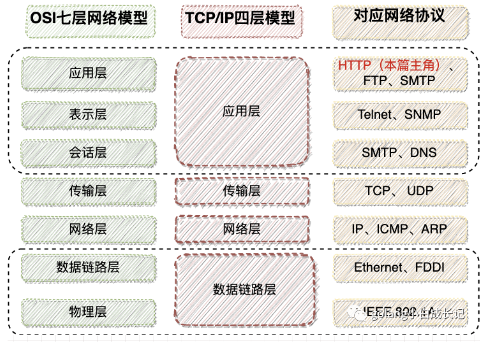

# Http杂谈

HTTP（Hyper Text Transfer Protocol）超文本传输协议，我们常见的文本、图片、视频都可以用超文本来表示。

## 七层网络结构

HTTP协议是应用层协议、类似的协议有FTP协议。HTTP协议端口443，FTP是20和21.

## 报文结构

### 请求报文
```http
GET /cmaskboss/164203142_30_1.enhance.webmask HTTP/1.1
Host: upos-sz-staticks3.bilivideo.com
Connection: keep-alive
User-Agent: Mozilla/5.0 (Macintosh; Intel Mac OS X 10_14_3) AppleWebKit/537.36 (KHTML, like Gecko) Chrome/88.0.4324.150 Safari/537.36
Accept: */*
Origin: https://www.bilibili.com
Sec-Fetch-Site: cross-site
Sec-Fetch-Mode: cors
Sec-Fetch-Dest: empty
Referer: https://www.bilibili.com/
Accept-Encoding: identity
Accept-Language: zh-CN,zh;q=0.9
Range: bytes=0-16
```

HTTP报文结构分为如下几个结构：
1. 请求行
2. 请求Header
3. 请求Body

这些在我们平时的HttpEntity中都可以设置，比如设置GET/POST的请求方法、设置Header中的内容，Body中的请求内容。

### 响应报文
```http
HTTP/1.1 206 Partial Content
Content-Type: application/octet-stream
Content-Length: 17
Connection: keep-alive
Server: Tengine
ETag: "92086de1e6d1d4791fb950a0ac7e30ba"
Date: Sat, 30 Jan 2021 09:31:31 GMT
Last-Modified: Sun, 04 Oct 2020 01:54:28 GMT
Expires: Mon, 01 Mar 2021 09:31:31 GMT
Age: 1018695
Content-Range: bytes 0-16/353225
Accept-Ranges: bytes
X-Application-Context: application
x-kss-request-id: 75bcbfa8ab194e3c825e89c81a912692
x-kss-BucketOwner: MjAwMDAyMDEwNw==
X-Info-StorageClass: -
Content-MD5: kght4ebR1HkfuVCgrH4wug==
X-Cache-Status: HIT from KS-CLOUD-JH-MP-01-03
X-Cache-Status: HIT from KS-CLOUD-TJ-UN-14-13
X-Cache-Status: HIT from KS-CLOUD-LF-UN-11-25
Access-Control-Allow-Origin: https://www.bilibili.com
Access-Control-Allow-Headers: Origin,X-Requested-With,Content-Type,Accept,range
X-Cdn-Request-ID: 7e2c783ca7d392624118593ec1dc66bc
```
响应报文有如下部分：
1. 状态行
2. 响应Header
3. 响应Body

## 什么是URL
URL（Uniform Resource Locator）统一资源定位符。作用是告诉使用者某个资源在web中的地址，这个地址可以是HTML页面、可以是CSS文档、可以是图形和视频。

https://upos-sz-staticks3.bilivideo.com/cmaskboss/164203142_30_1.enhance.webmask
解析这个URL

### 协议
协议部分为http、https、ftp之类的，用://隔开。

### 域名
upos-sz-staticks3.bilivideo.com这个部分就是域名，发送请求前需要进行DNS域名解析得到具体的IP地址，这样才能发送请求过去。如果已知IP，这部分可以替换成IP。

### 端口部分
默认的http请求端口是80端口,https的请求端口是443，如果有些服务需要的话就要带上端口。

### 虚拟目录
/cmaskboss/ 这部分是虚拟目录，它会被导向到真实的目录中
从第一个/ 到最后一个/都是虚拟目录

### 文件名部分
164203142_30_1.enhance.webmask 这个就是请求的文件

## URI和URL

**URI是URL的父类**，URI就是能够唯一标识出一个东西的方式、URL是特指像我们之前提到的URL的这样一种方式，所以它是URI的一种。

## 八种请求方式
### POST
向服务器提交数据，POST的每次调用会修改数据，是非幂等的，Get类似于只读操作。
### GET
请求指定页面的信息，返回body和header
### HEAD
Head和Get的区别就在于，head只返回header
### DELETE
删除一个资源，这个用的少，几乎也是用post来删除
### PUT

### CONNECT

### TRACE

### OPTIONS
它用于获取当前URL所支持的方法，若请求成功，那么会在HTTP响应头部汇总带上各种ALLOW的头部，表名在对应的服务器中支持什么方法。


#### Request Header中的关键字段

##### 1. Access-Control-Request-Method:GET
告知服务器，用GET去请求
##### 2. Access-Control-Request-Headers:range
告知服务区，使用range的header请求数据

#### Response Header中的关键字段
##### 1. Access-Control-Allow-Headers:Range
指明了允许携带的header字段
##### 2. Access-Control-Allow-Methods:GET,OPTIONS,HEAD
指明了允许的请求方法
##### 3. Access-Control-Allow-Origin:https://www.bilibili.com
允许跨域请求的域名，如果要允许所有域名则设置为*
##### 4. Access-Control-Expose-Headers:Content-Length,Content-Range
允许客户端在header中加入什么信息

总而言之，OPTIONS就像是小心翼翼的试探，试探一下对方服务器支持什么方法。

## 什么时候使用OPTIONS
当在<mark>跨域</mark>的时候，浏览器发送复杂请求前会自动发送OPTIONS请求。跨域共享标准规范要求，对那些可能对服务器数据产生副作用的 HTTP 请求方法（特别是 GET 以外的 HTTP 请求，或者搭配某些 MIME 类型的 POST 请求），浏览器必须首先使用 options 方法发起一个预检请求，从而获知服务端是否允许该跨域请求。服务器确认允许之后，才发起实际的 HTTP 请求。

### 什么是复杂请求
复杂请求就对应了简单请求，我们对于一些不会触发CORS预检请求，这样的请求我们一般称之为“简单请求”，而会触发预检的就叫“复杂请求”

### 简单请求
1. 简单请求方法为GET、HEAD、POST
2. 并且只有如下Header字段

    - `Accept`

    - `Accept-Language`

    - `Content-Language`

    - `Content-Type`

    - `DPR/Downlink/Save-Data/Viewport-Width/Width` (这些不常见，放在一起)
3. Content-Type只有以下三种
    - `application/x-www-form-urlencoded`

    - `multipart/form-data`

    - `text/plain`
4. 请求中的任意 XMLHttpRequestUpload 对象均没有注册任何事件监听器
5. 请求中没有使用 ReadableStream 对象。

> 而不满足简单请求的，都是复杂请求

由此可见，因为上述请求在获取B站资源的请求Headers里带有 Access-Control-Request-Headers: range , 而range正好不在简单请求的条件2中提到的Headers范围里，因此属于复杂请求，于是触发预检options请求。

## 什么是跨域
刚刚提到了一个词叫跨域，那什么是跨域呢？在了解跨域之前，首先要了解一个概念：同源。所谓同源是指，域名、协议、端口均相同


## OPTIONS的问题
options的发送条件很容易满足，那么说一旦是复杂请求，就会发送OPTIONS，而这样的发送需要一个RTT时间，显然会导致延迟和不必要的资源浪费。

### OPTIONS的优化
Access-Control-Max-Age就是告知了，在这么一段时间你不用再发送OPTIONS请求了。如果为-1，意思就是每一次都需要发送OPTIONS请求。

## Status Code状态码

### 五类状态码

#### 1xx
指示信息，表示已经接受请求，继续处理。
#### 2xx
成功，表示已经被成功接受、理解、处理。
#### 3xx
重定向，要完成请求必须要更进一步操作。
#### 4xx
客户端错误，请求语法有问题，或者请求无法实现（403，权限问题；404没有这个资源）
#### 5xx
服务器内部问题，服务器没有能够实现合法的请求

### 常见状态码

- 200 OK 已经成功返回了
- 206 Parial Content 表示已经成功处理了部分请求（断点续传、分成多个部分传输
- 307 Temporary Redirect 内部重定向；比如你请求http://www.baidu.com会给你内部重定向到https://www.baidu.com；并且在Responce的header中的location指明要重定向的地址。
- 404 Not Found 资源请求不对
- 403 权限问题
- 502 Bad Gateway 服务器无法给予正常的响应，一般常出现于服务器崩溃了，Nginx没办法收到服务端的响应，就给客户端502状态码
- 500 internal error 内部错误

## Headers
这里列举一下常见的http头部

### Content-Length
这是http的消息长度，用10进制数字表示，显示了当前实际的字节大小。

Content-Length一般都会自动封装好，如果是出现Content-Length和实际内容长度不一致的话就会出现问题。

1. Content-Length比实际大，会导致一直等待这些信息从而阻塞
2. Content-Length比实际小，将消息截断，然后得到缺陷的数据

### Range
实现视频播放需要的起始和结束位置的信息。

### Connection

长连接和短连接：
1. 长连接：Connection：keep-alive
2. 短连接：close

客户端和服务器的实际通信方式还是由服务器的response中的Connection确定，如果客户端想用长连接但是不支持的话，服务器会告知它使用close。

#### 长连接
如果不使用长连接，那么每次传输消息都会经过一次三次握手、四次挥手的过程。使用长连接的话会把连接保持住，然后不用每次都进行三次挥手。

同时为了防止连接占用过久，那么需要主动检测，如果长时间连接占用而不传输消息的话，就需要服务端主动断开连接了。

### Cookies
1. Cookie 是浏览器访问服务器后，服务器传给浏览器的一段数据。里面一般带有该浏览器的身份信息。

2. 浏览器需要保存这段数据，不得轻易删除。

3. 此后每次浏览器访问该服务器，都必须带上这段数据。服务器用使用这段数据确认浏览器身份信息。