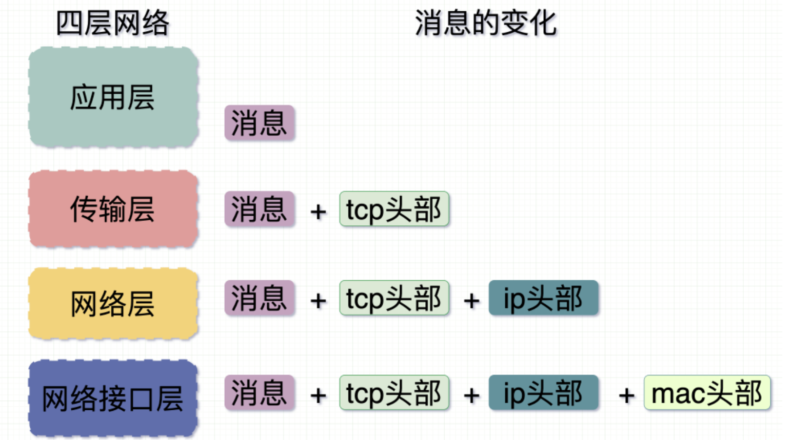
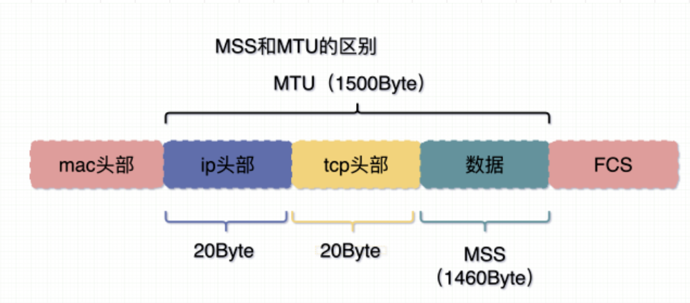

# TCP-沾包

网络中数据在一层层的传输过程中，有点像包快递，每一层都要标识上自己能识别的东西。比如mac头部标记了硬件的唯一地址，ip头部表示了从哪里来到哪里去，传输层头（如tcp）标识了到达目的主机后具体去哪个进程。

## 数据切片
由于网络相当于一个管道，管道的大小是有限的，所有一次并不能把所有的数据一股脑全传过来。

那么就有了这么一个所谓的限制

### MSS: Maximum Segement Size
一次允许传输的最多的数据，其实就是抛开网络层和传输层头部的真实数据大小。
### MTU：Maximum Transmit Unit
在网络层传输的数据包的最大大小。

一次传输可能会有多个MTU，由于每个网卡可能处理消息的能力不同，所以MTU的值也不同。
## 数据切片引起的沾包
由于网络中的传输时，在TCP接收端把收到的消息拼在了一起，并不知道他们到底是一次消息中的还是多次消息中的，所以很容易发生沾包，深刻原因还要说到这几点：

### 基于字节流
字节流可以理解为一串没有边界感的0/1二进制字符串。应用层传到TCP的数据，不是以消息为单位想目的主机传输，而是以字节流发送，所以这些数据会被切割和组装成新的数据包。如果接受端没有处理好数据的分离，就会发生沾包。

### Nagle算法
TCP真实的做法会为了节约资源这样做：
1. 如果是第一次发送，就直接发送
2. 如果数据包达到了一个MSS大小的数据包（或者含有FIN报文）才发送
3. 如果没有还没接受到的数据包才会发送
4. 等待超时，迟迟等不到第二个能合并的报文

Nagle就是做了一个延迟+合并发送，有点像是存了一个BUFFER，类似于Mysql的合并写入。

### 接收端的识别
就算关闭了Nagle算法，此时接收端不知道怎么才算是一个完整的消息，那也不行。

常用方式：
加入识别标记，结尾标记、长度信息、校验字段。

我这里常用的是一种叫TLV的方式：
### TLV
Tag、Length、Value。把你的消息分为这三部分封装起来。

然后在读取的时候，读取指定长度的head（Tag、Length）你就知道是哪种消息、消息有多长，然后就可以自定义的对数据进行读取了。

## UDP会不会沾包

答案是不会。

1. UDP是以数据报为单位发送的，与TCP的以字节流有区别。这样他可以保证他发送的一定是一个完整的数据报。
2. UDP是交由IP去进行数据报的切分与重组。
3. IP层它的切分和重组很“无脑”，它切分完之后在路由器之间传输，等到目的地之前它要保证重组成最初的样子，它才会继续传输。所以IP也不会有沾包的问题。

### UDP的长度信息的作用
这就要关于Socket Buffer，它也是有buffer存在的，所以有长度的话同样是为了标识哪里才是一个完整的数据报。

## 既然IP会分片，为什么TCP要分段

原因很简单，假设说TCP不分段和UDP一样，由于TCP不同于UDP是面向连接的可靠的传输协议，他是会保证送达的，所以如果它重传的话就会将整个一大串的数据全部重传，如果分段了只会传丢掉的一小部分了。