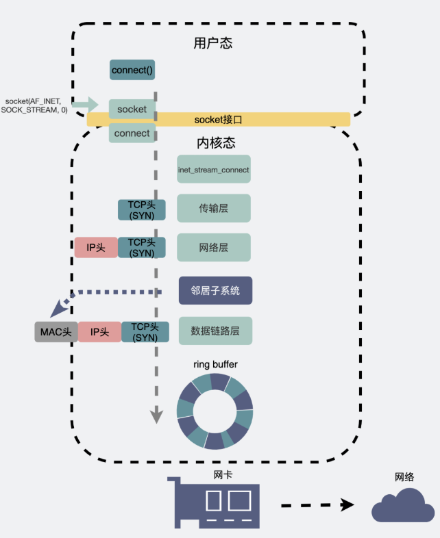
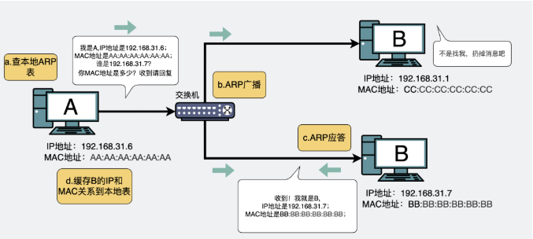

# 连接一个IP不存在的主机会发生什么

开头直接抛出两个问题：
1. 连接一个IP不存在的主机会发生什么
2. 连接一个IP地址存在但是端口号不存在的主机会发生什么

## 正常情况下的三次握手

1. 服务端在启动好以后调用listen()方法，进入到LISTEN状态

2. 客户端主动调用connect(IP地址)，就会像某个IP地址发起第一次握手，发送SYN到目的服务器

3. 服务端收到了第一次握手以后向客户端进行响应，这就是第二次握手

4. 客户端收到了服务端的响应消息后，响应服务端一个ACK，这就是第三次握手并进入ESTABLISHED状态，服务器接收到这次报文以后也会进入到ESTABLISHED状态。

## 连接一个不存在的IP

### 目标在局域网内
结论：根本不会进行三次握手，只是不停的发送ARP包
#### 为什么发送ARP

如上图，这是TCP发送第一次握手的connect()的具体操作。

首先从用户态转到内核态，进行传输层的TCP的封装、网络层的IP的封装、数据链路层的MAC的封装。

其中MAC的封装需要借助于邻居子系统，它处于网络层和数据链路层之间，通过ARP协议将目的IP地址转化为MAC地址，然后数据链路层就可以用这个MAC地址组装帧头。

由于查看本地的ARP表没有目标IP地址所以会进行ARP发送，广播找到目标地址对应的MAC地址。如果此时目标地址在局域网外，就会把MAC地址置为默认网关的MAC地址（家用路由器），让网关去传递消息出去找到对应的目的IP或者失败。
#### 为什么不会进行三次握手
因为每一次都会在发送ARP报文的地方卡住，没有MAC地址所以发送失败。
#### ARP并没有重试机制，为什么重发多次
因为TCP是可靠的传输协议，它会有失败重发，在没有收到ACK的情况下，它无法判定是什么原因导致的，所以它就会进行重发。

### 目标在局域网外
之前在ARP的部分已经提到过了，如果是在局域网外的IP，会先将MAC地址设置为网关的MAC地址。所以此时TCP的第一次握手的SYN包是肯定可以发送出去的。

但是一定是无法收到ACK的，那么就会导致重传。

在Linux下的重传最大次数是6次，并且是按照1s,2s,4s,8s,16s,32s这样的时间间隔规律。

## IP存在但是端口不存在

当服务端收到了这个SYN报文，它一步步拆开，但是到传输层的时候，一看端口并不存在。

核心就在于会发送RST报文（优雅的中断TCP连接），如果此时服务端有防火墙，那么根本都不会拆包了，直接在外面拒绝了。