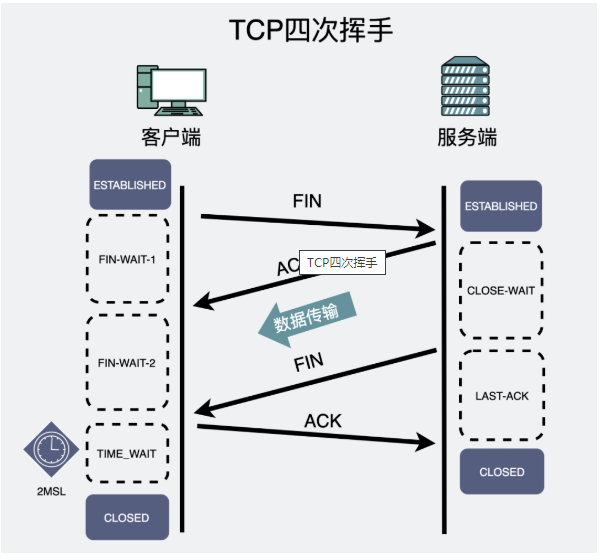
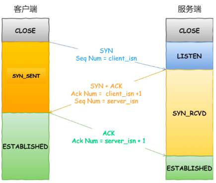
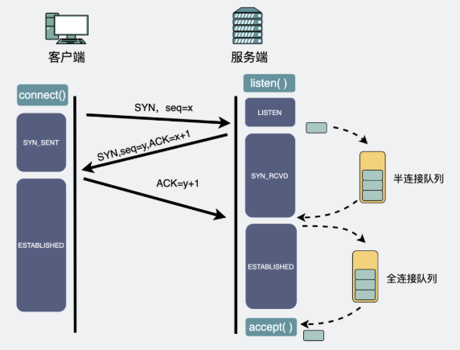

# TCP挥手和握手

TCP是一个面向连接、可靠、基于字节流的传输层协议。
需要建立连接、所以要经过三次握手和四次挥手。

## TCP四次挥手

1. 无论是客户端还是服务端都可以主动发起四次挥手。

2. 稍微深入了解一下状态的变化

### 状态变化

1. 当连接建立好了以后，双方都偶进入到了Established状态。此时某一方决定要断开，主动发送FIN报文，它就进入了FIN-WAIT-1状态。

2. 被动方收到FIN报文以后，返回一个ACK报文，告知我已经得知了断开连接的消息，之后进入CLOSE-WAIT状态。对于CLOSE-WAIT就是让被动方去处理好没有发送完的信息。同时主动方接受到ACK和下一次FIN之间的时间，处于FIN-WAIT-2状态。

3. 当CLOSE-WAIT结束，此时被动方发送FIN报文，之后进入LAST-ACK，等待主动方的ACK。

4. 主动方接收到FIN报文后进入TIME-WAIT状态并发送ACK报文，这一步的TIME-WAIT的时间就是一个TTL来回时间，确保如果有报文失败要重传的时间是够的。比如最后的ACK报文丢失，那么被动方就会重发FIN报文，而一个TTL时间是足以处理的。

为什么有TIME-WAIT状态呢。
1. 防止历史上连接中的数据被后面的四元组的连接错误的接收
2. 保证被动连接的一方被正确的关闭了，它能够保证一定能收到ACK报文。
### 三次挥手
如果说没有数据传输需要处理，那么其实是可以将CLOSE-WAIT的状态给清除出来，变成了三次握手

又或者说将数据给合并到了ACK和FIN报文中也是可以实现的。

### 两次挥手
两次挥手其实也是能够实现的，它存在于TCP自连接中。

### FIN-WAIT-2状态的保留
如果一直没收到第二个FIN，调用close的会在1min中后直接关闭，调用shutdown的时候就会一直死等。
## 三次握手
三次握手就是TCP比较基本的东西了。

1. 服务端在启动好以后调用listen()方法，进入到LISTEN状态

2. 客户端主动调用connect(IP地址)，就会像某个IP地址发起第一次握手，发送SYN到目的服务器

3. 服务端收到了第一次握手以后向客户端进行响应，这就是第二次握手

4. 客户端收到了服务端的响应消息后，响应服务端一个ACK，这就是第三次握手并进入ESTABLISHED状态，服务器接收到这次报文以后也会进入到ESTABLISHED状态。

## 四次握手
当两个客户端之间TCP全部打开，同时都主动connect，是可以用四次握手进行连接的。

## 三次握手的细节分析

服务端对socket执行bind方法监听端口，然后执行listen方法后进入LISTEN监听状态，阻塞调用accept。同时为每个处于监听状态的socket分配两个队列，半连接队列和全连接队列

### 半连接队列和全连接队列

1. 收到第一次握手后，会把sock加入到半连接队列中。
2. 收到第三次握手后，会把半连接的sock取出放入其中。等待accept取出。

其中全连接队列是一个链表、半连接队列是一个哈希表。

#### 为什么半连接队列设计成哈希表
全连接的队列是便于我们一个个取出，只要O（1）的时间复杂度，但是由于我们之后从半连接队列取出并不是完全按顺序来的，所以会有0（n）的时间复杂度，所以这时就要用哈希表来优化时间复杂度。

### 全连接队列满了会怎么样
如果满了就会丢弃这个ACK报文，并开始重传SYN+ACK报文，如果重传次数到达限定次数，就会把半连接当中的连接删掉。

### 半连接队列满了会怎么样
一般就会直接丢弃。但是一般情况下，第一次握手的半连接生存时间都很短。如果要面临满了的情况说明疯狂收到第一次握手请求，那么如果正常业务下有这么多请求，那不得了了。但是这很可能是SYN Flood攻击。

解决：绕过半连接，而是用一个根据IP地址、端口、时间戳等事实计算出来的一个cookies，去做一个验证，如果后续用户传过来的ACK报文满足就可加入全连接队列。

同时这样的行为会消耗CPU的算力，如果对方又进行ACK攻击，让你疯狂计算是不是满足的cookie，那也是会让服务器资源耗尽。