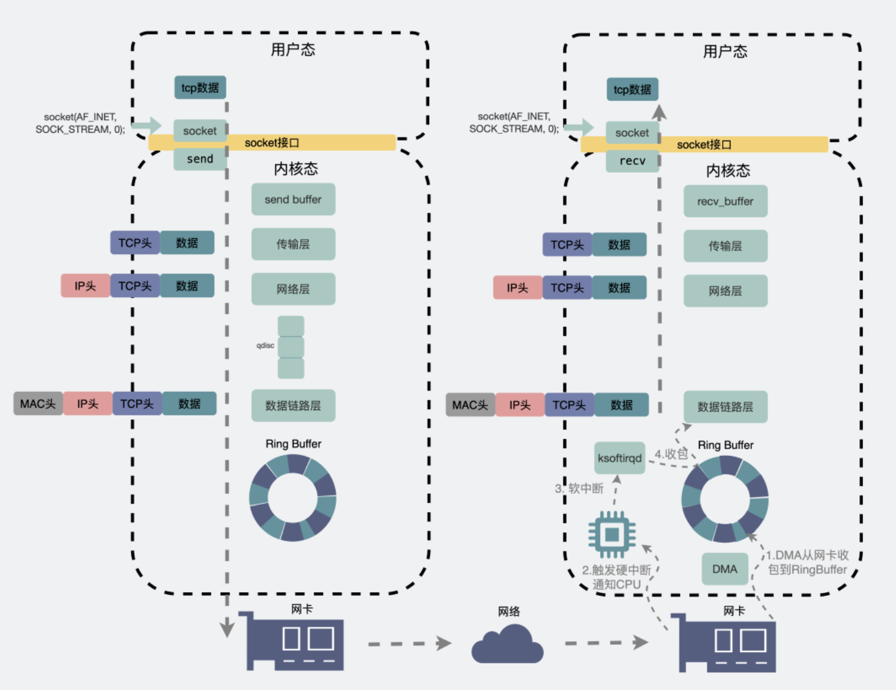

# TCP一定不会丢包吗

## 聊天软件发送消息的过程

一个数据包，从聊天框里发出，消息从聊天软件所在的用户空间拷贝到内核空间的发送缓冲区，数据包就顺着传输层、网络层、进入到数据链路层，在这里经过物理层的网卡发送到了网络世界里，经过各种路由器和交换机达到了目的机器的网卡处。

目的机器的网卡会通知进行中断去读取消息，顺着物理层、数据链路层、网络层、传输层并从内核空间拷贝到用户空间到目的用户的聊天软件里面。

## 常见的丢包场景

### 建立连接时丢包
服务器监听要listen(),第一次握手建立连接后进入半连接队列，之后从全连接队列中获取accept()。

但是半连接队列可能也会满的，新来的包就会被丢弃。

### 流量控制丢包
应用层要发送的数据很多的情况下，肯定不能一股脑冲到网卡，网卡会崩溃，所以数据会有一个排队的规则，这就是流量控制机制。

排队，就有一个队列，队列有长度。当发送数据过快但是流控队列长度不够大的时候，就容易出现丢包现象。

### 网卡丢包
网卡性能差、网线质量差、接触不良等原因导致网卡丢包。

###缓冲区丢包
外部网络收到的消息会暂存进入接收缓冲区，无论是接受还是发送，缓冲区的大小是有限制的。

1. 对于发送缓冲区，如果是阻塞调用，那么就会一直等待。如果是非阻塞调用，就会发送一个重试消息，让应用程序下次重试。那么这种情况一般也不会丢包。
2. 对于接收缓冲区，如果满了，它的TCP接口窗口就会变成0，会通过数据包里的win=0，告诉发送端不要再发送了。这种时候数据再发送过来，就会发生丢包。

### 网络两端之间的丢包
网络传输过程中，会经过很多外部网络，也是可能发生丢包的。

## 发生了丢包怎么办
发生丢包很常见，TCP是一种可靠的的协议，就会有重传。

TCP发送一个SYN报文就会期待一个ACK报文，如果没有收到，那么就会进行重传。

## 那么为什么TCP还会丢包
TCP保证的是传输层的可靠，TCP只保证能顺利从A机器的传输层发送到B机器的传输层。

假设现在A的消息已经发送到了B那边，同时接受端回了一个ACK。这次的消息传输已经结束了，但是此时另一半仍然需要从内核空间读出信息到用户空间，也就是聊天软件上，如果此时因为各种情况读取失败了（如程序崩溃，内存不够等），同样消息也会丢了。

### 如果发生了这种小概率事件怎么办
像这种两方的消息是要进行“对账的”，两边要对消息进行同步。对于发送方，定时的和服务器确认，就可以知道什么消息发送成功，什么消息发送失败。

TCP只能保证传输层的消息的可靠性，在应用层上的则需要应用层自己去做逻辑保证。