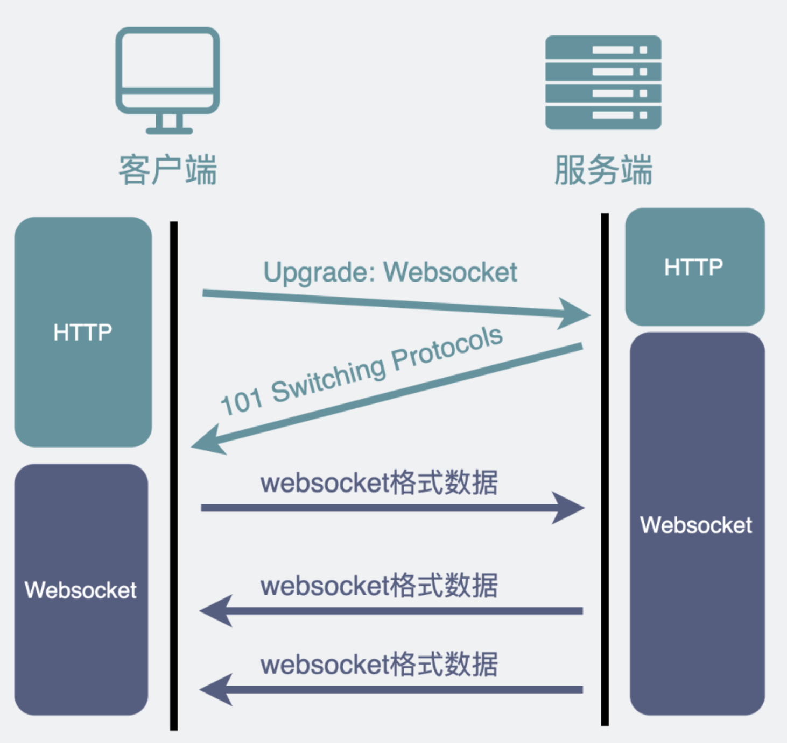

# 为什么有HTTP还要有WebSocket

## 如何实现“服务器主动发送信息给客户端”

痛点：**如何在用户无操作的情况下，用户收到消息**

最常见的解决办法：前端轮询发送HTTP请求到服务器，收到请求后给客户端发送消息。这是一种伪主动，最常见的情况就是扫码登录。

当登录页面二维码出现后，前端网页完全不知道用户有没有扫码，于是要不断去轮询后端说用户扫码没，大概是1s2s这样的间隔去发送请求，让用户能够在这个间隔内收到反馈。

## 长轮询解决
一般HTTP请求发送后，会留给服务器一些时间响应，比如3s，如果没有响应就认为是超时。

如果把超时时间设置得大一些，比如30s，在这一段时间内收到了消息，也可以立马返回给客户端，如果超时就进行下一次请求，这样子就可以看起来更加及时了。

查询有没有登录，超时时间设置为30s，在30s内如果查询成功即可返回登录信息。

## websocket
当然这种方式就是我们常用在游戏的场景时，客户端和服务端互传消息的方式。

我们知道TCP连接后，两方都可以互相发送消息，这就是全双工。而HTTP1.1就只能有一方主动发送消息，这就是半双工。

为了更好的使用这种双工场景，我们要设计出websocket这种协议了。

### HTTP->websocket
我们一般的浏览器支持的都是HTTP，这时候就要进行协议的切换。

为了兼容使用各种场景，浏览器在建立TCP三次握手后，都会统一使用HTTP协议进行一次通信。

1. 如果此时就是使用HTTP协议，那么无所谓
2. 如果此时要建立ws连接，就会在请求头上加上特定的header，意思就是要让浏览器升级协议到ws协议。

进行这么一次升级wb协议的握手，就能从HTTP协议转换到了websocket协议了。

websocket只是在协议升级的时候借用了HTTP去进行握手，和HTTP其实关系不大，传输层用的是TCP。