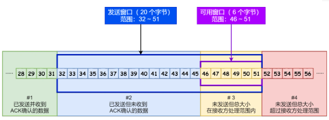
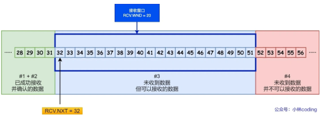
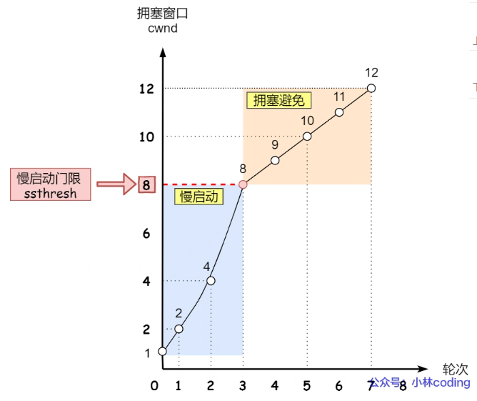
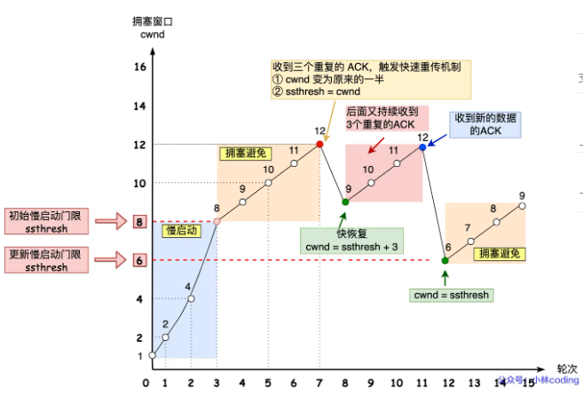

# TCP的拥塞控制、流量控制

## 滑动窗口
TCP每次发送一个消息都要等待一次回复，如果只是单纯的这么你一句我一句的苦等，效率是很低的。

所以引入了窗口这个概念。窗口就是无需等待ACK，而可以发送数据的最大值。

### 累计确认
当ACK为600的报文丢失，只要700的报文发送过来了就可以累计确认600的已经收到了，不需要再重传了。

### 字段window
TCP头上有个字段window，表示了接收方告知发送方自己的缓冲区还能接受多少的数据。发送方如果发送了超过这么多大小的数据，就可能被丢弃了。

### 发送方窗口

两个指针，一个大小：
1. SND.UNA：窗口发送但未ACK的起始位置
2. SND.NXT：窗口现在使用到了哪
3. SND.WND：告诉你窗口一共有多大

用SND.WND-(SND.NXT - SND.UNA)就可以知道还有多少的发送窗口

### 接收方窗口

一个指针，一个大小：
1. RCV.NXT：接收大小
2. RCV.WND：窗口大小

因为接收是使用的累计确认，要么就是之前的全部收到才算，要么就是全没有收到，RCV.WND就表示了能够接收的大小。

## 流量控制
发送方不可以一股脑的发送消息给接收方，要考虑接收方的接收能力，所以要有流量控制，流量控制就是根据滑动窗口来进行的。

### 操作系统缓冲区
其实到TCP这层数据能够正常传输，没问题，但是可能出现数据收到了，放入了缓冲区当中，此时应用程序并没有及时的读进去，就会影响滑动窗口的大小。

### 窗口关闭（零窗口）
如果窗口大小为0，就意味着发送方无法再发送消息了，直到窗口不再为0。

因为窗口关闭以后当再次恢复的时候，接受方会发送一个ACK报文给发送方，但是这个报文可能丢失，这就很危险了。

所以有一个持续计时器，如果超时了还没收到通知，就会发送探测报文，去看到底有没有恢复好。

### 糊涂窗口综合征

意思就是当接收方能接收了，就告知发送方，此时发送方就发送能接受这么小的窗口的一点点消息，把接收窗口占满了，后面又只能发这么小的消息过去，导致大消息无法传送。

解决办法：接收方不告知太小的窗口给发送方了，发送方开启Nagle算法。

## 拥塞控制

### 为什么有流量控制还要有拥塞控制
流量控制是在TCP的可控范围内，但是网络中可能发生各种各样的拥堵，如果发生拥堵的时候强行继续发送包，那么就会有大量的丢包。

拥塞控制就是对于发送方的控制，避免发送方的数据填满整个网络。

### 拥塞窗口cwnd
这是发送方维护的一个状态，根据网络的拥塞程度动态变化。

swnd = min(cwnd, rwnd)发送窗口等于cwnd和rwnd的最小值，只要是发生了重传，就认为网络中堵塞，堵塞之后要传输的就要更少。

### 慢启动
慢启动就是从0开始，每次按指数级别增长（没发送一次记1，但是只有到指数级别的时候才会增加cwnd），直到阈值。
### 拥塞避免算法
线性的增长，每次发送都会加1.

### 发生拥塞以后

#### 1. 超时重传
超时重传的话，ssthresh设置为当前cwnd / 2, cwnd重置为初始值（1）.
#### 2. 快速重传
快速重传是当接收方发现丢了包，那么会快速发送三次前一个包的ACK，发送方就会立即重传。

cwnd = cwnd / 2 ,ssthresh = cwnd / 2

同时进入快速恢复算法

#### 快速恢复算法
快速恢复算法认为啊，你都能接受到三个ack，说明网络还ok，所以cwnd = ssthresh + 3

重新发送丢失的数据包，如果收到重复的报文就将cwnd+1,如果收到了新的报文就会恢复到cwnd = cwnd / 2的初始值，也就是现在的ssthresh继续使用拥塞避免算法。
