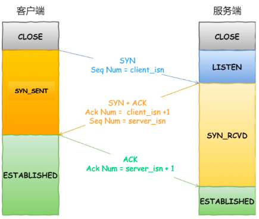
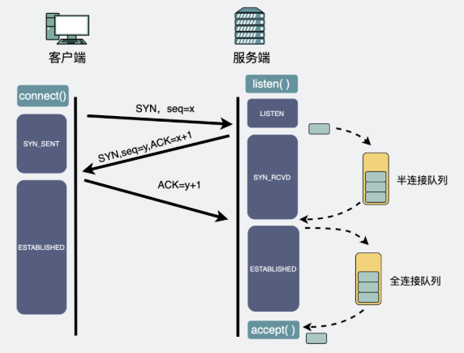

# TCP

## TCP基本知识
### TCP的header格式
要知道一个TCP连接肯定要由一个四元组确认，那么就需要源端口号和目标端口号，同时IP层提供源IP和目标IP。

此外还有序列号seq，和确认应答号ack。

以及几个标志位，如FIN,SYN,ACK.

### 什么是TCP
TCP是面向连接、可靠的、基于字节流的传输层协议。

1. 面向连接：TCP的传输是一对一的，不像TCP一样可以同时向多个主机发送消息。
2. 可靠的：无论网络中发生什么情况，TCP保证报文一定能够让接收端收到。
3. 基于字节流：区别于UDP的基于报文，TCP基于字节流，那么就会对其进行分段。

### 怎么确定一个连接
1. Socket：IP地址和端口号
2. 序列号：用来解决乱序问题
3. 窗口大小：用来做流量控制

### 怎么唯一确认一个TCP连接
通过四元组来完成。一般来说服务端都是监听一个IP的一个端口，那么客户端这边就能有2^32个IP，以及65536个端口（2^16），总共能有2^48个端口。

1. 当然这也是理论的上限，一般来说Socket在操作系统中用fd来代表，那么可以生成的文件总数是有限的，如果fd占满了，就无法有新的连接
2. 内存可能有上限，如果建立这么多连接以后导致内存占满了，同样无法接受新的连接。

### UDP和TCP的区别
1. 可靠与不可靠：UDP做的就是只负责传输出去，收不收到他是不管的。而TCP会做重传机制（快速重传和超时重传），同时有滑动窗口保证的流量控制以及拥塞控制。
2. 基于字节流和基于数据报：字节流的TCP可能会被分成多个报文来传输，它引发的是粘包半包问题，但同时能够很好的解决需要重传的时候只要重传某一段即可。而UDP需要重传时，就需要传整个数据报。
3. 无连接：UDP不需要建立连接即可
4. 首部开销：UDP首部9字节，TCP为20字节。
5. 分片：UDP是在IP层分片，TCP则是在TCP处就会分片。IP那边会在传输后进行重新组装的。

## TCP建立连接

### 三次握手

三次握手当然就是要经过三次的报文传输才可以算做的建立了连接。

客户端发送SYN报文给服务端，服务端收到后回复SYN/ACK报文给客户端，客户端收到后回复ACK报文给服务端，这样就算建立起来了连接。

更细节点讲就如下：
### 三次握手细节版

我们加上了半连接队列和全连接队列以后，这样看三次握手就更加全面了。

### 如何查看TCP状态
netstat -napt

### 为什么是三次握手？为什么不是两次和四次

三次握手的作用：
1. 三次握手保证双方都具有接收和发送的能力
2. 三次握手可以阻止重复历史连接的初始化
3. 三次握手同步初始序列号
4. 三次握手避免资源浪费

### 两次握手
如果只有两次握手，服务端只要接受到了SYN报文，他就会进入到established状态，那么接下来他就可以发送消息了。但是此时可能客户端那边因为没有收到ACK报文，它选择了重传新的SYN报文。在接到了服务端发送的消息后，它就会发送RST报文，让服务器中断。那么在这个过程中，服务端发送的历史连接的数据全部都浪费。

### 为什么IP层需要分片
处理重传问题，如果此时IP层分片丢失了，那么就会导致接收端迟迟无法发送ACK。那么发送方就会超时重新发送整个TCP报文，这个代价是很大的。

如果TCP层也进行MSS分片，那么就不会产生这个问题了。