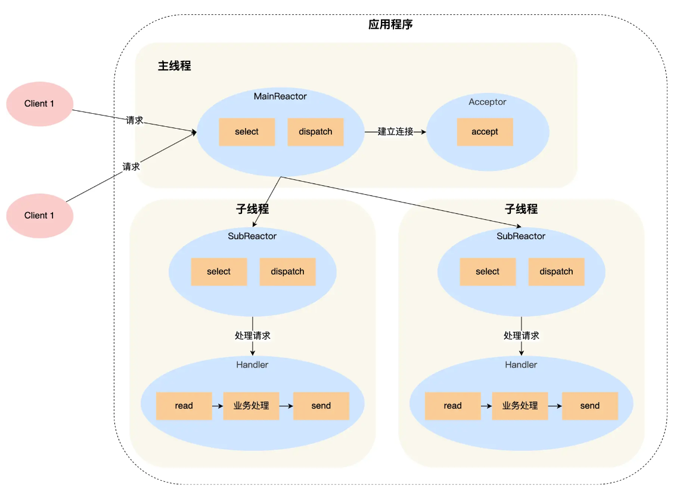

# reactor模型
其实最简单处理连接的方式就是，让主线程处理新建连接，一有新连接来了就新建一个线程让他去服务它，那么主线程也不会被阻塞。如果要优化也可以使用线程池。

根本问题：如果有10k甚至更多的socket，要分配这么多线程不太现实，实际上就是无法解决一个线程去处理多个socket。

Reactor就是对于多路复用的封装。
## 单Reactor单线程
Reactor有三个对象：
1. Reactor：监听和分发事件
2. Acceptor：处理连接事件
3. Handler：处理业务事件
### 事件逻辑
1. Reactor进行select监听，获取到了以后判断是什么事件，如果是连接事件就分配给Accptor，如果是业务事件就给Handler。
2. Accptor处理连接事件，然后会创建一个handler做后续处理。
3. handler就处理业务事件。
### 缺点
缺点十分明显，处理连接和Handler处理业务事件无法并行实现，当处理CPU密集事件，那么将占用住整个CPU，使得无法新建连接了。

Redis6.0之前就使用了单Reactor单线程。
## 单Reactor多线程
单Reactor多线程基本和单Reactor单线程一致，说说不同之处吧。
1. handler不再处理业务逻辑，而是交给下放的子线程去处理，然后处理完再返回给handler，handler再去返回给客户端。
2. 面临着多线程资源共享问题，多个线程共用了一个handler，那么就会出现这个问题，所以在某些处理时需要使用互斥锁。
## 多Reactor多线程
这也是Netty使用的模型。

ok，在Netty中这里就相当于一个bossEventLoop和一个workerEventLoop。

1. bossEventLoop负责去select/epoll监听事件，当是连接的话交给Acceptor进行处理
2. 同时会把socket交给workerEventLoop进行监听，如果有业务处理逻辑，那么就会交给Handler处理业务请求。

### 优势
1. bossEventLoop专注于建立连接，workerEventLoop专注于处理业务逻辑。
2. 子线程是直接与客户端对接，不用再返回给主线程。