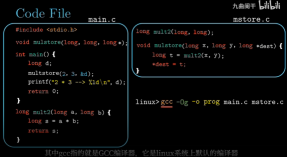
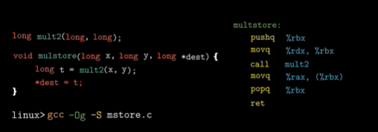

# 程序的机器级表示

## C代码和汇编代码的关系

gcc -Og -S mstore.c -> 变成汇编文件

### pushq %rbx
这一步是将数据压入寄存器（寄存器的存取读快，所以中间值存在寄存器中，cpu读取、计算的速度会更快，然而寄存器的数量大小有限，所以只有部分中间值存在寄存器中

因为在一个函数的调用过程中，可能会改变调用此函数中函数的rbx寄存器的内容，所以需要保存数据，再结束方法的时候恢复数据。

## 汇编代码和机械代码
汇编器仍然要将汇编代码编译成机械代码，其是二进制代码，不能直接查看