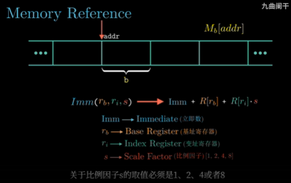

# 寄存器和数据传送指令

## 各种寄存器
如何使用寄存器其实是基于规定的，每个寄存器有着不同的功能

* %rax-保存程序的返回值
* %rsp-程序栈的结束位置

## 操作指令

### Operation code 操作码
moveq, addq, subq, xorq, ret

### Operands 操作数
(%rdi), %rax; 带括号是内存引用

## 读取内存

