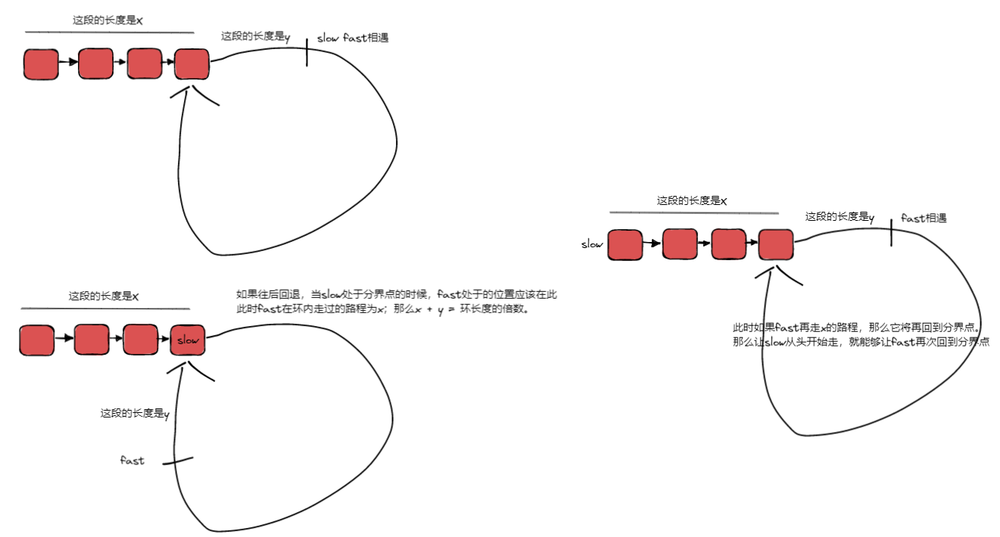

# 142. 环形链表 II

这题有两个主要思路
1. 如何判断是否有环
2. 怎么找到环的入口

我们由一张图直接解释清楚

```java
public class Solution {
    public ListNode detectCycle(ListNode head) {
        if (head == null) return null;
        ListNode dummy = new ListNode(-1);
        dummy.next = head;
        // x + y = 环长度
        ListNode fast = dummy, slow = dummy;
        while (fast != null) {
            fast = fast.next;
            if (fast == null) {
                return null;
            }
            fast = fast.next;
            slow = slow.next;
            if (slow == fast) {
                ListNode cur = dummy;
                while (cur != fast) {
                    cur = cur.next;
                    fast = fast.next;
                }
                return cur;
            }
        }    
        return null;
    }
}
```