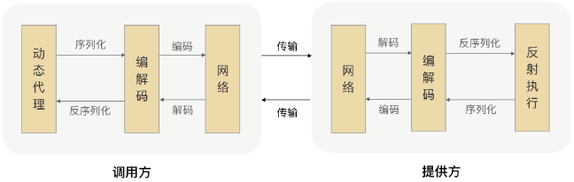

# RPC的通信过程

RPC-Remote Produce call，从字面上来看就是远程调用，其实际就是要让远程调用就像和本地调用一样。

那么要做到这点就离不开网络通信，同HTTP协议一样，RPC为了保证数据传输的可靠性，所以一般情况下使用TCP来传输。

同时我们网络上的传输都是二进制数据的传输，所以要经历序列化（请求数据处理）、编码（网络传输数据处理）才能够在网路上正常传输。

那么接受到这个消息就要进行相对的解码、反序列化的操作就可以得到请求数据了，之后再执行得到结果。

## 屏蔽实现细节
RPC同时有一个作用就是让远程请求和本地请求一样，作为开发者肯定不希望经历上诉的这么复杂的工作，所以一般的框架都进行了动态代理的封装。

1. 拼比了远程调用和本地调用的区别。
2. 隐藏了底层网络调用的处理，让我们专注于业务逻辑。