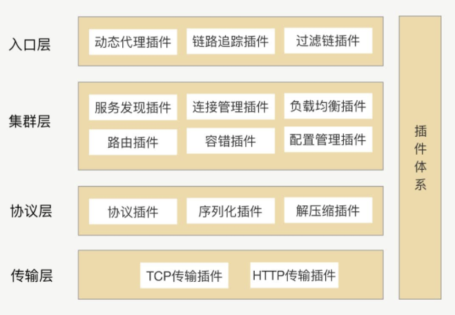

# 设计一个灵活的RPC架构

## 传输和协议
这是RPC最基础的东西，需要将入参传递、结果返回。由于需要在网络中传输，所以需要将消息进行二进制处理、要进行序列化、编码。

而协议在我的理解下，就是让接收方能够理解发送方东西的一个约定俗成的规定。比如，你不想TCP进行过多的拆分，那么就想着压缩数据，那么接收方就要知道要对数据进行解压。

## 入口层
入口层，在操作RPC的时候，我们不想要让使用者面对繁杂的网络和中间协议部分。所以用动态代理去进行屏蔽内部操作。此外，我们希望将RPC的实现类用spring bean的方式进行管理。可以用注解的方式去获取到这样的bean，方便对其的使用。

## 集群层
1. 第一个是需要有服务发现，能够让调用方找到所有服务提供方可以提供的接口和方法。
2. 第二个服务发现是要有动态能力的，能够应对实时变化的提供方的IP地址。所以要有连接的管理。

## 可扩展
这里就提到了SPI。其实我也使用过SPI，我开发Spirng Boot Starter的时候，经常要使用到SPI（Service Provider interface）。

我使用的方式是在CLASSPATH/META-INFO/spring.factories文件下写入要扫描到的类的全限定名。然后在调用到这个包的时候就可以进行加载。这样去做插件的处理。

### SPI
SPI就是提供一个方法把外部的模块和功能加载到当前项目中。
