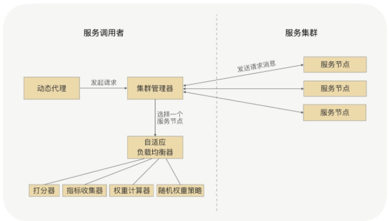

# 负载均衡

问题：发现有几台服务提供节点的处理能力相对比较差，这时候需要提供负载均衡的能力，让这些能力较差的节点处理少一些的请求。

## RPC的负载均衡
RPC的负载均衡是完全由框架自身实现的，不再需要依赖任何负载均衡设备，服务调用方也可以很简单地适配，同时可以通过权重来控制，对负载均衡进行治理。

## 怎么设计自适应的负载均衡
**知道每个节点的处理能力**

能力强的多分配，能力差点的就少分配

### 打分策略

有各种服务器的数据可以作为打分的指标：
服务器的CPU、内存、请求处理的耗时、TP99、TP999、服务的状态指标。
综合这些给它打个分数作为权重。

### TP99
能够满足99%的请求能完成的最低耗时。

## Dubbo的负载均衡策略

1. 基于权重随机算法
2. 基于最少活跃调用数算法
3. 基于hash一致性
4. 基于加权轮询法