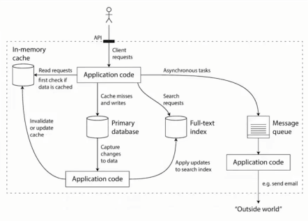

# 可靠性、可伸缩性、可维护性

## 常见的数据系统
1. 存储数据，以便之后使用-数据库
2. 记住一些非常“重复”的操作结果，方便后续加快使用-缓存
3. 允许用户以各种关键字搜索，并且以各种方式过滤数据-搜索引擎
4. 源源不断的产生数据，并且发送给其他进程进行处理-流式处理
5. 定期处理积累的大量数据-批处理
6. 进行消息的传送和分发-消息队列

## 数据复杂化

设计时的思考点：
1. 缓存策略，旁路还是写穿透
2. 机器出问题，保证一致性还是可用性
3. 机器难以恢复的时候，如何保证数据的正确性和完整性
4. 当负载增加，是增加机器还是提升单机性能
5. 设计对外的API时，是力求简洁还是追求强大

## 可靠性
### 如何衡量可靠性

#### 功能上
1. 正常情况下，应用行为能满足API给出的行为
2. 在用户错误输入下，能够正常处理
#### 性能上
在给定硬件和数据量下，能够满足承诺的性能指标
#### 安全上
能够阻止未授权、恶意破坏

### Fault和Failure
- Fault是系统出现问题，但是还能work
- Failure是系统不能提供服务

不能进行Fault-tolerance的系统，积累的fault多了，就容易Failure
比如一个没有合理释放内存的程序，系统运行久了以后导致了系统崩溃。
#### 怎么预防
混沌测试，如Netflix的chaosmonkey

### 硬件故障
在一个大型的数据中心中，很容易出现：
1. 网络问题
2. 硬件老化
3. 内存故障
4. 机器过热
5. 机房断电

硬件故障是具有随机性的

* MTTF mean time to failure
单块盘平均故障时间5-10年，如果有1w+硬盘，那么平均每天都会有坏盘出现，所以要合理的处理

解决办法：增加冗余度，机房多路供电，双网络等

### 软件错误
1. 无法处理特定输入，导致系统崩溃
2. linux的时钟问题导致的崩溃
3. 系统依赖的组件出现问题
4. 级联故障

### 人为问题
系统中最不稳定的是人，因此在设计层面要尽量避免人对系统的影响。依据软件的生命周期，按以下来考虑
#### 设计编码
1. 尽可能消除所有不必要的假设，提供合理的抽象，仔细设计API
2. 进程间进行隔离，对尤其容易出错的模块使用沙箱机制（使用容器
3. 对服务进行熔断处理，如果上游挂了，要及时熔断
#### 测试阶段
1. 尽可能引用第三方成员测试，尽量将测试平台自动化
2. 单元测试，集成测试、e2e测试、混沌测试
#### 运行阶段
1. 详细的仪表盘
2. 持续自检
3. 报警机制
4. 问题预案
#### 针对组织
科学的管理和培训

## 可伸缩性
系统能够应对负载增长的能力

### 应对复杂
1. 垂直伸缩：换成更强大性能的机器 
2. 水平伸缩：并联很多廉价机器、分摊负载

## 可维护性

有效的运维其实是很复杂的，系统必须有良好的可维护性，要将可定义的维护过程编写文档和工具以自动化，从而释放出人力来关注更高价值的东西。