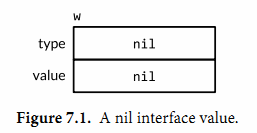
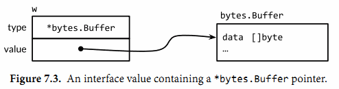
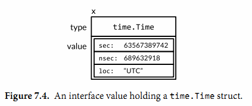

# 接口

## 接口约定

书中通过两个方法fmt.Printf和fmt.Sprintf来说明接口的意义

两个方法都是调用了fmt.Fprintf，只是其中Fprintf的参数使用了一个Writer接口，他们调用了不同的Writer实现

接口其实就是约定了穿入的参数要实现什么方法（功能），让这个调用者不用去考虑它的内部实现

## 接口类型

- 接口是可以进行组合的
- 命名习惯上，都喜欢叫 xxer

## 实现接口的条件

- 一个类型如果拥有一个接口需要的所有方法，那么这个类型就实现了这个接口
- duck typing

### 指针接受者的举例

- 一个值是可以调用指针接受者的方法的，但是这仅仅是一个语法糖，实际上它并没有实现接口
- 所以会有如下情况

```go
type IntSet struct { /* ... */ }
func (*IntSet) String() string
var _ = IntSet{}.String() // compile error: String requires *IntSet receiver

var s IntSet
var _ = s.String() // OK: s is a variable and &s has a String method

var _ fmt.Stringer = &s // OK
var _ fmt.Stringer = s  // compile error: IntSet lacks String method
```

1. IntSet{}由于不能寻址，所以它无法调用指针接受者的方法
2. 接口类型是强绑定的，如果是指针接受者实现了接口，那么就是指针才是实现者，反之是值

## 空类型值

var any interface{}

- 他可以表示任意类型
- 用类型断言来获取interface{}中值

## 接口的实现

实现接口的东西可以是各种各样的

- 引用类型如map,slice
- 函数类型
- 基本类型

任何变量都可以说能实现接口，不设上线，只为了表达某一种类型实现了某种功能

## 接口值

接口值由两个部分组成：
1. 接口类型
2. 那个类型的值



### 指针

### 值



## nil指针的接口

- var w oxwriter
- 如果执行了这样的操作，就会给接口类型附上值，但是接口值为nil
- 如果此时再去判断 w == nil,其实是不对的

## 排序接口

sort.Interface

```go
package main

import (
	"fmt"
	"os"
	"sort"
	"text/tabwriter"
	"time"
)

type Track struct {
	Title  string
	Artist string
	Album  string
	Year   int
	Length time.Duration
}

var tracks = []*Track{
	{"Go", "Delilah", "From the Roots Up", 2012, length("3m38s")},
	{"Go", "Moby", "Moby", 1992, length("3m37s")},
	{"Go Ahead", "Alicia Keys", "As I Am", 2007, length("4m36s")},
	{"Ready 2 Go", "Martin Solveig", "Smash", 2011, length("4m24s")},
}

func length(s string) time.Duration {
	d, err := time.ParseDuration(s)
	if err != nil {
		panic(s)
	}
	return d
}

func printTracks(tracks []*Track) {
	const format = "%v\t%v\t%v\t%v\t%v\t\n"
	tw := new(tabwriter.Writer).Init(os.Stdout, 0, 8, 2, ' ', 0)
	fmt.Fprintf(tw, format, "Title", "Artist", "Album", "Year", "Length")
	fmt.Fprintf(tw, format, "-----", "------", "-----", "----", "------")
	for _, t := range tracks {
		fmt.Fprintf(tw, format, t.Title, t.Artist, t.Album, t.Year, t.Length)
	}
	tw.Flush() // calculate column widths and print table
}

type byArtist []*Track

func (x byArtist) Len() int           { return len(x) }
func (x byArtist) Less(i, j int) bool { return x[i].Artist < x[j].Artist }
func (x byArtist) Swap(i, j int)      { x[i], x[j] = x[j], x[i] }

func main() {
	printTracks(tracks)
	sort.Sort(byArtist(tracks))
	printTracks(tracks)
	sort.Sort(sort.Reverse(byArtist(tracks)))
	printTracks(tracks)
}

```

- 可以把一个less函数当成结构体的参数传入
- reverse包装一下函数体，可以实现倒序

## Error接口

```go
package errors

func New(text string) error { return &errorString{text} }

type errorString struct { text string }

func (e *errorString) Error() string { return e.text }
```

并且因为是指针类型*errorString满足error接口而非errorString类型，所以每个New函数的调用都分配了一个独特的和其他错误不相同的实例。

fmt.Println(errors.New("EOF") == errors.New("EOF")) // "false"

### 创建error
调用errors.New函数是非常稀少的，因为有一个方便的封装函数fmt.Errorf，它还会处理字符串格式化。我们曾多次在第5章中用到它。
```go
package fmt

import "errors"

func Errorf(format string, args ...interface{}) error {
    return errors.New(Sprintf(format, args...))
}

```

## 类型断言

类型断言是一个使用在接口值上的操作。语法上它看起来像x.(T)被称为断言类型，这里x表示一个接口的类型和T表示一个类型。
一个类型断言检查它操作对象的动态类型是否和断言的类型匹配。

### 第一种，如果断言的类型T是一个具体类型，然后类型断言检查x的动态类型是否和T相同。
1. 如果这个检查成功了，类型断言的结果是x的动态值，当然它的类型是T。换句话说，具体类型的类型断言从它的操作对象中获得具体的值。
2. 如果检查失败，接下来这个操作会抛出panic。例如：

```go
var w io.Writer
w = os.Stdout
f := w.(*os.File)      // success: f == os.Stdout
c := w.(*bytes.Buffer) // panic: interface holds *os.File, not *bytes.Buffer
```

### 第二种，如果相反地断言的类型T是一个接口类型，然后类型断言检查是否x的动态类型满足T。

如果这个检查成功了，动态值没有获取到；这个结果仍然是一个有相同动态类型和值部分的接口值，但是结果为类型T。
换句话说，对一个接口类型的类型断言改变了类型的表述方式，改变了可以获取的方法集合（通常更大），但是它保留了接口值内部的动态类型和值的部分。

在下面的第一个类型断言后，w和rw都持有os.Stdout，因此它们都有一个动态类型*os.File，但是变量w是一个io.Writer类型，只对外公开了文件的Write方法，而rw变量还公开了它的Read方法。

```go
var w io.Writer
w = os.Stdout
rw := w.(io.ReadWriter) // success: *os.File has both Read and Write
w = new(ByteCounter)
rw = w.(io.ReadWriter) // panic: *ByteCounter has no Read method
```

上面的情况换句话说就是，如果w的实际类型有这个接口的能力，那么就可以使用这个实际接口的能力


### 自己判断

当我们不确定类型的时候， 可以如下判断
```GO
var w io.Writer = os.Stdout
f, ok := w.(*os.File)      // success:  ok, f == os.Stdout
b, ok := w.(*bytes.Buffer) // failure: !ok, b == nil
```

你有时会看见原来的变量名重用而不是声明一个新的本地变量名，这个重用的变量原来的值会被覆盖（理解：其实是声明了一个同名的新的本地变量，外层原来的w不会被改变），如下面这样：

```go
if w, ok := w.(*os.File); ok {
    // ...use w...
}
```


## 自定义判断错误

```go
import (
    "errors"
    "syscall"
)

var ErrNotExist = errors.New("file does not exist")

// IsNotExist returns a boolean indicating whether the error is known to
// report that a file or directory does not exist. It is satisfied by
// ErrNotExist as well as some syscall errors.
func IsNotExist(err error) bool {
    if pe, ok := err.(*PathError); ok {
        err = pe.Err
    }
    return err == syscall.ENOENT || err == ErrNotExist
}
```

```go
_, err := os.Open("/no/such/file")
fmt.Println(os.IsNotExist(err)) // "true"
```

## 类型分支
通过断言去遍历x的实际类型

```go
func sqlQuote(x interface{}) string {
    switch x := x.(type) {
    case nil:
        return "NULL"
    case int, uint:
        return fmt.Sprintf("%d", x) // x has type interface{} here.
    case bool:
        if x {
            return "TRUE"
        }
        return "FALSE"
    case string:
        return sqlQuoteString(x) // (not shown)
    default:
        panic(fmt.Sprintf("unexpected type %T: %v", x, x))
    }
}

```

## 一些建议

- 接口只有当有两个或两个以上的具体类型必须以相同的方式进行处理时才需要。
- 当一个接口只被一个单一的具体类型实现时有一个例外，就是由于它的依赖，这个具体类型不能和这个接口存在在一个相同的包中。这种情况下，一个接口是解耦这两个包的一个好方式。