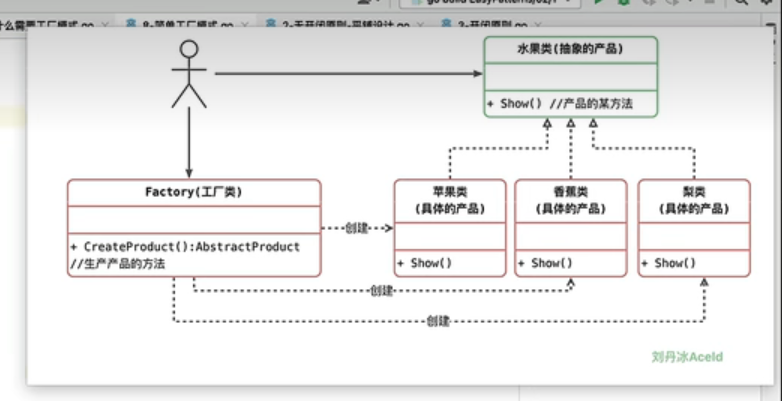

# 简单工厂模式

## 为什么需要工厂模式
1. 逻辑编排的使用引入过多对象创建的代码，阅读难度大，代码冗长
2. 类本身职责过重，多出来一部分初始化代码和显示代码，违背了单一责任原则，不利于代码的维护 
3. 再根据迪米特法则，一个类依赖的其他类越少越好，用工厂去衔接其他类，让逻辑编排类轻松写
所以在中间引入一个简单工厂去解决这个问题

## 优缺点

### 优点
1. 实现了对象创建和使用的分离
2. 不需要记住具体类名，记住参数即可，减少使用者的记忆量
### 缺点
1. 违背了开闭原则，使用简单工厂就避免不了违背开闭
2. 增加系统中类的个数，复杂度和理解难度增加
3. 工厂类职责过重，一旦不能工作，系统将受到影响