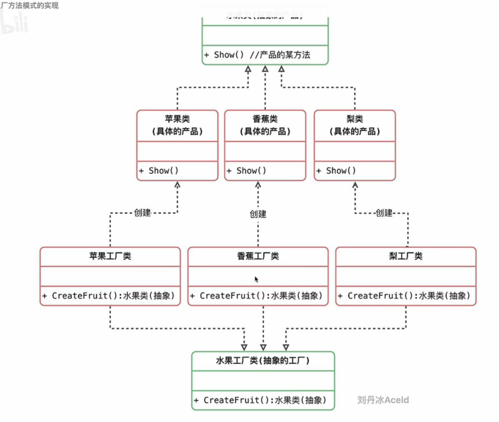
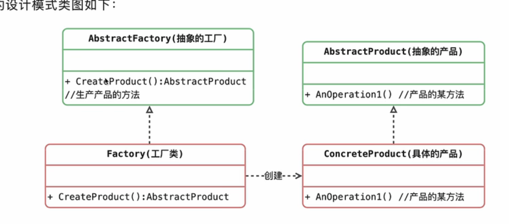

# 工厂方法模式

## 模型

## 对比
1. 相较于简单工厂模式，它由于把工厂提取出来了，解决了简单工厂模式未实现的开闭原则
2. 当需要新增方法的时候，只需要新增工厂即可，不用修改原来的代码

## 优缺点

### 优点
1. 不需要记住具体的类名，甚至参数都不用记忆
2. 实现了对象创建和使用的分离
3. 系统的可扩展性变得非常好，无需修改接口和原类
4. 对于新产品的创建，符合开闭原则

### 缺点
1. 增加系统中类的个数，复杂度和理解难度增加
2. 增加了系统的抽象性和理解难度

### 适用场景
1. 客户端不知道它所需要的对象的类
2. 抽象工厂类通过其子类来指定创建哪个对象

