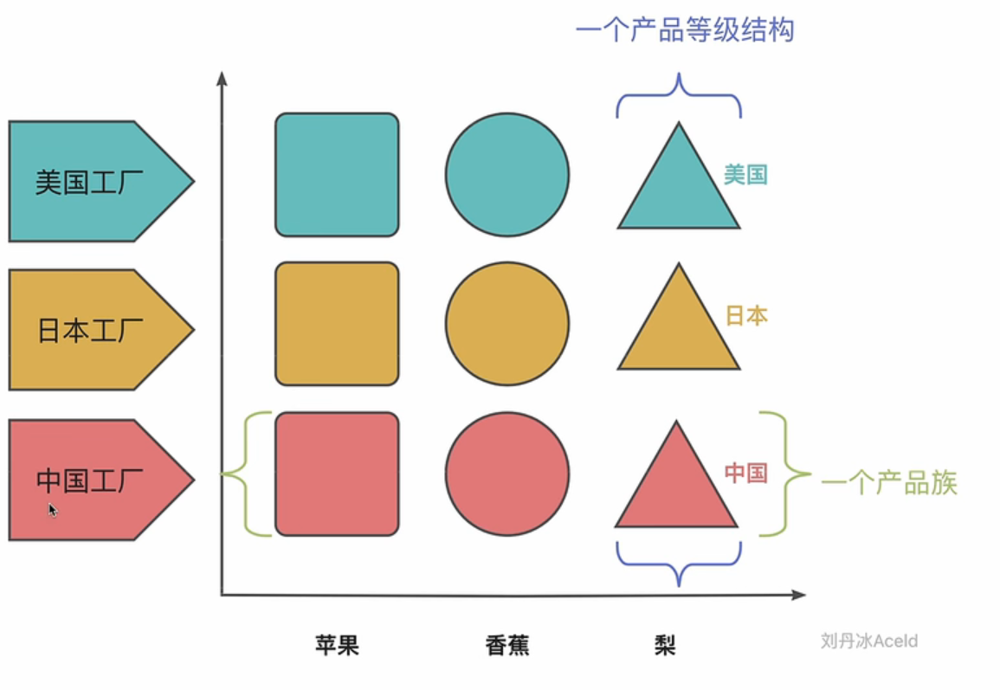
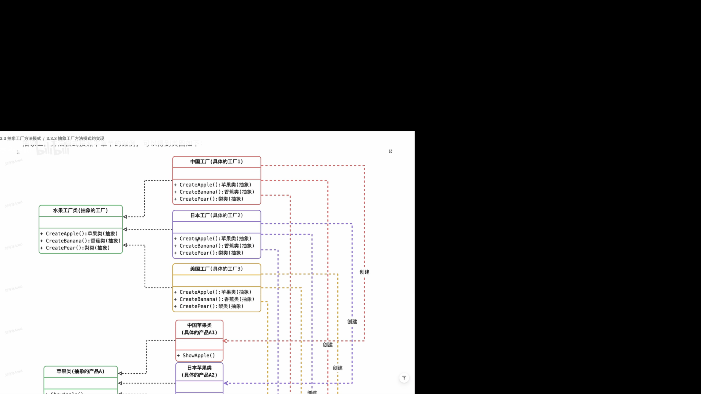

# 抽象工厂方法模式

## 产品族和产品等级结构

把产品分为两个象限，产品族和产品等级结构

**把产品从产品族维度划分**

1. 因为产品族可能早就被确定了，比如一台电脑有的内部部件是确定的
2. 但是不同的品牌是不确定的，可新增的，所以把产品以这个维度划分比较合适

## 优缺点

### 优点
1. 拥有工厂方法模式的优点
2. 新增新的产品族很方便，无需修改已有系统，符合开闭原则
### 缺点
1. 增加新的产品等级结构麻烦，需要堆原有系统做较大的修改，甚至需要修改抽象层的代码，这显然违背了开闭