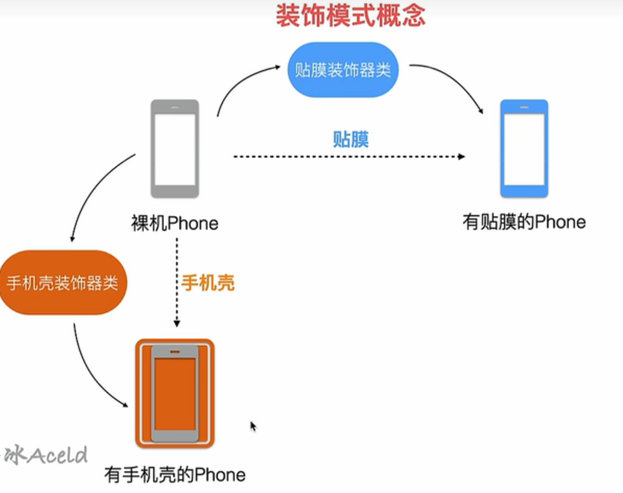
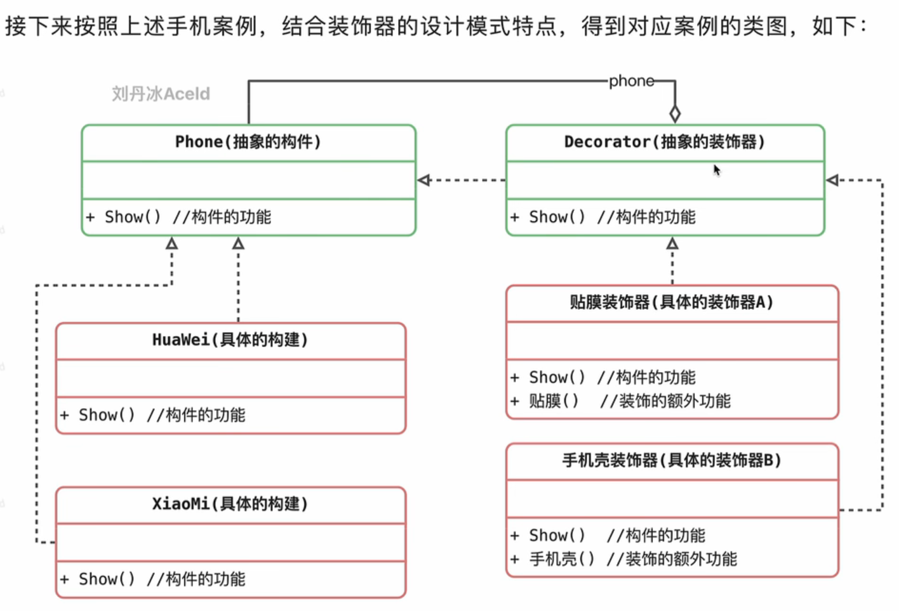

# 装饰器模式

一个类，通过装饰器，变成一个新的类

## 案例

## 特点
和代理模式及其相似，装饰类（代理类）去实现原对象需要实现的方法，并且内嵌原对象

## 优缺点

优点：
1. 对于扩展一个对象的功能，装饰器模式会比较灵活
2. 可以通过一种动态的方法来扩展一个对象的功能
3. 可以对一个对象进行多重的装饰
4. 具体类和装饰类可以独立的变化，符合开闭原则

缺点：
1. 使用装饰器模式会产生很多小对象，大量小对象导致占用内存多
2. 装饰器模式，代码会难阅读，难排错

## 使用场景
1. 动态，透明的给单个对象添加职责
2. 不能采用继承来扩展的时候

## 和代理模式的区别

1. 装饰器模式关注于一个对象上添加方法，代理模式关注于控制对象的访问
2. 代理模式中，代理类可以对它的客户隐藏一个对象的具体信息
3. 因此，在使用代理模式的时候，常常是在一个代理类中创建一个对象的实例
4. 使用装饰器模式的时候，我们通常将原始对象作为一个参数传给装饰器的构造器
