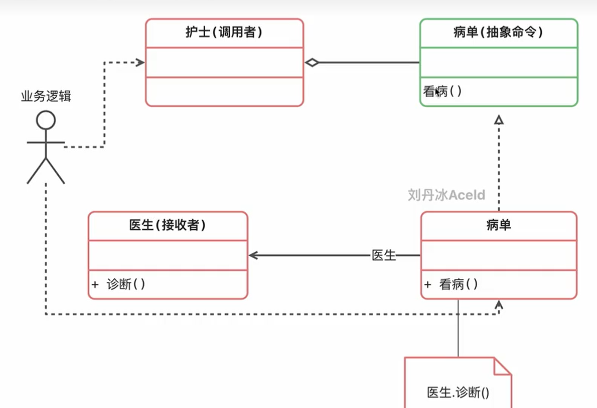
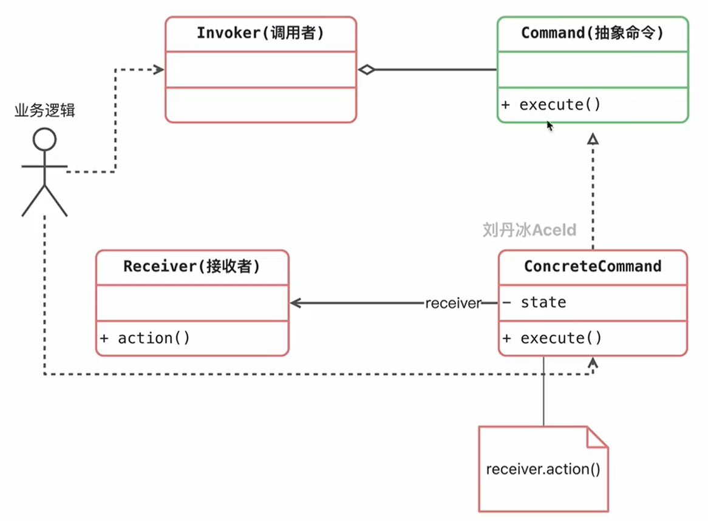

# 命令模式





## 个人理解
命令模式像是把指令（需求）和具体执行者给拆开的这么一个设计。

执行者只关心执行方法，而不关注具体的命令内部是怎么实现的

这样就可以做到一定程度的解耦

比如可以有个订单中心，它会接受各种各样的命令去入库订单，但是它不会注意是哪里来的命令

```go
package main

import "fmt"

type Cooker struct {}

func (c *Cooker) MakeChicken() {
	fmt.Println("烤串师傅烤了鸡肉串儿")
}

func (c *Cooker) MakeChuaner() {
	fmt.Println("烤串师傅烤了羊肉串儿")
}

//抽象的命令
type Command interface {
	Make()
}


type CommandCookChicken struct {
	cooker *Cooker
}

func (cmd *CommandCookChicken) Make() {
	cmd.cooker.MakeChicken()
}

type CommandCookChuaner struct {
	cooker *Cooker
}

func (cmd *CommandCookChuaner) Make() {
	cmd.cooker.MakeChuaner()
}

type WaiterMM struct {
	CmdList []Command //收集的命令集合
}

func (w *WaiterMM) Notify() {
	if w.CmdList == nil {
		return
	}

	for _, cmd := range w.CmdList {
		cmd.Make()
	}
}


func main() {
	cooker := new(Cooker)
	cmdChicken := CommandCookChicken{cooker}
	cmdChuaner := CommandCookChuaner{cooker}

	mm := new(WaiterMM)
	mm.CmdList = append(mm.CmdList, &cmdChicken)
	mm.CmdList = append(mm.CmdList, &cmdChuaner)

	mm.Notify()
}

```

## 优缺点

### 优点
1. 解耦
2. 新的命令不会影响到旧命令，符合开闭原则
3. 可以很容易的设计出一个命令队列

### 缺点
会出现很多的具体命令，让系统代码变得繁杂和冗余