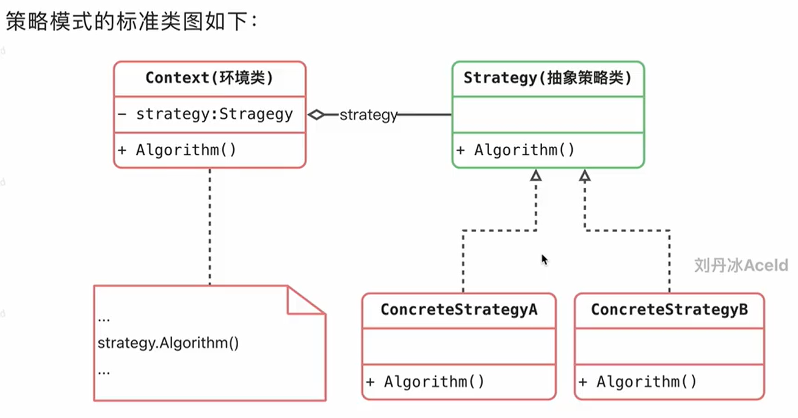

# 策略模式

策略模式就是提供一种算法接口，有不同的实现，根据不同场景使用不同的实现算法



```go
package main

import "fmt"

/*
	练习：
	商场促销有策略A（0.8折）策略B（消费满200，返现100），用策略模式模拟场景
 */

//销售策略
type SellStrategy interface {
	//根据原价得到售卖价
	GetPrice(price float64)	 float64
}

type StrategyA struct {}

func (sa *StrategyA) GetPrice(price float64) float64 {
	fmt.Println("执行策略A, 所有商品打八折")
	return price * 0.8;
}

type StrategyB struct {}

func (sb *StrategyB) GetPrice(price float64) float64 {
	fmt.Println("执行策略B, 所有商品满200 减100")

	if price >= 200 {
		price -= 100
	}

	return price;
}

//环境类
type Goods struct {
	Price float64
	Strategy SellStrategy
}

func (g *Goods) SetStrategy(s SellStrategy) {
	g.Strategy = s
}

func (g *Goods) SellPrice() float64 {
	fmt.Println("原价值 ", g.Price , " .")
	return g.Strategy.GetPrice(g.Price)
}

func main() {
	nike := Goods{
		Price: 200.0,
	}
	//上午 ，商场执行策略A
	nike.SetStrategy(new(StrategyA))
	fmt.Println("上午nike鞋卖", nike.SellPrice())

	//下午， 商场执行策略B
	nike.SetStrategy(new(StrategyB))
	fmt.Println("下午nike鞋卖", nike.SellPrice())
}

```

## 优缺点

### 优点
1. 完全符合开闭
2. 避免多重条件的选择语句，如果不用策略，就会有大量繁杂的代码
3. 策略模式是把真正的算法提取出来了，不同环境可能都能复用这套算法

### 缺点
1. 客户端需要知道他要使用什么策略类
2. 策略模式会产生很多具体策略类，任何一个细小的变化都导致系统要新增一个策略类