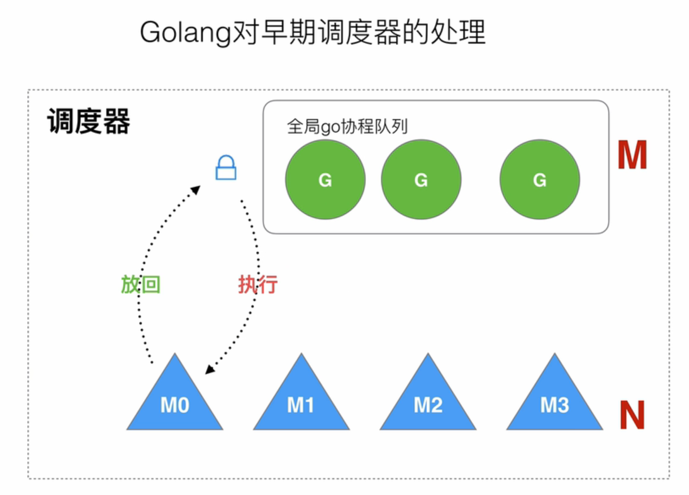

# goroutine

## 程序的演进

- 最开始的读写队列，程序一边写，另一边读，是一个阻塞队列
- 后续有了批处理，等于有了一些buffer，把这个阻塞给解决了
- 再后来，有了进程这个概念，把程序资源分配在自己独立的空间进行管理
- 在有了多核cpu之后，慢慢有了线程这个概念，线程就是一个进程中拥有独立线程栈和pc，能够独立处理命令的单位，能够很好的适用于多核工作环境
- 线程之间也共用着进程的资源，所以线程的上下文切换的损耗也相对进程少很多

## 调度器

### 多进程/多线程
在批处理的时候，多个任务之间是阻塞的，序列化的，单次只能执行一个任务。

当多进程环境的时候，就出现了上下文切换（CPU时间片的切换），每次任务的执行，只能在CPU时间片之内执行，如果超过了就会被释放。

这就是非常经典的轮询调度，由时间片来控制每个进程是否结束

### 切换成本
在上下文切换的时候，就会有拷贝和复制，CPU也会去工作，那么会对CPU有一种浪费。
进程和线程的数量越多，切换成本越大，就会越浪费

而提高CPU的利用率，则是底层开发的一大目标

## 协程

在大量IO的情况下，为了性能，那么就要用更多的线程上下文切换去工作，在线程多了的情况下，这部分的损耗就不能忽略不计了。

所以考虑一个更轻量级的设计-**协程**

## 线程的切分

### 原始状态
操作系统将一个线程分成了，用户空间和内核空间

### 切分线程
如此切分，操作系统的视野中，线程并没有什么改变，代码不需要更改，而是多出一个用户线程部分，绑定住了内核线程。

### 演变协程
根据上述的切分，那么就可以演变成n比1的对应关系。

### 问题
1. 当多个协程绑定一个内核的线程，那么就会出现阻塞，一个协程占有住了线程，那么其他的就需要等待。
2. 当一个协程绑定一个内核的线程，那么当需要切换执行任务的时候，依旧是要进行底层的线程的切换的。

### 再次演变 m:n
再演变之中，用m:n的对应来解决阻塞，同时协程调度器的逻辑就更加重要了。

### 纤程

- 纤程：一种只有用户线程栈，没有内核栈，由用户态自主创建和销货，所以没有上下文的切换
- 由于之前大多是CPU密集型任务，而之前网关大多还是用阻塞式IO，线程也都挂起了，不会有机会去创建纤程

### IO多路复用
goroutine是集协程思想与IO多路复用为一体的思想

#### IO事件循环
像epoll这种的事件驱动的IO多路复用，它一直处于一个IO事件循环当中。

#### 结合
IO事件循环中，注册了许多的socket，那么把每个socket都对应上一个协程，这个协程单独的去处理这个IO事件。
对于整个程序来说就无感知的在内部完全实现了IO事件的完成

## 占用内存区别
1. 进程：虚拟内存4GB
2. 线程：4MB
3. 协程：4KB

## GMP模型
GMP：goroutine,Machine,Processor

GMP简单来说就是Task，Worker，Resource的关系，G和P都是Go语言实现的抽象都更高的组件，而对于工作线程来说，Machine一词表述了它和具体的操作系统，平台密切相关，对具体平台的配置，特殊处理都在这一层实现

## 从GM到GMP

**协程好不好，落脚到调度器优化的好不好**

golang对协程的处理：
1. 协程轻量，默认4kb一个，可以创建大量，造价低。
2. 轻松切换，切换成本低。
### GM
通过锁，让M去G队列中获取任务，执行完了再放回G的队列

#### GM的问题
1. 创建，销毁，调度G，都需要用到锁，而用到锁就会导致锁的竞争
2. M转移G会造成延迟和额外的系统负载，当在goroutine中新建了一个goroutine，那么新建的还是会入队列，让其他的M去执行（我们期望的是在本M执行最简单），这样的话会造成不必要的开销。
3. 系统调用（CPU在M之间切换），导致频繁的线程阻塞和取消阻塞操作增加了系统开销

## GMP 

### 1. GMP模型简介

1. G：goroutine
2. P: processor处理器，处理G
3. M: Machine, thread线程

一个程序中，能够最大并行的go的数量是GOMAXPROCS个，也就是P的数量

- 全局队列：存放等待运行的G
- 本地队列：存放P即将要运行的G，有数量限制，一般不超过256G
- 优先将新创建的G放在P的本地队列中，如果满了就放在全局队列中
- P列表：程序启动的时候创建
  - 最多有GOMAXPROCS个，
  - 通过环境变量中设置$GOMAXPROCS
  - 或者runtime.GOMAXPROCS()来设置
- M列表，当前操作系统分配到GO程序的内核线程数，本身现在M的最大数量是10000，但是实际上操作系统没有这么多
  - runtime/debug的SetMaxThreads函数来设置
  - 一旦有M阻塞，会创建一个M来执行。一旦有M空间，就会回收或者睡眠
### 2. 调度器的设计策略

#### 1. 复用线程

##### working stealing机制

当一个P中有多个G在等待，另一个P正在空闲，那么会有空闲P从等待P中偷取的动作

##### hand off机制
当一个G在P中阻塞住了，P的本地队列都hang住了，这时候就会新创建/唤醒一个thread，把之后的P的本地队列接管

1. work stealing：当本地无可用的G的时候，不会将G给销毁，而是尝试去帮别人做
2. hand off：当我本地阻塞的时候，不要坐以待毙，把本地队列交给空闲的人去做
#### 2. 利用并行
可以指定占用CPU个数（P的个数），合理的分配CPU

#### 3. 抢占

1. 在之前的模式中，一个协程要等另一个协程执行完毕释放CPU才行。
2. 在goroutine的模式中，设置一个最长10ms的等待，如果没有释放CPU，那么就会进行抢占
#### 4. 全局G队列
对work stealing的一个补充

由于全局队列的拿取是要用锁的，所以性能会低。

1. 当一个P空闲的时候，首先会从其他队列中stealing
2. 再尝试从全局队列中去获取
### 3. go func()经历了什么

1. 执行 go func()
2. 创建一个G
3. 加入局部队列
   - 因为当前肯定有执行这段代码的线程，那么这个G就会加入这个线程的P的本地队列
   - 如果局部队列已经满了，那么就会往全局队列中添加
4. M执行G
   - M尝试从从P中获取G，P首先访问本地队列
   - 再尝试全局队列中获取
   - stealing
5. 调度执行
   - 顺利执行，释放时间片，再去循环调度执行
   - 被阻塞，就触发了hand off机制，会尝试将P的本地队列交由休眠/空闲的M来接管，如果没有就创建新的M
   - 然后M阻塞完了以后被加入休眠队列，或者被销毁
   - 如果运行时间片超时，也会被返回
### 4. 调度器的生命周期
当创建一个go语言进程的时候，是怎么创建这些MP的

#### M0
1. 启动程序后，编号为0的主线程
2. 再全局变量runtime.m0中，不需要在heap上分配
3. 负责执行初始化操作和启动第一个G0
4. 启动第一个G以后，M0就和其他的M一样了
5. 主要做初始化工作

#### G0
1. 每次启动一个M，都会第一个创建的G，就是G0
2. G0仅用于负责调度的G
3. G0不指向任何可执行的函数
4. 每个M都会有自己的G0
5. 在调度或系统调用时，M会先切换到G0，再去调度其他的G
6. M0的G0也是放在全局空间

### 5. 可视化的GMP编程

#### 基本的trace编程

1. 创建trace文件
2. 启动trace
3. 停止trace
4. 通过go build 并且运行，会得到一个trace.out文件
5. go tool trace工具打开trace文件

#### 通过Debug trace调试

设置GODEBUG=schedtrace=1000 ./可执行程序

这是每隔1000ms执行一次

##### 具体分析
- SCHED:调试的信息 
- 0ms:从程序启动到输出经历的时间
- gomaxprocs:最大的P的数量,默认是当前CPU的核心一致
- idleprocs:空闲P的数量
- threads:所有的线程数量，包含M0，包含trace等需要的线程
- spinningthreads:处于自旋状态的线程数量
- idlethreads:处于空闲状况下的线程数量
- runqueue:全局队列的长度
- `[0, 0]:每个P的本地队列中，目前存在的P的数量`

