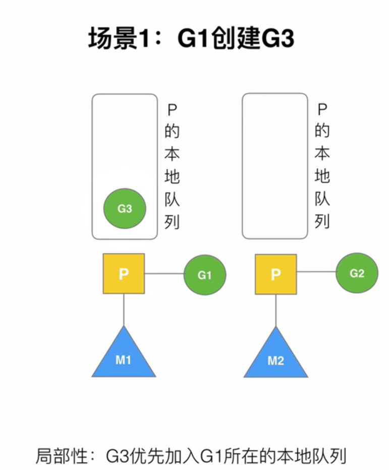
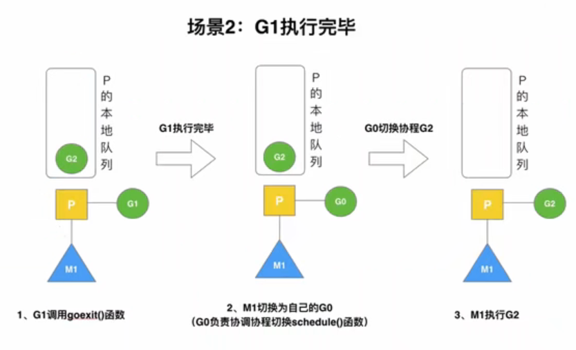
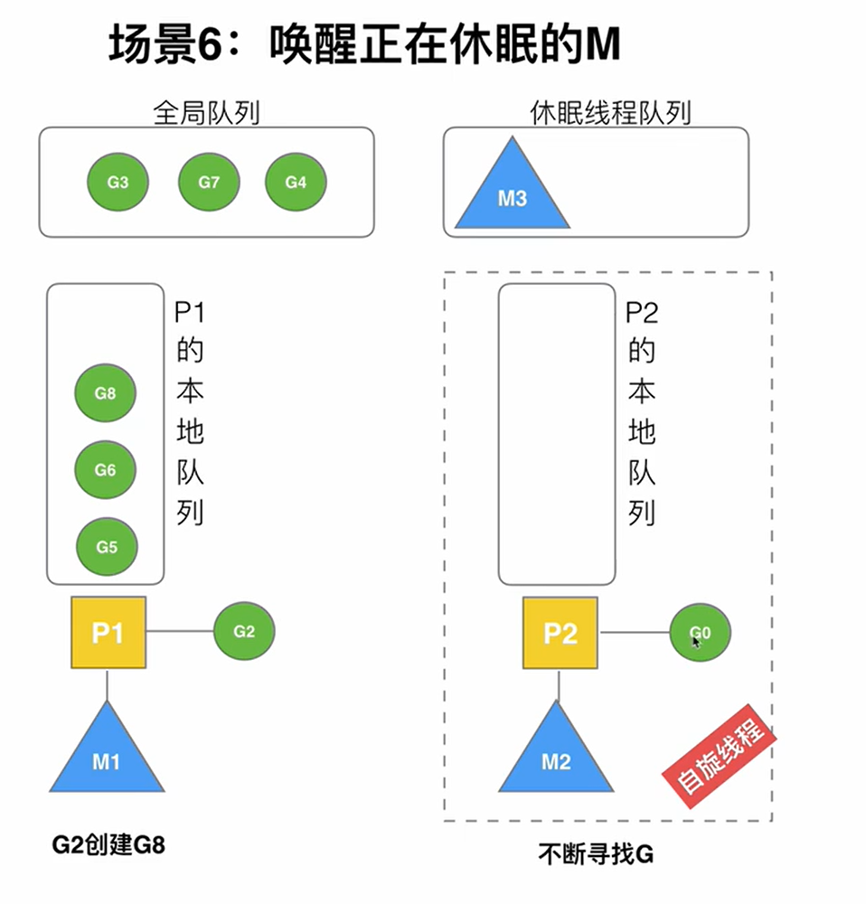

# goroutine案例

## 场景1: G1创建G3

## 场景2: G2执行完毕

## 场景3，4，5: 连续创建多个G 导致本地队列满

### 场景3 G2突然创建了6个G，而本地队列最多存4个。
先按顺序在本地队列中创建，溢出后按后续来
### 场景4 G2本地满再创建G7
把本地队列分为前半部分和后半部分，把前半部分与G7乱序后一起放入全局队列（使得G7和这些G公平竞争）
### 场景5 G2本地未满创建G8
直接加入本地队列当中

## 场景6 唤醒正在休眠的M

每次创建一个新G的时候，都会尝试在休眠M队列中唤醒一个M。此时M就会成为一个自旋线程，去寻找一个能够执行的G。
（stealing 或者 全局队列）

## 场景7 被唤醒的M从全局队列中取G

从全局队列取的个数：
n = min(len(GQ) / GOMAXPROCS  + 1, 128)
从全局队列到P本地队列的负载均衡

## 场景8 偷取G的情况
把本地队列一分为2，取后半部分的所有

## 场景9 自旋线程的最大限制
- 自旋线程 + 执行线程 <= GOMAXPROCS
- 没有P的M就会进入休眠

## 场景10 G发生系统调用/阻塞
会让当前G停留在M，然后M和P解绑，让P去重新获得空闲M/休眠M，如果没有的话，就会进入空闲P队列

## 场景11 G发生系统调用后已经不阻塞了

M尝试绑定休眠P，如果成功就继续执行G。如果失败，G就加入全局队列，M加入空闲M队列

