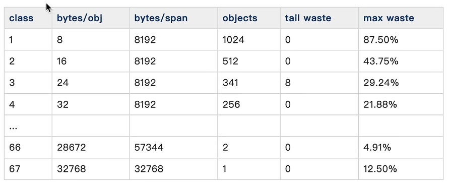

# go内存管理

## 虚拟内存和物理内存

1. 隔绝用户使用的地址和真实的物理地址，防止误操作
2. 让用户感觉自己使用的内存空间是连续的
3. 通过段页表去将虚拟内存转化为物理内存
4. 放大物理内存，由于虚拟内存的使用加上swap机制，可以使得用户使用的内存被放大

## 分页管理

分页管理-提高空间利用率

- 以页为粒度以后，相对于分段，外部碎片减少。
- 而内部碎片则是可控的
- 与虚拟内存配合
- 提高内外村交换效率，细粒度交换更加灵活

## golang内存模型
- 以空间换时间，一次缓存，多次利用。一次申请多一些的空间，到时候一起用，这样来省时间

相比于用时申请的栈，堆就是这么干的。

- 多级缓存，实现无/细粒度锁

当所有的M都使用了堆来分配空间，那么就有一个问题，就是对共享资源的顺序访问，就需要有锁；
为了解决这个问题，那么给中间把锁细粒度化了，划分出了mcache和mcentral和mheap,后续再细讲

1. mheap:全局的堆内存
2. mcentral:每种对象大小规格（全局划分为68种）对应的缓存，锁的粒度仅限于同一种内存规格
3. mcache:每个P持有的一份内存缓存，访问时无需加锁

### 存储单元
1. page: 最小的存储单元
Golang借鉴了分页管理思想，每个最小的存储单元页叫做页，但大小为8KB
2. mspan: 最小的管理单元
mspan大小为page的整数倍，且从8B到80KB被划分为67种不同的规格，分配对象时，会根据大小映射到不同规格的mspan，从中获取空间
优势：
- 根据规格大小，产生了对象等级制度
- 很大程度消除了外部碎片，但不可避免会有内部碎片
- 宏观上能提高整体空间利用率
- 支持mcentral实现锁细粒度化

## mspan
1. mspan是最小的管理单元
2. mspan大小是page的整数倍
3. 是一个链式结构存储
4. allocCache是一个bitmap，用来标记所有的page的使用情况
5. npages表示包含几页，而页是连续的，大小确定的
6. Ctz64算法去寻找空的page

```go
// runtime.mheatp.go
type mspan struct {
  _    sys.NotInHeap
  next *mspan     // next span in list, or nil if none
  prev *mspan     // previous span in list, or nil if none
  list *mSpanList // For debugging. TODO: Remove.
  
  startAddr uintptr // address of first byte of span aka s.base()
  npages    uintptr // number of pages in span
  
  manualFreeList gclinkptr // list of free objects in mSpanManual spans
  
  // freeindex is the slot index between 0 and nelems at which to begin scanning
  // for the next free object in this span.
  // Each allocation scans allocBits starting at freeindex until it encounters a 0
  // indicating a free object. freeindex is then adjusted so that subsequent scans begin
  // just past the newly discovered free object.
  //
  // If freeindex == nelem, this span has no free objects.
  //
  // allocBits is a bitmap of objects in this span.
  // If n >= freeindex and allocBits[n/8] & (1<<(n%8)) is 0
  // then object n is free;
  // otherwise, object n is allocated. Bits starting at nelem are
  // undefined and should never be referenced.
  //
  // Object n starts at address n*elemsize + (start << pageShift).
  freeindex uintptr
  // TODO: Look up nelems from sizeclass and remove this field if it
  // helps performance.
  nelems uintptr // number of object in the span.
  
  // Cache of the allocBits at freeindex. allocCache is shifted
  // such that the lowest bit corresponds to the bit freeindex.
  // allocCache holds the complement of allocBits, thus allowing
  // ctz (count trailing zero) to use it directly.
  // allocCache may contain bits beyond s.nelems; the caller must ignore
  // these.
  allocCache uint64
  
  // allocBits and gcmarkBits hold pointers to a span's mark and
  // allocation bits. The pointers are 8 byte aligned.
  // There are three arenas where this data is held.
  // free: Dirty arenas that are no longer accessed
  //       and can be reused.
  // next: Holds information to be used in the next GC cycle.
  // current: Information being used during this GC cycle.
  // previous: Information being used during the last GC cycle.
  // A new GC cycle starts with the call to finishsweep_m.
  // finishsweep_m moves the previous arena to the free arena,
  // the current arena to the previous arena, and
  // the next arena to the current arena.
  // The next arena is populated as the spans request
  // memory to hold gcmarkBits for the next GC cycle as well
  // as allocBits for newly allocated spans.
  //
  // The pointer arithmetic is done "by hand" instead of using
  // arrays to avoid bounds checks along critical performance
  // paths.
  // The sweep will free the old allocBits and set allocBits to the
  // gcmarkBits. The gcmarkBits are replaced with a fresh zeroed
  // out memory.
  allocBits  *gcBits
  gcmarkBits *gcBits
  pinnerBits *gcBits // bitmap for pinned objects; accessed atomically
  
  // sweep generation:
  // if sweepgen == h->sweepgen - 2, the span needs sweeping
  // if sweepgen == h->sweepgen - 1, the span is currently being swept
  // if sweepgen == h->sweepgen, the span is swept and ready to use
  // if sweepgen == h->sweepgen + 1, the span was cached before sweep began and is still cached, and needs sweeping
  // if sweepgen == h->sweepgen + 3, the span was swept and then cached and is still cached
  // h->sweepgen is incremented by 2 after every GC
  
  sweepgen              uint32
  divMul                uint32        // for divide by elemsize
  allocCount            uint16        // number of allocated objects
  spanclass             spanClass     // size class and noscan (uint8)
  state                 mSpanStateBox // mSpanInUse etc; accessed atomically (get/set methods)
  needzero              uint8         // needs to be zeroed before allocation
  isUserArenaChunk      bool          // whether or not this span represents a user arena
  allocCountBeforeCache uint16        // a copy of allocCount that is stored just before this span is cached
  elemsize              uintptr       // computed from sizeclass or from npages
  limit                 uintptr       // end of data in span
  speciallock           mutex         // guards specials list and changes to pinnerBits
  specials              *special      // linked list of special records sorted by offset.
  userArenaChunkFree    addrRange     // interval for managing chunk allocation
  
  // freeIndexForScan is like freeindex, except that freeindex is
  // used by the allocator whereas freeIndexForScan is used by the
  // GC scanner. They are two fields so that the GC sees the object
  // is allocated only when the object and the heap bits are
  // initialized (see also the assignment of freeIndexForScan in
  // mallocgc, and issue 54596).
  freeIndexForScan uintptr
}
```

mspan重要参数:
1. 左右两个链表节点
2. mspan等级->对应有page数量，对象个数
3. 当前占用情况的bitmap
4. freeIndex，从这个index后开始遍历
5. mspan的初始地址

## mspan的等级
mspan以页基本单位，最小为8，最大为32768，总共67个等级，以及一个隐藏的0级，总共68个等级

数据存放在runtime/sizeclasses.go


spanClass是一个uint8的8位数字，前7位用来表示等级，后1位来表示是否位noscan的标识位。

提供了两类span，一种分配含指针的对象，一种分配不含指针的对象，意思是如果不含指针对象，那么就不用进一步进行GC扫描

## mcache

1. mcache是每个P独有的缓存，因此交互无锁，那么就回优先从此处获取
2. mcache将每种spanClass等级的mspan缓存两份，之前已经提过了
3. mcache还有一个对象分配器tiny allocator，用于处理小于16B对象的内存空间

```go
const numSpanClasses = 136 // 68 * 2(含指针和不含指针)
type mcache struct {
	// 微小对象分配
	tiny uintptr
	tinyoffset uintptr
	tinyAllocs uintptr
	
	// mcache中缓存的mspan，每种spanClass各一个
	alloc [numSpanClasses]*mspan // 提前分配，以空间换时间，用时不用再创建
}
```

## mcentral

1. 每个mcentral对应了一种spanClass
2. 每个mcentral下聚合了该spanClass下的mspan
3. mcentral的mspan分为两个链表，分别为有空就mspan链表partial和满空间mspan链表full
4. 每个mcentral各有一把锁

```go
type mcentral struct {
	// 对应的spanClass
	spanClass spanClasss
	// 有空位的mspan集合, 两个，一个用于抗GC
	partial [2]spanSet
	// 无空位的mspan集合
	full [2]spanSet
}
```

## mheap
- 对于Golang上层应用而言，堆是操作系统虚拟内存的抽象
- 以页（8KB）为单位，作为最小内存存储单元
- 负责将连续页组装成mspan
- 全局内存基于bitmap标识其使用情况，每个bit对应一页，0则free，1则被占用
- 通过heapArena聚合页，记录了页刀mspan的映射信息你
- 建立空闲页基数树索引radix tree index,辅助快速寻找空闲页
- 是mcentral的持有者，持有所有spanClass下的mcentral，作为自身的缓存
- 内存不够的时候，向操作系统申请，申请单位为heapArena(64M)

```go

type mheap struct {
	// 堆的全局锁
	lock mutex
	
	// 空闲页分配器, 底层是多颗基数树组成的索引， 每棵树对应16GB内存空间
	pages pageAlloc
	
	// 记录了所有的mspan, 所有的mspan都是经由mheap，使用连续的空闲页组装
	allspans []*mspan
	
	// heapAreana数组
	arenas [1 << arenaL1Bits] * [1 << arenaL2Bits] * heapArena
	
	// ...
	// 多个mcentral， 总个数为spanClass的个数
	// numSpanClass-> 68 * 2 = 136
	central [numSpanClasses] struct {
		mcentral mcentral
		// 对齐
		pad
	}
	
	//...
}
```

## 页索引&heapArena
底层为一个基数树，辅助来空闲页分配

