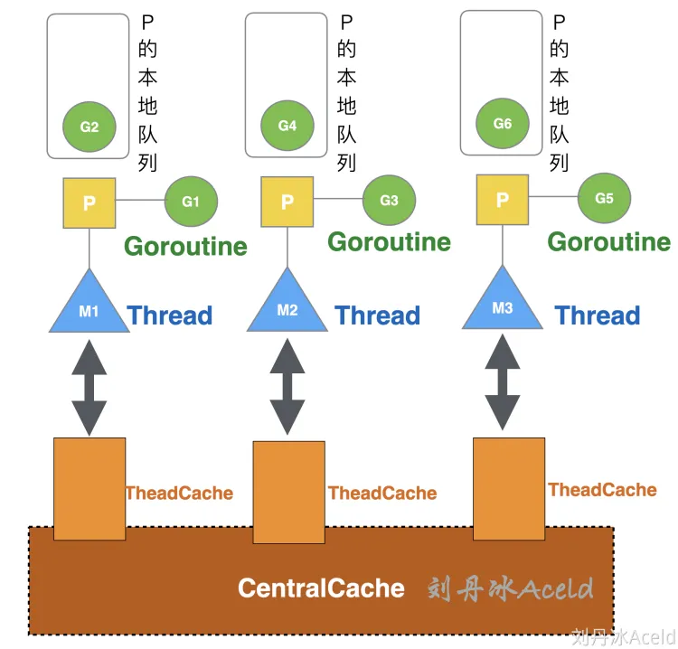
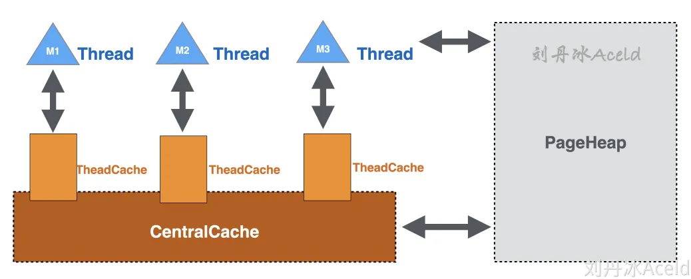
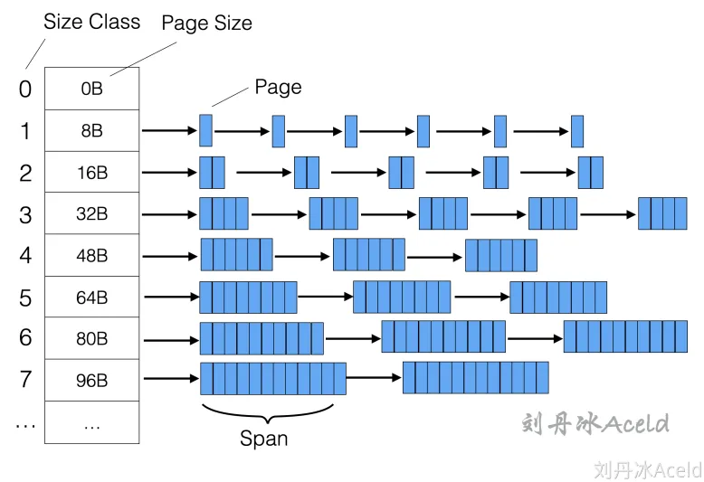
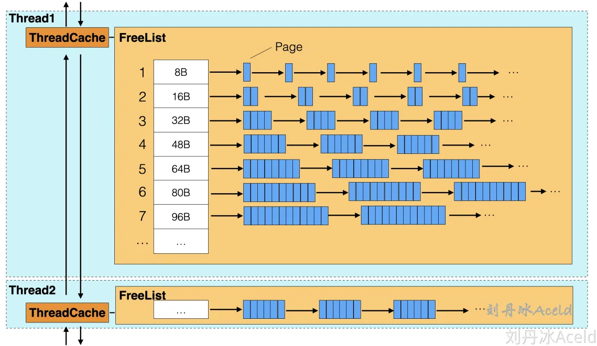
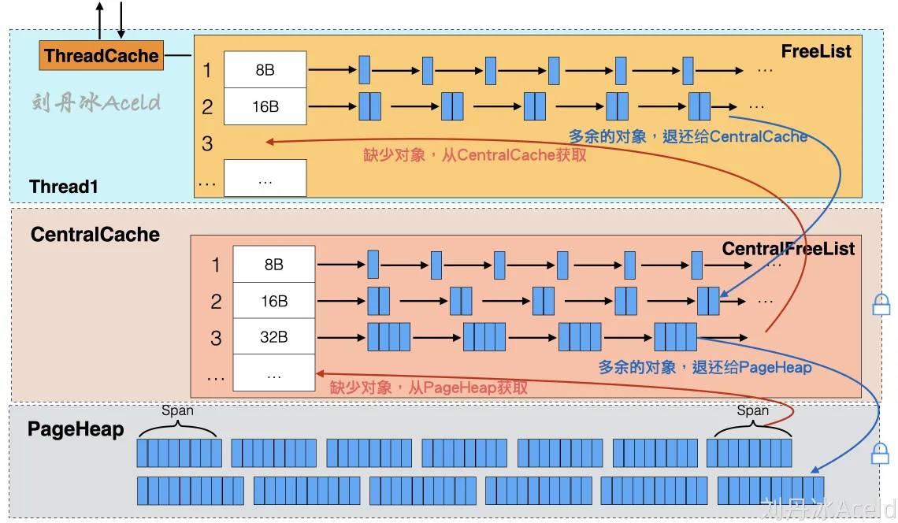
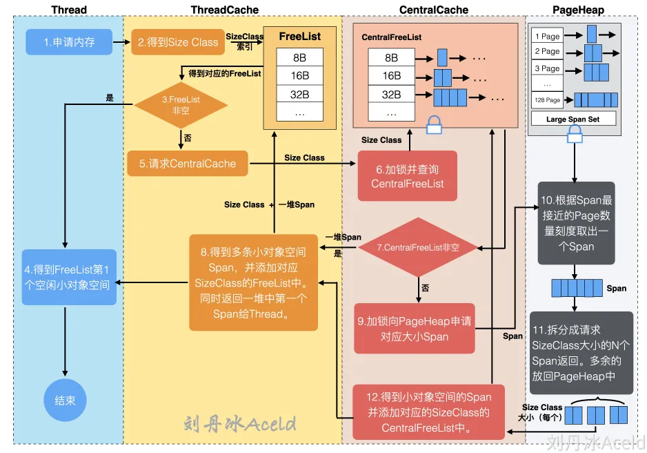
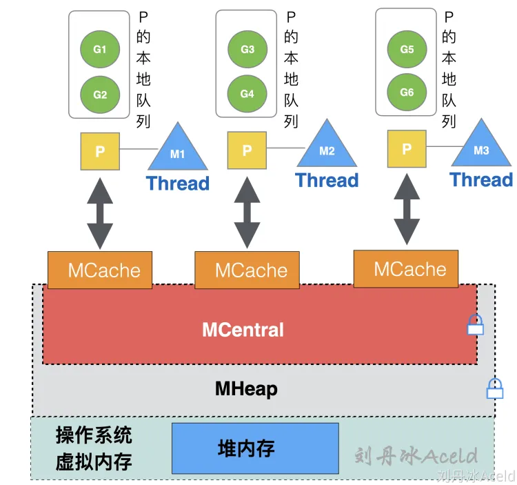

# go内存管理洗髓经

## TCMalloc
TCMalloc(Thread Cache Malloc)，Golang的内存管理就是基于TCMalloc的核心思想来构建的。本章将介绍TCMalloc的基础理念和结构。

TCMalloc最大的优势就在于，每个线程都会独立维护自己的内存池，sync.pool也有类似的思想。

如果所有的线程公用一个内存池，那么内存的分配势必要有互斥和同步策略，十分影响性能。

那么TCMalloc就是为每个Thread单独分配了一个内存缓存，每次申请内存的时候，先从ThreadCache中申请，如果不够了，再到共享内存区CentralCache去申请。

这样做的好处其一是ThreadCache做为每个线程独立的缓存，能够明显的提高Thread获取高命中的数据，其二是ThreadCache也是从堆空间一次性申请，即只触发一次系统调用即可。每个ThreadCache还会共同访问CentralCache，这个与BufPool的类似，但是设计更为精细一些。CentralCache是所有线程共享的缓存，当ThreadCache的缓存不足时，就会从CentralCache获取，当ThreadCache的缓存充足或者过多时，则会将内存退还给CentralCache。但是CentralCache由于共享，那么访问一定是需要加锁的。ThreadCache作为线程独立的第一交互内存，访问无需加锁，CentralCache则作为ThreadCache临时补充缓存。

除此之外，TCMalloc将对象分级成3类：
1. 小对象，(0,256KB]
2. 中对象，(256KB, 1MB]
3. 大对象，(1MB, +∞)

小对象在缓存中去解决。但是大对象呢，就不太适合了。为了解决大对象的内存申请，又引入了全局共享堆PageHeap。

PageHeap也是一次系统调用从虚拟内存中申请的，PageHeap显然是全局的，所以访问是需要加锁的。其作用就是当CentralCache无法支持大内存的时候，去PageHeap分配。

## TCMalloc模型设计
### 1. page
page就是最小的一个分配单元。默认8KB
### 2. Span
多个连续的page称之为span
### 3. sizeClass

## ThreadCache
ThreadCache会对每一个sizeClass都会有对应的FreeList，表示目前可用的空闲内存。

使用方对于从TCMalloc申请的小对象，会直接从TreadCache获取，实则是从FreeList中返回一个空闲的对象，如果对应的Size Class刻度下已经没有空闲的Span可以被获取了，则ThreadCache会从CentralCache中获取。当使用方使用完内存之后，归还也是直接归还给当前的ThreadCache中对应刻度下的的FreeList中。
整条申请和归还的流程是不需要加锁的，因为ThreadCache为当前线程独享，但如果ThreadCache不够用，需要从CentralCache申请内存时，这个动作是需要加锁的。不同Thread之间的ThreadCache是以双向链表的结构进行关联，是为了方便TCMalloc统计和管理。

## CentralCache
CentralCache是各个线程公用的，所以与CentralCache进行交互获取内存是需要加锁的。

## PageHeap
ThreadCache和CentralCache的布局一样，用于小对象的分配。而PageHeap的布局就不同了，他是用于中大型对象的分配，也直接与操作系统相交互。

## 小对象分配流程

小对象为占用内存小于等于256KB的内存，参考图中的流程，下面将介绍详细流程步骤：
（1）Thread用户线程应用逻辑申请内存，当前Thread访问对应的ThreadCache获取内存，此过程不需要加锁。
（2）ThreadCache的得到申请内存的SizeClass（一般向上取整，大于等于申请的内存大小），通过SizeClass索引去请求自身对应的FreeList。
（3）判断得到的FreeList是否为非空。
（4）如果FreeList非空，则表示目前有对应内存空间供Thread使用，得到FreeList第一个空闲Span返回给Thread用户逻辑，流程结束。
（5）如果FreeList为空，则表示目前没有对应SizeClass的空闲Span可使用，请求CentralCache并告知CentralCache具体的SizeClass。
（6）CentralCache收到请求后，加锁访问CentralFreeList，根据SizeClass进行索引找到对应的CentralFreeList。
（7）判断得到的CentralFreeList是否为非空。
（8）如果CentralFreeList非空，则表示目前有空闲的Span可使用。返回多个Span，将这些Span（除了第一个Span）放置ThreadCache的FreeList中，并且将第一个Span返回给Thread用户逻辑，流程结束。
（9）如果CentralFreeList为空，则表示目前没有可用是Span可使用，向PageHeap申请对应大小的Span。
（10）PageHeap得到CentralCache的申请，加锁请求对应的Page刻度的Span链表。
（11）PageHeap将得到的Span根据本次流程请求的SizeClass大小为刻度进行拆分，分成N份SizeClass大小的Span返回给CentralCache，如果有多余的Span则放回PageHeap对应Page的Span链表中。
（12）CentralCache得到对应的N个Span，添加至CentralFreeList中，跳转至第（8）步。
综上是TCMalloc一次申请小对象的全部详细流程，接下来分析中对象的分配流程。

## 中大对象由于ThreadCache和CentralCache没有，都是从PageHeap中取得

# Golang内存管理
