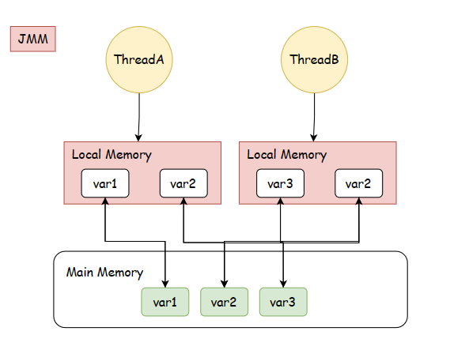

# 从JMM模型复盘Java多线程

## 多线程的由来
任何事情都是有一个发展的历程，多线程也是，我们聊聊多线程的历史。

- 最开始的时候什么都没有，只有CPU和磁盘的概念。
- 之后人们觉得CPU和磁盘（也就是IO）的差速太大，为了弥补想出了批处理的模式，在如今的视角看，像是一个读写缓冲。
- 当这样的阻塞式的运行久了之后，人们会发现如果一个任务挂掉了，CPU就相当于宕机了，十分痛苦。所以衍生出了进程，任务与任务之间是隔离的，就算一个任务挂掉了，后面的任务并不是直接被阻塞掉了，这就是进程的作用。
- 只有串行的时代是满足不了人们的，人们想出了并行和并发。并行即是扩充CPU的核数，让多个CPU同时来执行我们的任务，并发则是最大程序的利用CPU，让CPU宏观看起来在同时运行多个任务。
- 这种看起来同时执行多个任务的感受，就是线程带来的，线程相比于进程，他们共享了进程的资源，他们之间的沟通是“无阻的”。
- 再之后为了避免繁重的上下文切换带来的损耗，例如Golang就建立起了用户级别的协程。
>> 我相信这也就合理的回答了一个经典的面试题：什么是进程，什么是线程？

## 浅析JMM模型
从上图JMM内存模型可以初看端倪，线程之间有自己隔离的内存以及主存中的共享内存。而这样的的模型在操作系统中像是cache和main memory的关系，所以我更愿意称共享内存为Main Memory。

## Java中的Thread
Java中的Thread是与操作系统中的线程一一对应的，而这个将Java中的线程和真实的线程绑定的操作是在Thread.start()中实现的，说到此时，又回答了一个面试题。start()方法和run()方法的区别。

### 操作系统中的线程状态
- New：新建线程
- Runable：得到了资源，等待分配时间片
- Block：失去了资源而被阻塞，或者说在等待资源
- Run：线程得到了时间片，得到了资源
- Teminated：线程被终结。
### Java中的线程状态
Java中的线程状态和操作系统中的是略有不同的，具体如下
- New：new Thread(); 刚被创建出来的线程
- Runable：当进行了Thread.start()之后就会进入Runable状态。
- Waitting：等待状态, wait(), LockSupport.park()等
- Timed Waitting：有等待时间的等待状态，如sleep(),wait(1000)， LockSupport.park(1000)
- Blocked：当被synchronized锁住的时候，称之为Blocked
- Terminated：线程被终结。

## 内核态和用户态
操作系统中并不是所有的操作都是我们用户能够去访问的，所以区分去了用户态和内核态，而当要使用到这些用户无法操作的东西的时候，就要进行内核态到用户态的切换。有如下三种：
- 中断
- 异常
- 系统调用

## 线程之间的通信
线程之间的通信我将分为如下几类：

1. 共享变量:
   
   共享变量比较好理解了，就是多个线程去访问同个变量，用同一个变量去沟通。volatile或者各种锁都是这样沟通的。
2. 等待唤醒：
   
   等待唤醒算是一个比较经典的东西，在Java里面有condition，wait/notify，park/unpark等去实现。
3. 中断机制：
   
   中断本是操作系统中内核态到用户态切换的一种方式，在这里如果一个线程能够去中断另一个线程，不也是一种通信的方式嘛。尤其在Java中的通信算是比较优雅，它并不会直接给你中断，而是设置你的中断标志位。
   
   Java使用的是抢占式的线程调度，由操作系统去分配时间。

## 线程的特性
- 可见性：可见性的保障主要由两类方式实现，内存屏障和上下文切换。在这里特殊提一嘴，volatile是通过lock前缀指令去保障可见性，synchronizied也在JMM规范中有提到，在解锁前要把最新值刷新到内存中，加锁时要读到最新的内存值。
- 有序性：有序性就不得不谈到内存屏障，x86架构下的内存屏障是由lock前缀指令去保障的，在java中可以通过unsafe类去调用fence。
- 原子性：一个线程的操作要么都成功，要么都失败，不能够被另外的线程给打断。所以像volatile其实是保障了单个操作的原子性的，但i++这样的复合操作是无法保障的。