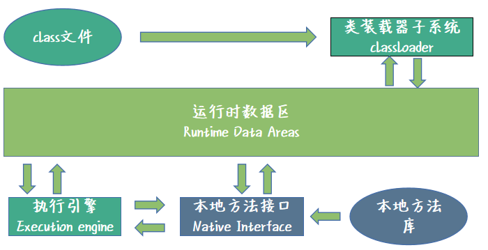

# class文件结构总览



## 拆解class文件
```
CA FE BA BE //魔数 4个字节 u4表示

00 00 次版本
00 34 主版本 52 JDK 8

00 13 常量池计数器 19 （18个常量）

//第一个常量
0A 10 CONSTANT_MethodRef_info
00 04 指向第四个常量 java/lang/Object //一旦有一个类需要初始化，就必须首先初始化他的父类
00 0F 指向 第 15 个常量 CONSTANT_NameAndType_info

//第2个常量
09  CONSTANT_FieldRef_info
00 03 指向第三个常量 jvmClass/jvmClass 
00 10 指向第16个常量  CONSTANT_NameAndType_info

//第3个常量 jvmClass/jvmClass 
07 CONSTANT_class_info
00 11 指向第 17 个常量

//第4个常量 Object
07 CONSTANT_class_info
00 12 指向第18个常量

//第5个常量
01 CONSTANT_UTF8_info
00 04 长度，字符串的长度
6E 61 6D 65  代表 name

//第6个常量
01 CONSTANT_UTF8_info
00 12 长度是18的字符串
4C 6A 61 76 61 2F 6C 61 6E 67 2F 5374 72 69 6E 67 3B //Ljava/lang/string;
// L 开头代表后边直接跟的我们的类描述符,并且以;皆为

//第7个常量
01 CONSTANT_UTF8_info
00 06 
3C 69 6E 69 74 3E // <init>方法 初始化的，java文件编译为class文件，jvm为我们自动生成

//第8个常量
01 CONSTANT_UTF8_info
00 03 
28 29 56 （）V 方法的返回值为 void （<init>方法的返回值）

//第9个常量
01  CONSTANT_UTF8_info
00 04 
43 6F 64 65 // Code属性 （我们的方法，里边都有code属性）

//第10个常量
01  CONSTANT_UTF8_info
00 0F 一共15个长度的字符串
4C 69 6E 65 4E 75 6D 62 65 72 54 61 62 6C 65 // LineNumberTable 代表代码的行号
//抛出异常，需不需要看异常代码？代码是第几行啊？打印的错误信息里边就包含了吧？

//第11个常量
01 CONSTANT_UTF8_info 字面量=看上去是啥就存啥
00 07 
67 65 74 4E 61 6D 65 // getName （方法名称）

//第12个常量
01 
00 14 长度为 20 
28 29 4C 6A 61 76 61 2F 6C 61 6E 67 2F 53 74 72 69 6E 67 3B // Ljava/lang/string;

//第13个常量
01
00 0A 长度为 10 
53 6F 75 72 63 65 46 69 6C 65 // SourceFile (源文件标识)

//第14个常量
01 
00 0D 13个长度
6A 76 6D 43 6C 61 73 73 2E 6A 61 76 61 // jvmClass.java 真正的文件名称啊

//第15个常量 （有一个常量，代表了 init名称 和 void名称）
0C  CONSTANT_NameAndType_info
00 07 指向第7个常量  <init>
00 08 指向第8个常量  void返回值

//第16个常量 （有一个常量，他的名称叫name，他的类型叫 Ljava/lang/string;）
0C  CONSTANT_NameAndType_info
00 05 指向第5个常量  name
00 06 指向第6个常量  Ljava/lang/string;

//第17个常量
01 
00 11 17个长度的字段富川
6A 76 6D 43 6C 61 73 73 2F 6A 76 6D 43 6C 61 73 73  // jvmClass/jvmClass (全包名+类名)

//第18个常量
01 
00 10 16个长度的字符串
6A 61 76 61 2F 6C 61 6E 67 2F 4F 62 6A 65 63 74 // java/lang/Object

00 21 //访问标志 ACC_PUBLIC +ACC_SUPER
00 03 //类索引 指向第三个常量 jvmClass
00 04 //父类索引指向第4个常量 Object

00 00 没有实现任何接口，所以为0

00 01 字段表计数器 有一个字段

00 02 private  （access flag）
00 05 指向第五个常量 name （name index 获取字段名称）
00 06 指向第6个常量 Ljava/lang/string ===> 推导出来 priavte String name; （描述符指向）
00 00 没有其他属性 （字段表下的 - 属性表的计数器）

00 02 方法表计数器 】有2个方法 （init，getname）
00 01 public方法
00 07 指向第7个常量 init
00 08 指向第8个常量 void
00 01 有一个属性，（Code属性）
00 09 指向第9个常量 Code属性
00 00 00 1D 长度是 1D = 29
00 01 最大栈深度 1 
00 01 最大局部变量表槽的数量 1
00 00 00 05 代码编译后所生成的 JVM 指令码的长度
2A //aload_0 指令，将我们的第一个属性压入栈顶
B7 //invokespecial，调用所引用对象的构造方法
00 01 //调用第一个方法 （init） 
B1 //  return

00 00 异常信息为空
00 01 Code属性是有一个的
00 0A 指向第10个常量  LineNumberTable
00 00 00 06 属性长度为 6
00 01 有一个属性
00 00 字节码的行号
00 03 代码的行号

00 01  public方法
00 0B  指向第11个常量  getName
00 0C  指向第12个常量  Ljava/lang/string
00 01 1个属性
00 09  指向第9个常量 Code属性
00 00 00 1D  29个长度
00 01 最大max stack
00 01 最大的 slots
00 00 00 05 五个jvm指令码
2A  //aload_0 指令，将我们的第一个属性压入栈顶
B4 //getfield指令 我们这个方法就是为了获取name并且retrun
00 02 // 指向第2个常量   Ljava/lang/string;name
B0 // arereturn ,返回name对象这个引用。
00 00 异常信息为空
00 01 Code属性是有一个的
00 0A 指向第10个常量  LineNumberTable
00 00 00 06 属性长度为 6
00 01 有一个属性
00 00 字节码的行号 
00 07 代码行号 7


00 01 属性表计数器，一个属性
00 0D 指向第13个常量 SourceFile
00 00 00 02 2个长度的属性
00 0E 指向第14个常量  jvmClass.java
```

如上所示，这其实就是class文件的所有信息，我们可以按照class文件的规范还原出我们真实的java文件。