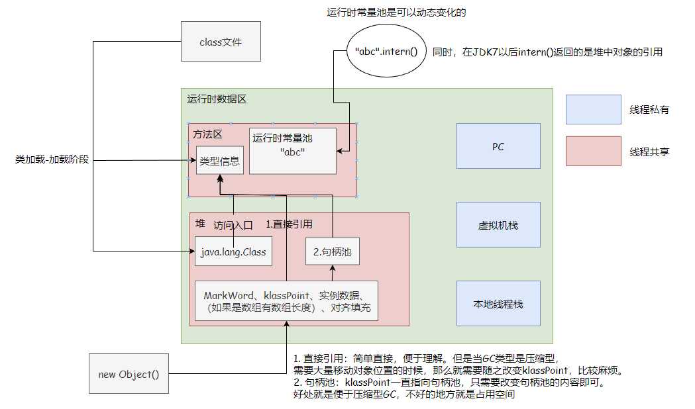

# 对象的访问

上图是我对JVM的一个总体的叙述，从中可以知道，访问对象的方法有两种：

## 直接指针
在Java栈中的reference里面指向的直接就是对象的地址。

直接指针：简单直接，便于理解，速度快，直接一步到位定位到对象。但是当GC类型是压缩型，
需要大量移动对象位置的时候，那么就需要随之改变reference，比较麻烦。

## 句柄池
在Java栈中的reference里面指向的是句柄池

句柄池：klassPoint一直指向句柄池，只需要改变句柄池的内容即可。
好处就是便于压缩型GC，不好的地方就是占用空间