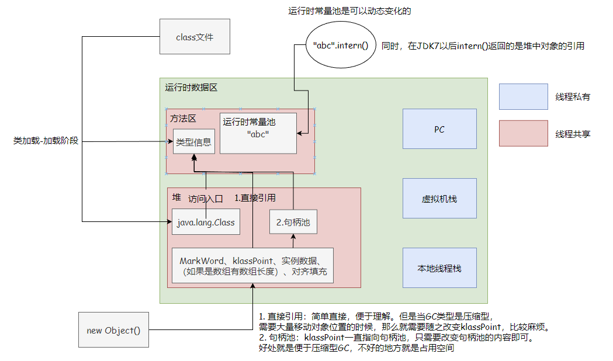

# 方法区

方法区和Java堆一样，是线程共享的内存部分。它用于存储被虚拟机加载的类型信息、常量、静态变量、即时编译后的代码缓存等。

## 静态变量
在JDK7以后就把方法区中的静态变量和字符串常量池给移出去了，在JDK8就完全废弃了永久代的概念，用元空间来代替。

其实就是把一部分的空间给圈起来，专门放一部分的东西，没必要细究。

## 垃圾回收
在方法区的回收约束比较宽松，可以选择不实现垃圾收集。这区域的垃圾回收一般是针对常量池和类型的卸载，但是这都是比较困难实现的。