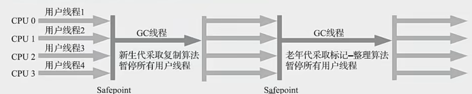
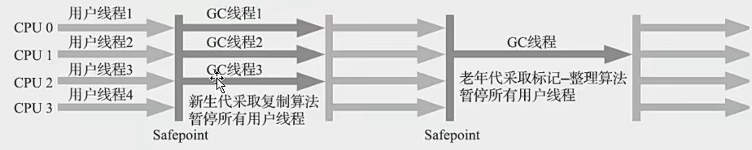

# 新生代收集器

## Serial收集器

单线程的收集器，它进行垃圾收集时必须暂停其他所有线程。

它坏处就是单线程，好处就是简单高效、专注地进行垃圾回收，是在资源有限的时候额外消耗最少的。

同时是HotSpot虚拟机在客户端模式下的默认垃圾收集器（因为我们平时的本地环境基本上都没有垃圾回收

## ParNew收集器

是Serial的多线程版本，除了多线程执行外，与Serial是没有区别的。

除了Serial收集器外，只有它能和CMS进行配合。

所以CMS只能和Serial和ParNew收集器配合

## Parallel Scavenge收集器
并行的、关注吞吐量的收集器，目的是为了是达到一个可控的吞吐量。

问题：老年代无法和CMS配合使用