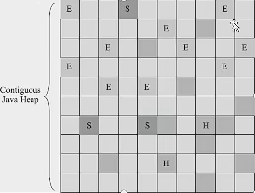

# G1收集器

里程碑式的设计，开创了面向局部收集的设计思路和基于Region的内部才能布局形式。

G1被称之为全能收集器并在JDK9之后取代Parallel Scavenge + Parallel Old组合。 而CMS沦落为不再被使用的收集器。

G1跳出了新生代（Minor GC） 老年代（Major GC、整个堆(FULL GC)。而且面向任何一个部分组成回收集合（Collection Set）简称为CSet进行回收。

衡量标准不再是属于哪个分代，而是哪块内存中存放的垃圾数量最多，回收收益就最大。这就是G1的Mixed GC模式。

## Region
G1开创了基于Region的堆内存布局。每个Region都可以根据需要被看做是Eden（E），Survivor(S), 或者是老年代空间。

还有特殊的Humongous（H）区，专门用来存储大对象。对于大小超过了一个Region的容量的一半的对象，都是放到H区中的，超过的则会放入连续的H区空间中。作为老年代的一部分来考虑。

Region是回收的最小单元，这样就每次根据需要的Region进行回收，不需要堆全部进行回收。

## 最大收益回收
G1会根据Region中的价值（回收所获得的空间大小以及回收所需要时间的经验值），优先回收收益大的Region。

## 跨Region引用

同样是用记忆集，但是复杂很多，每个Region都要用记忆集，记录下别的Region指向自己的指针。

## 并发标记阶段如何解决收集线程和用户线程不干扰

CMS用了增量更新算法（记录下黑色节点到白色节点的引用的更新，后续再重新遍历）

G1则使用原始快照算法，记录下灰色节点到白色节点的删除，后续重新遍历。

## TAMS指针
G1为每个Region设计了两个名为TAMS的指针，是为了在并发清除的时候，用户线程新创建的对象分配的位置。

同时这样的处理也就会导致 Concurrent Mode Fail。

## G1的过程

1. 初始标记：stop the world， 标记到GC ROOTS 可以标记到的对象，修改TAMS的值。
2. 并发标记：不需要，把GC ROOTS开始扫描进行标记。
3. 最终标记：stop the world，利用快照进行再次标记。
4. 筛选回收：stop the world，计算Region的回收成本，然后对Region进行回收，因为要确定Region当前的回收成本所以要stop the world

## 与CMS对比

它与标记清除算法不同，整体上是标记整理算法（因为每次垃圾收集完成后能够提供规整的可用内存），局部上从两个Region来看是标记复制算法。

G1劣势就是占用内存高（如记忆集和卡表占用大），计算负载大。

小内存应用上可能CMS表现高于G1，大内存用G1。但是JDK9以后可能还是G1更佳。

# 什么是G1垃圾回收器
G1是个跨时代的垃圾回收器，它把新生代和老年代回收的概念去掉了，变成了mixed gc。其把内存分成了同等大小的region，超过一个region的大对象会放到连续的专门的大对象 region中。

## 处理并发
原始快照来处理。同时有TAMS指针专门给一块区域来分配新对象。所以这样看来如果分配对象的速度大于垃圾回收的速度，也会出现concurrent mode fail。导致不够分配的full gc。

G1会根据region的回收价值进行一次筛选，优先进行回收价值高的region的回收。