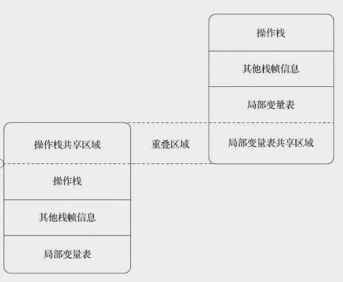

# 棧幀

从一下几部分介绍栈帧
## 栈帧的结构
栈帧是用于支持虚拟机进行方法调用和方法执行背后的数据结构

它是虚拟机栈中栈的元素，栈帧存储了方法的局部变量表，操作数栈，动态链接，方法返回地址。

每一个方法从调用到执行结束都是对应着入栈和出栈的过程。
## 局部变量表
局部变量表容量以slot为单位，已经在编译器把局部变量表的最大深度写到Code属性中，一个变量槽（slot）中就一定能存放一个boolean,byte,char,short,int,float,reference,returnAddress这些类型的数据。

而long double则会存放在连续的两个slot当中。

如果访问的是32位的数据类型的变量，索引N就是使用了第N个slot，64位的就是N和N+1两个变量槽。

如果方法不是静态方法，索引槽也是从0开始，第0个slot放的就是this。这是一个隐藏的变量。
## 操作数栈
同局部变量表一样，操作数栈的最大深度也已经写入了Code属性当中。

操作数栈是配合着指令执行，方法已经被解析成为了字节码指令，它会对操作数栈进行操作。

在大多数的虚拟机里面会进行一些优化处理，使得两个栈帧可以重用一些空间，下面栈帧的操作数栈与上面栈帧的局部变量表重叠在一起。
## 动态连接
每个栈帧都包含一个指向运行时常量池该栈帧所属方法的引用。持有这个引用是为了支持调用过程的动态链接（Dynamic Linking）。
### 静态解析
Class文件中有大量符号引用，有一部分是在类加载的时候，或者是第一次使用时候转化为直接引用，这种就叫静态解析。

### 动态连接
另一部分在每次运行期间转化为直接引用，这一部分就叫动态链接。
## 方法返回地址
一个方法返回只有两种方式：
1. 正常返回
2. 异常返回

无论哪种方式，只要方法退出，比较返回到方法最初调用的位置，程序才能正常完成。