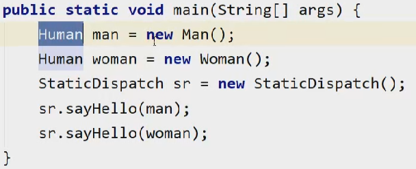
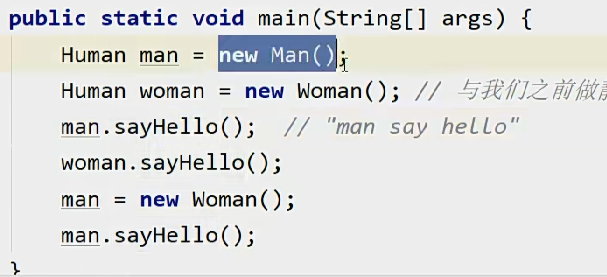

# 方法调用

## 方法调用-解析
方法调用不等同于方法中的代码被执行，方法调用的任务就是确定被调用的方法。

如果在编译的时候就可以确定（有唯一确定的要执行的版本，并且是不可变的），这是在类加载的解析阶段干的事情。

可以确定的方法（非虚方法）有：
1. 静态方法
2. 私有方法
3. 实例构造器
4. 父类方法
5. 被final修饰的方法

解析调用是一个静态的过程，编译期间就可以直接确定。
## 方法调用-分派
### 静态分派
静态分派其实也是发生在编译时期确定版本，最典型的应用就是重载。

解析和静态分派的区别：解析是在类加载阶段将符号引用转化为直接引用，静态分配则是在类加载期间确定版本，而运行时才真正转化为直接引用。

在这个例子中，Human属于静态类型（外观类型），new Man(), new Woman()属于运行时类型（实际类型）  

对于方法的重载，判断时使用的是外观类型，所以才能够在类加载时期就能够判断。

静态分配的方法选取并不是绝对正确，只是一个相对合适的版本。

就比如一个char类型的参数，他可以适配char、int、long等类型的参数的方法。
### 动态分派
动态分派与重写、多态有着密切的联系。

重写是属于动态分派，要根据实际类型去判断。
调用方法是invokevirtual
