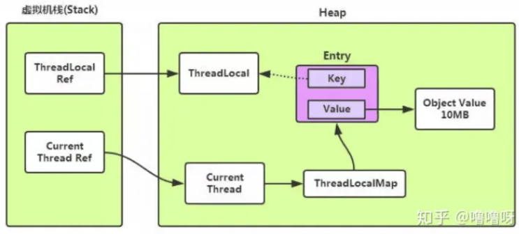

# threadlocal

## 什么是threadlocal
在每个线程中保存了一个threadlocalmap，threadlocal则是作为map里的key。用此来做到线程隔离的数据存取。

## 内存泄露问题
为什么会内存泄露呢？

是由于当ThreadLocal外部的强引用失去了以后，ThreadLoacl必然会被回收（因为key的引用是弱引用，到下次GC就会被回收）。此时就会出现key为null value不变的Entry。

发生内存泄露是当此时线程没有被销毁，但又新创建了threadlocal对象，但是又没有调用get/set方法。此时就可能会发生内存泄露，不被需要的Value一直没有被销毁。

## threadlocal内部的努力
当执行set和get方法的时候，都会对null的key进行探测，将这些key对应的Entry给清空。

## 弱引用的作用
如果此时key是强引用，threadlocalmap的entry继承了弱引用，它使得指向key的引用是弱引用，threadlocal就无法被GC给回收了。

## 怎么解决
解决的话就是记得调用threadlocal.remove()，将其清空。