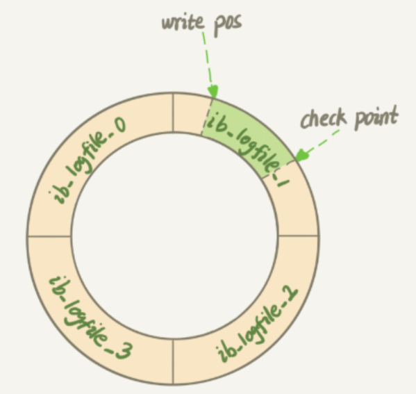
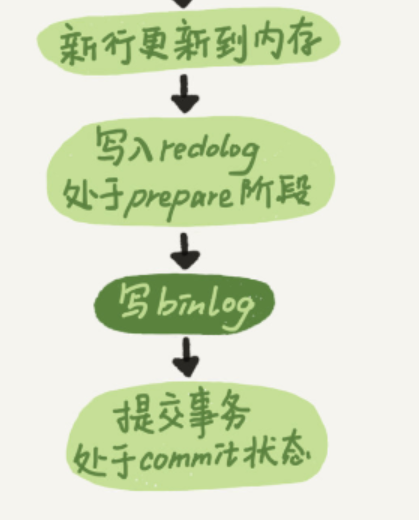

# Day2-日志系统：一条SQL更新语句是如何执行的

> 客栈老板在营业的时候，不一定都是立刻记在账本上，而是会记在脑子里。他会选择定时往账本上记录，或者当自己记不住的时候往账本上记录，以这样的方式去保证记账正确。

## 从redo log和binlog开始了解Innodb日志系统

我习惯性的在深入了解一个东西的时候知道为什么需要它，或者说它提供了什么。

redo log：在执行引擎级别记录了执行的语句。

binlog：在Mysql服务端级别记录了执行语句。

## 一条SQL更新语句的执行

先不急着去了解redo log和binlog的具体区别。去看看他们是怎么记录更新的语句。

由于Mysql的存储是基于磁盘的，所以执行的语句是需要更新到磁盘中去。可是更新磁盘就代表着IO操作，这些操作往往是不希望立刻执行。为了优化这个过程，就需要日志，日志去确保数据不会丢失，保证持久性。

于是乎一个叫write ahead log（WAL）的概念出现了。

### WAL

WAL的思想给许许多多的系统的效率提供了很大的提升。具体的就是，在写入之前先记日志，优化的核心就在于随机IO的消除。如果没有WAL，我们刷新的时候要在众多页里面去找到要刷新的页，这时候就会产生许多的随机IO，而这样连续写的日志则可以很大程度的优化。

## 细说redo log

redo log可以抽象成当客栈老板的大脑，他会记住当前消费的客人的账本。

具体而言他是一个1G4组的总共4G循环写的文件，如下：

从图中可以看到write pos和check point， 一个记录着已经写到的位置，一个记录着更新完的位置，所以这两个之间就是还可以写入的位置，当write pos追上了check point那就说明需要刷回一些脏页了，重新提出一些空间。

一句话总结，redo log以最终物理写入形式记录了更新语句的执行，并等待刷新回磁盘

### 什么时候会将redo log写入磁盘

1. 事务的提交
2. redo log不够用了，触发了checkpoint
3. 每一秒master thread会对其进行刷新

## binlog

之前听过一个面试题；有了redo log为什么还需要binlog？

我觉得这应该还是和他们两的来源和具体功能来谈：
- binlog是Server级别，也就是Mysql提供的，而redo log是Innodb存储引擎级别。他们本身就不在一个层面。
- binlog从前面也得知是循环写的，所以它完成不了整个数据库的备份，这个职责就是binlog在担当。
- 同时，redo log最重要的能力就是crash-safe，也可以说是保障持久性。这是binlog不具备的能力。

换句话说，redo log作为客栈老板的“脑子”是用来做crash-safe的，binlog存储了全部的资源，是用来做数据备份的。

### binlog的日志参数

binlog的初始大小为1G，写不下后会后续创建一个1G的文件继续写入，同样的binlog自身也带有缓存。

比较有意思的一些参数：

- sync_binlog：每写入多少缓存就写入磁盘，如果为1的话，binlog缓存就无意义了。
- binlog_cache_size：大小超过多少就写入磁盘，
  - binlog_cache_use：使用cache
  - binlog_cache_disk_use：使用磁盘，
如果发现disk_use很多，那毫无疑问要调整binlog_cache_size了
- binlog-format:这是一个很重要的参数啦，这决定着binlog将以哪种方式写入;
  - STATEMENT就是正常的语句
  - ROW就是原本的样子
  - MIXED默认使用STATEMENT,有需要就使用ROW格式
说的也是当使用了一些不确定的函数或者什么的导致STATEMENT每次读取出来的值可能不一样

binlog-format后续还会和其他的一些参数交互，因为用statement可能会导致一些使用到表达式的sql出现问题，例如自增长锁的获取的模式和binlog-format就相关。

## 两阶段提交

好了，我们有了两种很方便的日志，可是现在有一个问题，他们的维护不是那么简单，两个日志的写入并不是原子性的，所以可能会出现一个日志写入另一个却没有的情况，而这肯定是不允许的，我们是要保障日志所在的是同一个版本。所以有了一种技术叫两阶段提交。

### 为什么需要两阶段提交

我遇到这样的问题，我一般喜欢反推。比如如果不进行两阶段提交会发生什么：
1. 先提交binlog，再提交redolog，此时binlog提交上去了，redolog没有提交上去。那么数据库恢复的时候，并不会恢复崩溃前的场景，但是binlog却写入了，这时候就出现了差池。
2. 先提交redolog，后提交binlog。崩溃后恢复redolog，恢复到崩溃前，但是binlog没有写进去，此时有人来备份那就出问题咯。

### 怎么使用两阶段提交

1. 当检查redo log处于prepare阶段，再检查binlog写入成功，那么这次就算写入成功了。
2. 当检查redo log不处于prepare状态，那无事发生。
3. 当检查redo log处于prepare状态，binlog却没有写入，此时就发生差池，这次的redo log不能恢复。
4. 当检查redo log处于commit状态，这太稳健了，肯定能够保证日志已经写入完成。

## 总结

Mysql的日志当然不仅仅是binlog和redo log，我们只是开始窥探其一二，后续慢慢深入。
