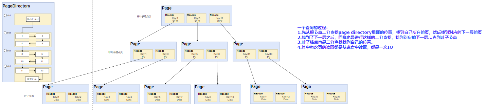

# 05-蛐蛐索引（下）
> 这章开始介绍以二级索引出现而产生的覆盖索引、回表、联合索引的概念。





## 二级索引/非聚簇索引

二级索引是概念是基于聚簇索引之外的普通索引，它的特点是只存储主键和二级索引的数据，并基于二级索引内容、主键进行排序的B+树结构。

## 回表
回表的意思就是，当你where key1 = xx,利用key1这个二级索引找到了对于的行，但是你select key1, key2的时候，索引里面并没有存储key2的信息，所以你需要拿到这条数据对于的主键id，去聚簇索引里面查找对应的内容。这个过程就叫做<mark>回表</mark>

## 覆盖索引
这样的回表其实是效率很低的，因为他要进行多次的IO，内存和磁盘之间的信息交换是真的慢，所以如果在情况允许的时候，我们会选择另一种方式，覆盖索引

### 什么是覆盖索引
试想，如果我们的二级索引里面有着key1和key2,那么我们查询的时候，已经获取到了所有的信息，就不再需要再去聚簇索引里面找了，这样一来效率就高了很多。所以有些时候添加一些信息到索引里面，让我们能够实现覆盖索引这也是性能的优化。

那么这种一个索引里面添加多个信息的方式就叫做联合索引

## 联合索引
简单来说，联合索引以多个列的信息作为索引。复杂点说就是B+树在compare比较大小的时候按照联合索引的这些信息按序进行对比。这也对应着一个最左匹配原则

### 最左匹配原则
不知道第一个提出这个原则的人是谁，取了一个好听的名字。这在底层其实就是B+树在比较两个数据的大小的时候，是按索引列进行的，单个索引好说，多个索引则就按index(key1, key2)，先比较key1，如果key1相等就比较key2这样的方式去构建B+树，如此一来就说成了我们的最左匹配原则。

### 最左匹配原则失效
那就更简单了，比如你建立了(key1, key2)这样的索引，你当然不能在通过这个索引去按key2去索引咯，因为在B+树的底层叶子节点key2基本是无序的，当然会索引失效。

## 简单聊Mysql的几个优化

### 重建索引
接着上一章聊下去，我们知道了如果乱序插入会导致页分裂，当我们数据乱成一锅粥的时候，这时候页利用率会比较低，我们进行索引的重建，让数据按序再插入一遍，这时候就不会有页分裂的情况，利用率增加。

### ICP (Index Condition Pushdown)索引下推
这个优化就关乎于联合索引，当我们在有index(key1,key2)的表t里操作如下语句
```sql
select key1, key2 from t where key1 like %a and key2 = 2;
```
我们知道，当使用%a这样的语句的时候，联合索引是使用不上的，在之前的操作，是会取出%a找到的数据，回表到聚簇索引去对比key2的值。

在Mysql5.6以后进行了这样的优化，是在二级索引找到%a的同时对比key2的值，这样就不会进行回表了。

### MRR (Multi range read)
MRR的优化是基于随机IO读的优化，还记得在用redo log这种WAL思想的时候利用的是随机IO写的优化，看来IO在Mysql里的影响还是很大的。

#### 什么是MRR
当我们二级索引找到了需要回表到聚簇索引的id的时候，正常来说是要一个个对比，这时候我们知道id是乱序的，然后不同id可能是处于不同页，甚至是不同区、段，那么势必会有随机IO写。

所以这时候MRR优化出现了，MRR是在回表前，把这些需要找到的id给排序一下，这样可以最大可能的去减少随机IO的出现。

### FIC 快速索引

首先快速索引是只针对于辅助索引的。
在Mysql5.5之前的时候，是通过新建一个索引，再替换给旧的索引这样的操作去替换。

在Mysql5.5之后的版本，新建索引的时候是会通过给这个表一个S锁，这样的意思就是之后只允许读操作了，所有的写操作都会被阻塞。删除索引的时候则是把索引所在空间设置为可用，然后删除内部对索引的定义

## 索引选择问题
索引的选择也是有学问的，毕竟维护一个索引也不是那么简单的事情，没必要做一些没必要的浪费。

### Cardinality
这是来判断不重复记录的一个预估值。要知道如果一个索引里面全都是同样的数据，那根本毫无意义，还是要一个个的去进行提取对比。

具体操作逻辑：
1. 取八个叶子节点的页数据
2. 计算每个页不同的记录的值为Pi
3. 一共有多少个叶子节点A
4. 预估值就等于A * (P1+P2+P3...+P8) / 8

如果这个值越大，就说明不重复的记录数预估会更多，那么就更适合当索引。

## 总结
好了，到目前为止，我们由浅入深，从二级索引聊到回表、覆盖索引、联合索引、最左匹配原则、基于索引的一些优化。到现在我们对索引已经有了一个很清晰的认识了。市面上的面试题看起来已经难不倒我们了。下一章我将单独一节补充说明索引选择问题和索引失效的场景。