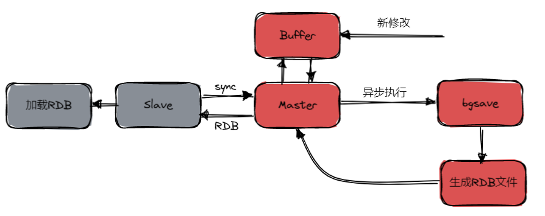
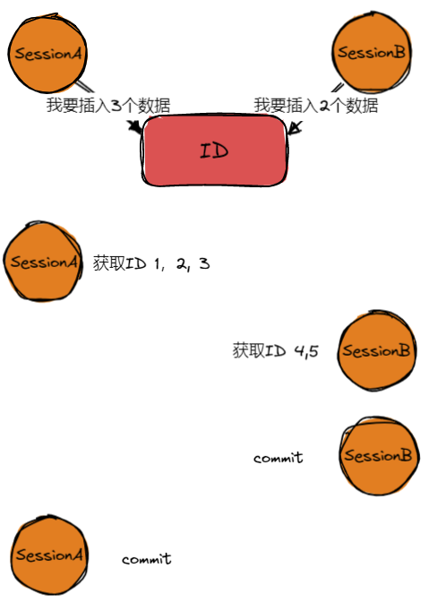

# 全局锁、表级锁

让我们从全局锁、表级锁开始，一步步领略Mysql中的锁机制

## 从备份场景说起
当我们需要备份的时候，肯定是不希望此时有新的东西再写入了，聊聊redis的策略。

### redis的策略
当slave节点向master节点发送SYNC指令的时候，master会非阻塞的执行bgsave命令，此时如果有新的内容写的话，会被写入缓冲区。然后bgsave结束以后会把生成的rdb文件发送给slave进行加载。最后将缓冲区中的内容读进来。

我这里联想到了快照读，在mysql里不也是如此？当你需要备份的时候，如果有RR有MVCC的加持，可以在事务开启的时候读一份快照当成事务中使用的版本，那么在这个事务中进行备份，其实就和redis的处理是差不多的了。

### 全局锁
Flush tables with read lock ，听名字就知道就是用完大家只能读啦~

那么在Mysql中可能会有种情况，我没有MVCC。这就尴尬了，那么当你需要备份的时候，如MyISAM这样的存储引擎可能就要使用到全局锁了。

当然使用全局锁听起来就很重量级，因为只要是使用全局锁以后，这个表就只能读不能再写入了。

## 表级锁

表级锁我们讲谈及意向锁、表锁、元数据锁、自增锁，前置知识是，数据库里面是有独占锁IX，共享锁SX的说法，并有update set id = 1 + 1 where id = 1这种所谓的乐观锁的隐式锁。

### 从表锁开始聊起
其实表锁也很重量级，我也没有用过，它的主要使用对象还是那些不支持行锁的如MyISAM引擎的用户名。

用法： lock tables … read/write。
同样，他也是用unlock tables进行解锁

### 元数据锁MDL
元数据锁其实可以理解为对表结构的锁，当我们对数据进行读写的时候，如果有结构上的变更其实是不容许的。

在Mysql5.5.之后，你的所有增删改查DML操作都会自动上MDL读锁，而对结构的DDL都会上写锁，这样一来，读锁之间是不互斥的，你可以正常进行增删改查，而当要进行DDL的时候上了写锁自然就阻塞住了增删改查操作。

#### 元数据锁的优化ONLINE DDL
仔细想想，DDL操作真正费时间的操作都是在更新表结构上了，那么把这几部分拆分开来是不是DDL并不需要占住长时间的MDL写锁呢？
ONLINE DDL：
1. 获取MDL写锁
2. 降级为MDL读锁
3. 进行DDL操作
4. 获取MDL写锁
5. 进行DDL操作提交
6. 释放MDL写锁

那么这样的过程就保证了两件事：

1.本次DDL操作正常执行且不会影响DML操作
2.其他DDL操作会被阻塞

#### 元数据锁使用的小问题
元数据锁的释放是在事务提交之后的，所以稍有不慎就会在长事务中出现一些问题。

如上所示，当CRUD的DML操作会上MDL的读锁，但是此时它没有提交并不会释放锁，所以当要对表结构进行修改的时候，之后的增删改查操作全都会被阻塞掉了。

### 意向锁
意向锁的出现我觉得是用来解决一个场景的：全表扫描

试想我们当前事务需要进行全表扫描，但是其他事务可能正在对表内数据进行update或者delete，insert,我们总不能一个个去检查。所以有了意向锁这个概念。

意向锁同样有IX锁和IS锁的区别，我们的更改操作会被默认上IS锁，所以当要进行全表扫描的时候要获取IX锁，这时候就会被IS锁给阻塞住了，哦原来表内有人在改数据，我等等再说，就不用一个个去扫描检查了。
### 自增长锁
自增锁是在要自增索引的时候使用的策略。
#### 如果多个事务同时要获取一个自增索引该怎么办？
我第一个想法就是挨个获取，换句话说就是上锁。可是该上什么程度的锁，该给谁上锁，这又是有说法的了。

#### 给执行语句上锁
也就是所有的插入语句之间是互斥的，一个插入执行完，另一个插入才能进行，这样子的自增长锁。

#### 互斥获取自增id
插入的时候自增长的只是id，那么我们就可以不管具体的插入顺序，互斥的拿到id，这样就能保证不会有重复id、自增长地获取。

<mark>这其实就是自增长锁的使用的两个模式</mark>

#### innodb_autoinc_lock_mode

1. mode = 0，默认使用autoinc_lock也就是执行语句级别的锁
2. mode = 1，混合模式，simple insert的时候使用mode2,bulk insert的时候使用mode0
3. mode = 2，互斥获取自增长id

#### 会出现什么问题呢？
我们应该回想起之前聊到了的binlog，binlog有个参数叫binlog_format，它有statement和row,mixed三种参数。而使用statement的时候与innodb_autoinc_lock_mode=2配合就会出现一个问题，具体如下：

那么当出现以上场景的时候，binlog里面先记录的是SessionB插入的数据，如果是statement语句，它并不会记住实际上的id。那么最终记录到的binlog中id对应的记录就和redolog中是不一样的了，这种情况是完全接受不了的。
