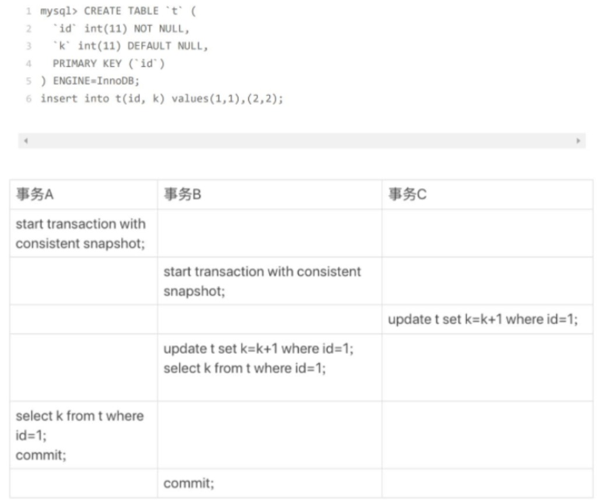
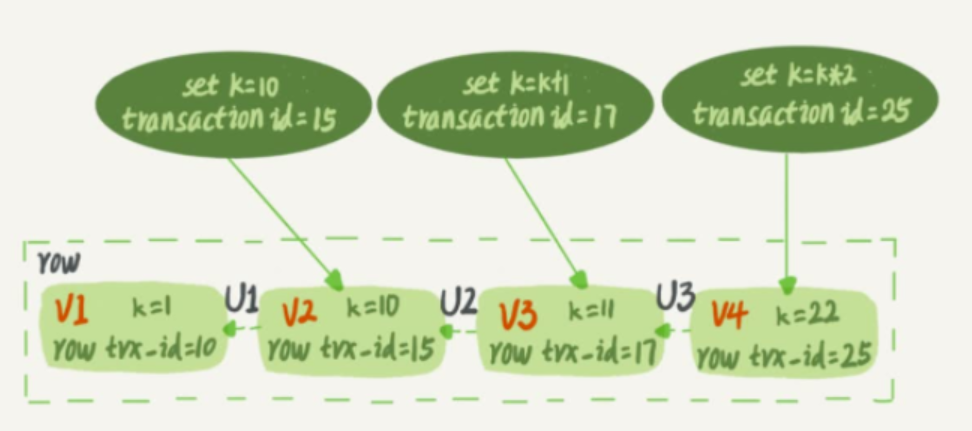
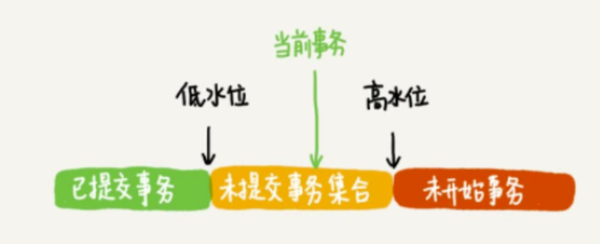
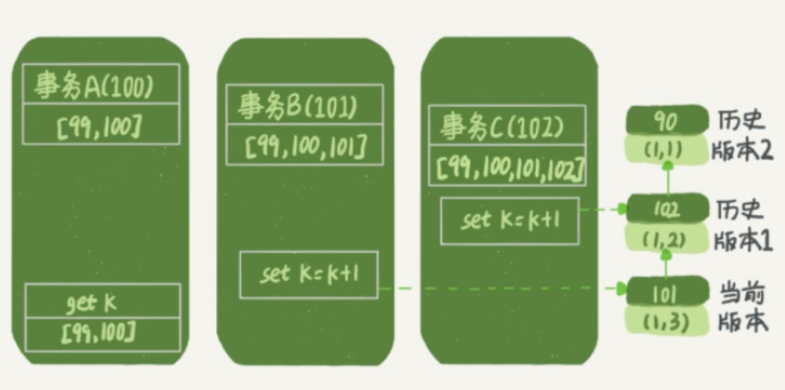
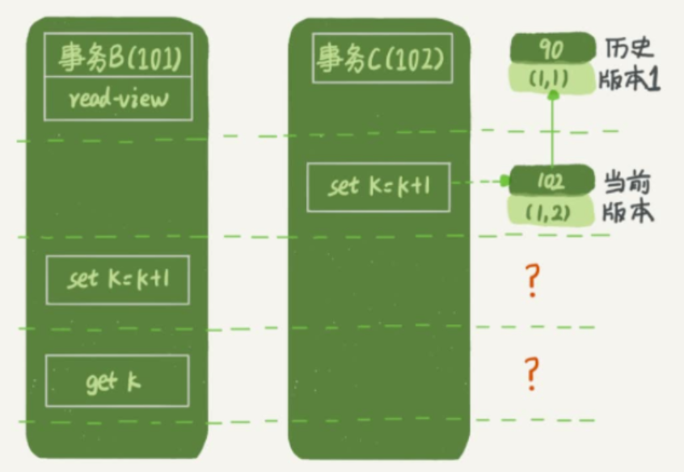
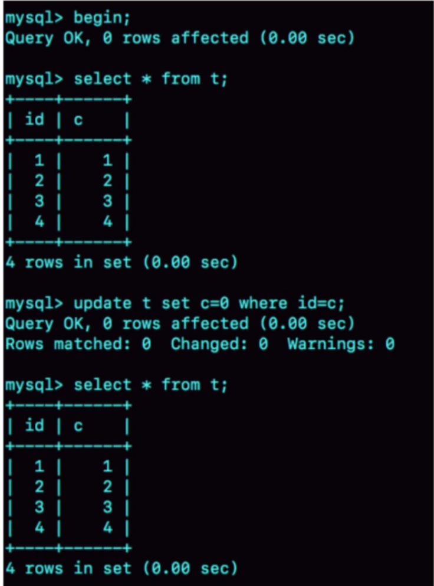

# 事务隔离精讲

> 这节主要是讲事务隔离级别是怎么实现、当前读和快照读是如何一起工作的。

## 让我们从一个案例出发吧
首先注意start transaction with consistent snapshot和BEGIN的区别。BEGIN命令并不会生成快照，而是当第一次快照读的时候才会生成快照，而前者则是命令伊始就生成快照。

我们假设k = 1，隔离级别为RR，我们来看看各个事务的结果吧
### 事务C的结果
由于没有声明事务，我们默认这个语句自动提交了，它就是正常更新语句。
### 事务A的结果
由于事务隔离级别为RR，我们读取的是事务开始时的快照，那么它读到的必然是k = 1
### 事务B的结果
事务B的结果，我最开始也没想到，它居然是3！
首先，它进行了update语句，那么我们知道update是当前读，修改的过程是先读再改，由于事务C已经提交了那么它读到的k是2，执行完之后的k就是3.如此一来可以知道他已经把k的值改成3了。
### 为什么B最后能读到3
如果按我们MVCC的逻辑，它快照读肯定是读的最开始的快照，那不就是1吗？为什么呢？我们要从快照读的背后开始聊起了。

## 快照读的背后
我们知道，依托于undo log，存放了历史版本的快照，这也是快照读的源头，那么我们怎么知道哪个版本的快照是我们找的那个版本呢。

### 怎么找到属于我们版本的快照
Innodb里面每个事务都会给他分配一个严格自增的事务id，记作transaction_id.每一行数据都有多个版本，而这个版本的控制就是依赖于事务id，一个事务对一行进行了修改的话就会把transaction_id赋给row trx_id。这样一来，就有了些眉头了，我们可以通过事务id与数据行的 trx_id进行对比。在此之前，看看undo log是怎么维护快照的。

如图，我们每个事务的修改，会记录成一条undo log（代表着一条实际并不存在的对应事务id的行记录），想要获得之前版本的快照，我们不会存实际的数字，而是通过undo log的逆推获得。

### 如何找到该读的快照

上图代表着Innodb下事务所处的状态。而对于每一个创建的事务来说，Innodb都会给他维护一个目前正在活跃的事务数组，数组中的最小事务id为低水位，当前事务的后一个id为高水位。
1. 当前事务之后的事务，我们不可能见得到
2. 当前事务之前未提交（也就是仍在活跃的事务），我们不可能见到
3. 当前事务之前已提交的事务，以及自身提交的事务，是我们可见的。

我们找到事务的原则基本如上所述，而具体实现就是靠的这个维护着的目前正在活跃的事务的数组，只要我们找到的快照的事务id属于这个数组，那么很明显我们不能读到它了。

### 具体的版本控制流程

#### A事务为什么读的是1

如上图，A事务创建之前有一个仍然活跃着的99事务，A事务为100，B事务为101，C事务为102。
1. 当C事务修改之后，生成了一个快照，trx_id为102。
2. 当B事务去修改的时候，也生成了一个快照，trx_id为101，102这个版本就变成了历史版本
3. A事务去读的时候，先读了101这个版本，发现比自己的事务ID更大，不可能见得到，下一条。发现还是比自己的事务ID更大，下一条。90发现不在还活跃的事务ID数组里，并且小于低水位，绝对可读。

#### B事务为什么读的是3

此时B事务的读历史版本的过程会怎么样呢？它首先读到的是自己更新的版本，于是乎就直接读取了，整个过程并没有什么特别的。

那么我突然想到个问题，如果事务C还没提交事务，那岂不是事务B已经读到了还没提交的数据？
说完我就笑出声了，因为刚刚讲的行锁又被忽略掉了，由于使用的是两阶段锁，只有事务提交之后才会释放锁，那么事务C不释放锁，事务B根本都改不了。

写到这我就发现，整个章节已经串联起来了，锁和MVCC的配合也显得比较完整。所谓RC和RR的区别也就是，一个允许读到当前已提交的所有事务，一个只允许读到事务开始前已提交的所有事务。

## 一个案例

为什么会出现这种情况？

一开始我也很纳闷，后来想了想，肯定是有人在update语句之前把c的值进行了修改并提交了修改。update由于是当前读，所以先读后写发现此时没有id=c的行，所以没有一行复合，他也没有留下新的快照。也正是基于此，再次去读的话还是读到了事务开始的那一版快照。

## 总结
经过些许案例分析，我大致明白了Innodb下的读写分析，RC,RR情况下读依赖MVCC给他提供支持，写通过锁给他提供支持，而MVCC的核心正是undo log提供的多版本的快照，通过事务id去判别自己该读的版本。