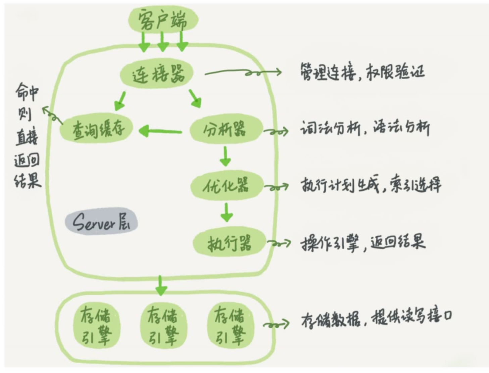

<!-- more -->
<section id="nice" data-tool="mdnice编辑器" data-website="https://www.mdnice.com" style="font-size: 16px; color: black; padding: 0 10px; line-height: 1.6; word-spacing: 0px; letter-spacing: 0px; word-break: break-word; word-wrap: break-word; text-align: left; font-family: Optima-Regular, Optima, PingFangSC-light, PingFangTC-light, 'PingFang SC', Cambria, Cochin, Georgia, Times, 'Times New Roman', serif;"><h1 data-tool="mdnice编辑器" style="margin-top: 30px; margin-bottom: 15px; padding: 0px; font-weight: bold; color: black; font-size: 24px;">第一章《一条查询语句是怎么运行的》</h1>
<h2 data-tool="mdnice编辑器" style="margin-top: 30px; margin-bottom: 15px; padding: 0px; font-weight: bold; color: black; border-bottom: 2px solid rgb(239, 112, 96); font-size: 1.3em;">Mysql内部是怎么运行的 </h2>
<figure data-tool="mdnice编辑器" style="margin: 0; margin-top: 10px; margin-bottom: 10px; display: flex; flex-direction: column; justify-content: center; align-items: center;"></figure>

这一章的重点就是这一张图，我们从一个外层使用者的角度来窥探一下Mysql的内幕。

<h3 data-tool="mdnice编辑器" style="margin-top: 30px; margin-bottom: 15px; padding: 0px; font-weight: bold; color: black; font-size: 20px;">连接器</h3>

首先，我们知道不同系统之间的通信，就离不开网络，所以一定要有一个Server端去处理这些网络请求。在这里Mysql去客户端沟通的就是连接器。

看到这个我不由的想起来了在Api网关中负责网络处理部分的Netty服务的，它同样也是做了管理HTTP请求、权限验证这样的功能。在这里我可以认为他就是Mysql这个系统的网关。

<h3 data-tool="mdnice编辑器" style="margin-top: 30px; margin-bottom: 15px; padding: 0px; font-weight: bold; color: black; font-size: 20px;">查询缓存</h3>

查询缓存，我看过很多教程，他们都将它称之为“鸡肋”；食之无味弃之可惜。为什么呢？

因为当一个表进行了一次修改了以后，它表内所有的缓存都将被清理掉。可以说可能查询缓存带来的便利还不及我们花费的维护它的付出。所以顺理成章地在Mysql8.0以后查询缓存就不复存在。

<h3 data-tool="mdnice编辑器" style="margin-top: 30px; margin-bottom: 15px; padding: 0px; font-weight: bold; color: black; font-size: 20px;">分析器</h3>

要知道，我们写出来的SQL并不是它最终的样子，比如我们可能有很多的符号啊变量啊，要把它分析成它真正的样子，比如字符串id它其实是某一列id，赋予他真正的含义。同时在这个过程中，会进行判错，如果这一个字符串在我们的表中没有，或者我们的sql语义不对，他就会进行报错。

这里我很快联想到了JVM的类加载阶段的连接阶段中的解析，同样也是需要把符号引用转为直接引用，这里也是同理，把代表着某列的字符串转为真实的某列。

<h3 data-tool="mdnice编辑器" style="margin-top: 30px; margin-bottom: 15px; padding: 0px; font-weight: bold; color: black; font-size: 20px;">优化器</h3>

我们写的SQL语句，它最终将如何执行这是不确定的，优化器就是来判断着去找一条它认为最优的方案，具体为我要使用什么哪个索引，我join的时候哪个表要作为驱动表，诸如此类。

但是有些时候优化器的判断也会出错，它并不一定能给我们最优解。所以我们有时仍需要自主设置索引force index().

<h3 data-tool="mdnice编辑器" style="margin-top: 30px; margin-bottom: 15px; padding: 0px; font-weight: bold; color: black; font-size: 20px;">执行器</h3>

分析器告诉了执行器需要做的事，优化器告诉了执行器该怎么去做，那执行器当仁不让，去做自己要做的事了。

另外在做之前还要判断一下，我能不能有进行这个操作的权限。

<h3 data-tool="mdnice编辑器" style="margin-top: 30px; margin-bottom: 15px; padding: 0px; font-weight: bold; color: black; font-size: 20px;">存储引擎</h3>

存储引擎是可插拔的，例如Memory，Innodb。当然我们常用的就是Innodb，他是以B+树为索引，用页的方式去存储数据。

同时这也意味着，Mysql服务端提供的操作和存储引擎是相互隔离的。

<h2 data-tool="mdnice编辑器" style="margin-top: 30px; margin-bottom: 15px; padding: 0px; font-weight: bold; color: black; border-bottom: 2px solid rgb(239, 112, 96); font-size: 1.3em;">总结 </h2>

第一章从Mysql全局出发，了解了我们写的一条sql语句，它在mysql中会经历什么。

</section>