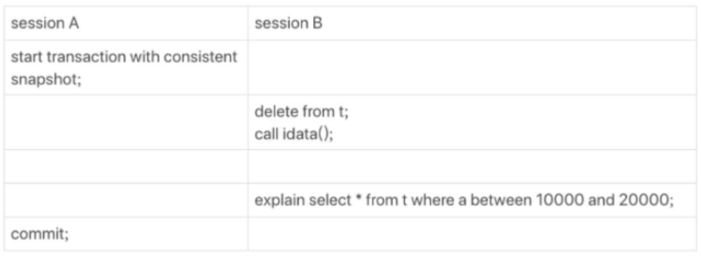

# 为什么会选错索引

回想一下一条sql语句的执行过程，sql分析完之后需要通过优化器去决定使用的索引等。那么Mysql是如何确定使用什么索引，它会不会出错呢？

## 从一个案例开始
```sql
CREATE TABLE `t` (
`id` int(11) NOT NULL,
`a` int(11) DEFAULT NULL,
`b` int(11) DEFAULT NULL,
PRIMARY KEY (`id`),
KEY `a` (`a`),
KEY `b` (`b`)
) ENGINE=InnoDB

delimiter ;;
create procedure idata()
begin
declare i int;
set i=1;
while(i<=100000)do
insert into t values(i, i, i);
set i=i+1;
end while;
end;;
delimiter ;
call idata()
```



看上述这个案例，当我们执行的时候，会发生什么呢
```sql
select * from t where a between 10000 and 20000
```

### 单纯的执行这条语句
那他结果会是使用a索引然后找到这些id进行回表然后返回结果。

### 如图中的场景
很不幸的事情是，它会使用全表扫描而不会使用索引a，原因就是它判断出全表扫描要扫100000行数据，而使用索引要扫37000+行，同时使用索引还要回表，优化器认为这种方式性能更差，所以没有选用索引。
那么其实事实上，表中真实只有10001行数据，那为什么会出现这种情况呢？

我们先了解一下，Mysql是怎么计算出rows这个参数。

## Cardinality
这个值也是基数，是用来表示一个索引稀疏程度的值，那么它的背后代表了一种统计方式。

我们不可能每次都全表扫描看会影响多少行，那么就要使用预估的方式，也就是一个采样的方式，用少数样本去估计全部样本，这像是在产品质检时的抽查一样。
具体来说，Innodb在此有 innodb_stats_persistent这个参数。

1.  innodb_stats_persistent为on，那么N为20，M为10
2.  innodb_stats_persistent为iff，那么N为8，M为16

看完参数我们来看看策略：
1. 先抽取N个数据页，看看这N个数据页的平均基数（有多少个不同的数）
2. 再乘以所有的页的数量，就可以得到预估值了
3. 当改变的行的次数超过了1 / M，那么就会进行一次重新计算

## 索引选择异常和处理

从上面来看，我们其实可以发现，Mysql其实也是估计一下，当出现一些极端条件的时候，他也是会犯错的，那么它的错误不该带到生产环境中，我们要对此进行应对。

### force index
强制性的去选择一个我们认为对的索引，但是这样可能会觉得不优美，或者在数据迁移到其他数据库的时候会出现问题。

### 修改使用索引的方式
文中举了一个例子是，想办法拒绝让他使用它觉得更合适的索引，但我觉得这样可能太复杂了，实际也运用不到。

### 优化索引
当Mysql如果经常性的选用一个不对的索引，那么要考虑一下是不是要对表中是索引进行一个重新选择，没准把多余的索引进行删除就可以解决问题了。

## 总结
Mysql的优化器也不是神，没办法做到所有的判断都是正确的，不过它在大多数情况下还是发挥比较稳定的。所以我们需要对他选用索引的方式有所了解，在他犯错的时候给他纠正一下。