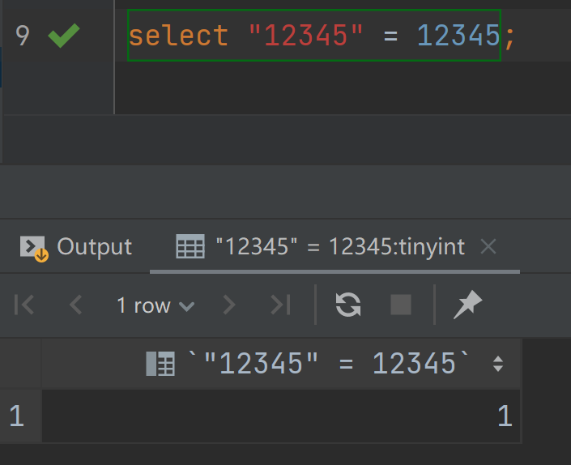
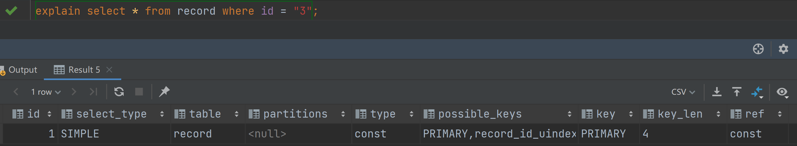

# 索引失效案例
这一章由使用函数引起的索引失效谈及一下索引失效的各种情况吧。

## 索引失效
1. 联合索引不符合最左原则
2. like模糊查找，%ab
3. 多个列一起范围查找，只有对索引最左边的列范围查找的时候才能用上索引
4. 精确匹配+模糊匹配+模糊匹配，第二次模糊匹配失效
5. 索引可以用来order by排序，联合索引的顺序必须和order by的顺序一致，不然索引失效
6. 对于多个列升序和降序不能混用
7. where语句中用了非索引列再进行排序，索引失效、
8. 使用了复杂的表达式，索引失效
9. groupby和order一意思，要和联合索引的顺序一致，否则索引失效

### 失败案例s
如下图所示, 当有此情况的时候，前面的列会被认定为数字

但是，如果是这样的情况，则是后面的值会转化为数字，不会导致索引失效。

在string和int对比的时候，会倾向把string转int。

同时，在使用函数、进行列的加减操作的时候，都会导致索引的失效。
## 如何挑选索引
1. 只为用于搜索、排列、分组的列索引 （where，order by，group by
2. 考虑列的基数（Cardinality），如果所有的数都一样，那索引就没意义了，会变成全表扫描，所以尽量选列的基数大的列
3. 索引列的类型尽量小，类型越小，占用空间越小，读取的性能消耗越小。
4. 只用字符串的前几个字符作为索引，比如name(10)
5. 让索引在比较中单独出现，用了表达式或者其他的就会索引失效
6. 数据插入的最理想的情况是从大到小依次插入，这样可以比较好处理页面分裂。所以最好使用AUTO_INCREMENT, 让存储引擎自己生成主键，而不是主动插入
7. 索引是需要维护成本的，所以要尽量杜绝冗余索引