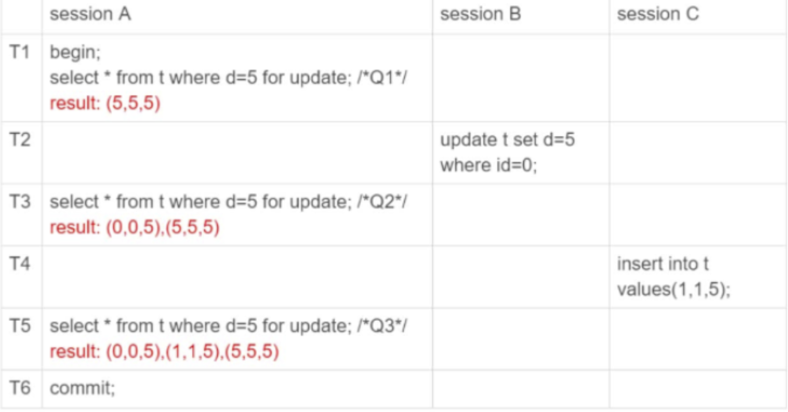
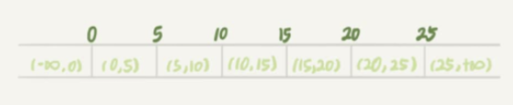
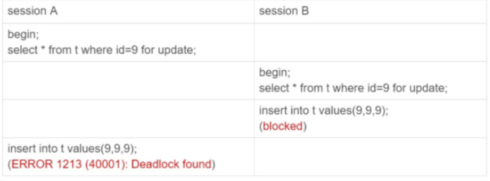

# 幻读

先引入之前提过的一个场景，如果此时行锁失效了，也就是没有命中索引，要进行全表扫描了，那么它会怎么进行加锁。

```sql
CREATE TABLE `t` (
`
id` int(11) NOT NULL,
`
c` int(11) DEFAULT NULL,
`
d` int(11) DEFAULT NULL,
PRIMARY KEY (`id`
)
,
KEY `c` (`c`)
) ENGINE=InnoDB;

insert into t values(0,0,0),(5,5,5),
(10,10,10),(15,15,15),(20,20,20),(25,25,25);
```

```sql
begin;
select * from t where d=5 for update;
commit;
```
此时d是没有索引的，那么它就会走聚簇索引的全表扫描。

## 如果只给id为5的这行上锁
这一听就肯定不行，就会出现只要有新增加的d=5的数据，都会被感知到。

那么这就产生了幻读的情况，多次查询，查询出来的数据个数居然不一样了，就像是我眼花了一样。

## 什么是幻读
1. 幻读指的是一个事务在前后两次查询同一个范围时，后一次查询看到了前一次查询没有查询到的行。
2. 幻读在可重复读查询级别下，如果是快照读，是不会发生的幻读这种情况的。
3. 幻读仅仅指的是新插入的行。如sessionB中对其进行的修改，是不被认定为幻读的，我们一般称之为不可重复读。

## 幻读有什么问题

### 语义问题
我们已经声明了锁把d=5的行锁住，但是实际上却没有这样做，那肯定是不允许的，这破坏了锁的语义。

### 一致性问题
一致性的问题不仅仅是数据状态的一致性，同样的也是日志的一致性，那么我们知道，innodb里面日志的真实写入是随着事务的提交的，那么运行这样的破坏锁语义的修改，可能就会导致日志文件和实际操作的文件是不一致的。这也是为什么RR事务隔离级别的时候需要两阶段锁，在事务提交的时候才释放锁。

## 把所有记录都上锁
这可以解决update的问题，但是同样无法解决插入的问题。那么为了应付插入的问题，就有了间隙锁，它是专门和插入语句互斥的锁。

### 用间隙锁解决幻读
现在我们6个数据产生出来了7个间隙，我们不仅给每个记录加上了record lock 给这些间隙中也加上锁gap lock了。


### gap lock注意事项
gap lock是只和插入数据这个动作互斥，它们互相之间并不互斥，也就是说每个事务可以自主地获取或释放gap lock。

### gap lock导致死锁
同样的，因为间隙锁之间是不互斥的，那么如果此时两个事务都获取到了相同的间隙锁，但是没有释放，那么可能会产生死锁。具体如下：


## 总结
gap lock是在RR的隔离级别下才会生效的，那么如果你不想出现这样的死锁情况，那么就考虑用RC并使用binlog_format为row。