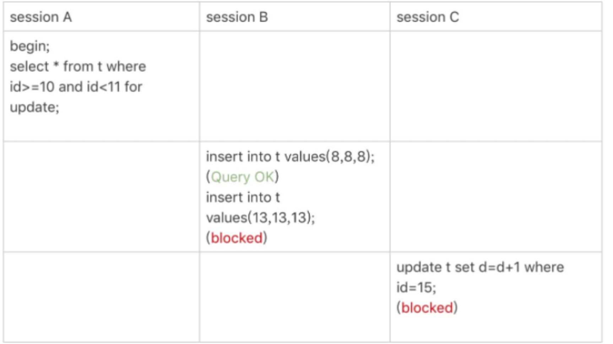

# next-key lock 从0到精通

这一章base在RR的隔离级别下。
## 先从next-key的规则开始说起

1. 原则1：加锁的基本单位是next-key lock。所有的情况都是先加next-key lock，之后才去考虑优化场景。然后它是根据此时访问到的行去上一个左开右边的区间。
2. 原则2：查找过程中给访问到的对象上锁。
3. 优化1：索引上的等值查询，给唯一索引上锁的时候，next-key lock会退化为行锁。
4. 优化2：索引上的等值查询，向右遍历时且最后一个值不满足条件的时候，next-key lock会退化为gap lock
5. bug：唯一索引的范围查询还会往后遍历到第一个不满足条件的值。

同样，目前的表情况如下：
```sql
CREATE TABLE `t` (
`
id` int(11) NOT NULL,
`
c` int(11) DEFAULT NULL,
`
d` int(11) DEFAULT NULL,
PRIMARY KEY (`id`
)
,
KEY `c` (`c`)
) ENGINE=InnoDB;

insert into t values(0,0,0),(5,5,5),
(10,10,10),(15,15,15),(20,20,20),(25,25,25);
```
那么接下来，按一个个案例去理解next-key lock是怎么上的。

## 案例1：等值查询间隙锁

等值查询，此时id是唯一索引，它访问到id=7的时候发现没有值，那么这时候的加锁范围是(5,10],但是由于是等值查询，10并不满足查询条件，它会被优化为(5, 10)的间隙锁

## 案例2：非唯一索引等值锁

此时是非唯一索引，同样也是等值锁。
首先会上一个(0, 5]的一个next-key lock，由于是非唯一索引那么就要继续往后遍历然后往后遍历到10，上一个(5, 10]的lock，然后10并不满足，所以会优化为(5, 10)

> 同时根据原则2，只有被访问到的对象才会被加锁，那么对于主键索引上的操作，是不会被阻塞的。

## 案例3：主键索引范围锁

> 这个主键索引的范围锁就很有意思了， 10 <= id < 11 难道和 id = 10不一样吗？

其实还真的不一样:
1. id = 10, 就比较显而易见会被优化为一个id=10的记录锁
2. id >= 10的情况，它会先上一个(5, 10]的next-key lock, 被优化成10, 然后执行>10的遍历，此时会找到下一个15，发现它不满足条件，但是上了(10, 15]这么一个next-key lock。

同时，这里因为是范围查询，并不会有(10, 15)的这个优化。

所以这样的范围查询会多出来一个gap lock.

## 案例4：非唯一索引范围锁

与上个案例不同，此时是非唯一索引，那么首先，它缺少了(5, 10]的next-key lock向record lock的优化。

所以它会把(8, 8, 8)的插入也给阻塞住了。
## 案例5：唯一索引范围锁bug

在唯一索引的范围查询的时候，我们想的是肯定不会往后再遍历了，比如到15就停止了，但是其实不是，它还是会往后遍历直到找到不满足条件的值才停止。
## 案例6：非唯一索引上存在“等值”


这个例子是让我们更好的理解一下间隙的含义，其实间隙就是在这之间的范围是不允许插入数据的。


有(5, 10] (10, 15),由于等值查询15会被优化掉。
那么在delete的情况下，只会涉及图中深色的部分。
## 案例7：limit语句加锁

这里主要是突出limit对加锁的优化。
使用了limit以后，当遍历到了第二个记录，就不会往后再遍历了。相比之前少了一段gap lock。

## 案例8：死锁的例子


> 这里死锁的例子是说明，next-key lock并不是单独加锁的，而是分成gap lock和 record lock，他们会分别进行阻塞。

## 一个特殊的倒序例子


在倒序的时候，很特殊，它加锁的方向不会变。
首先我们遍历c=20, 它会上(15, 20]的next-key lock, 然后往后遍历到25, 基于等值查询优化，就只上一个(20, 25)的gap lock。
然后处理范围查找，先找到了15，符合条件，就会上一个(10, 15]的next-key lock
往后查找，找到(5, 10]上了一个next-key lock, 发现10不满足，就不会往后进行了。