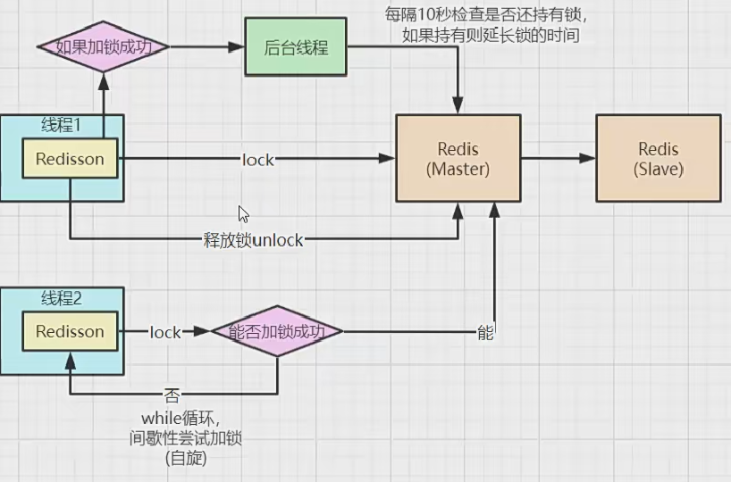
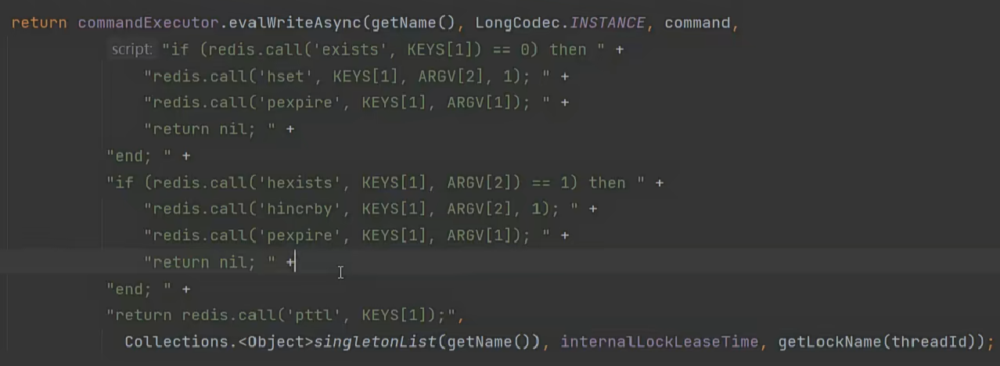

# 分布式锁

最简单的set nx ex

## 如果过期了业务还没有执行完
setnx key uuid-me

释放的时候判断是不是当前锁是自己上的:if get key == uuid-me,说明是自己上的，可以去释放锁。

问题：get和释放锁的操作不是原子操作，那么就可能有人在get判断成功后获取了锁。

## redission实现看门狗机制
由于这个过期时间的设置很难控制，所以有一个看门狗去续费锁还是挺好的。

redission内部是用lua脚本来实现的,lua是有原子性的。

1. redis里面有没有这个key的值？
2. 如果没有，就设置这个key为哈希结构，其中一个设置线程ID为dict中的key，值为重入次数，并且给这个key一个过期时间
3. 如果有这个key，查看是不是相同线程，如果是的话就重入。

如果加锁成功的话，会有一个回调函数，会给他安排一个线程去进行看门狗，去判断当前线程是不是还占有这个锁，如果是的话就进行续费。时间间隔为过期时间的1/3。

没加锁成功，就会订阅一个channel频道（相当于监听一个topic，释放锁的时候会发布）。然后尝试加锁，如果失败就会被阻塞到过期时间结束，然后再次尝试加锁。

## 主从模式下，如果分布式锁上给master，master挂掉了

### redlock红锁
效仿zookeeper，只有超过半数的redis节点加锁成功才算成功。

红锁是要开启几个不同的redis节点的连接，对这些节点同时尝试加锁。

### 红锁的问题
红锁对应的节点要是不采取主从模式，如果挂掉了就可能出现无法加锁，如果有主从那么如果红锁对应的节点挂掉了，那么同样会面临上述的问题。
