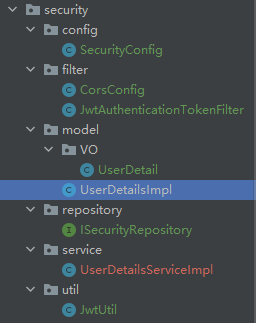
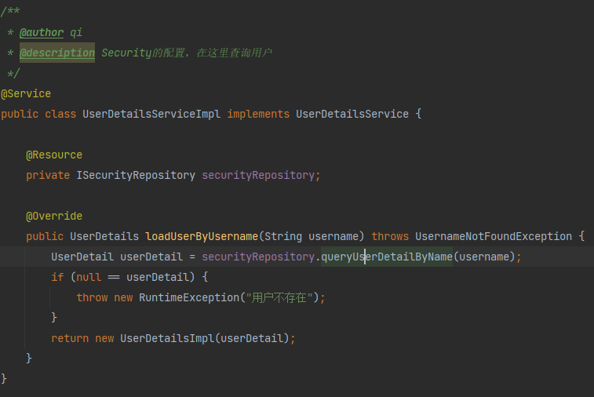

# Day2
>今天主要目的是接入SpringSecurity和JWT，不多说开干！

## 接入SpringSecurity


### Step1

实现来自SpringSecurity的UserDetailService接口，实现它的loaduserByUserName, 实现与数据库中数据的绑定，后续也是通过这个进行验证



### Step2

实现ScurityConfig类，配置密码的加密解密，公开链接/拦截链接的配置。以及一些Filter的加载
```java
    /**
     * 密码加密
     * @return
     */
    @Bean
    public PasswordEncoder passwordEncoder() {
        return new BCryptPasswordEncoder();
    }

    @Bean
    @Override
    public AuthenticationManager authenticationManagerBean() throws Exception {
        return super.authenticationManagerBean();
    }

    @Override
    protected void configure(HttpSecurity http) throws Exception {
        http.csrf().disable()
                .sessionManagement().sessionCreationPolicy(SessionCreationPolicy.STATELESS)
                .and()
                .authorizeRequests()
                // 下面的链接是公开的
                .antMatchers("/user/account/token/", "/user/account/register/", "/websocket/**", "/test").permitAll()
                .antMatchers("/pk/start/game/").hasIpAddress("127.0.0.1")
                .antMatchers("/pk/receive/bot/move/").hasIpAddress("127.0.0.1")
                .antMatchers(HttpMethod.OPTIONS).permitAll()
                .anyRequest().authenticated();
        http.addFilterBefore(jwtAuthenticationTokenFilter, UsernamePasswordAuthenticationFilter.class);
    }
```

### Step3

实现JwtUtil，解析和生成JwtToken
```java
    public static String getUUID() {
        return UUID.randomUUID().toString().replaceAll("-", "");
    }

    /**
     * 生成JWT-token
     * @param subject
     * @return
     */
    public static String createJWT(String subject) {
        JwtBuilder builder = getJwtBuilder(subject, null, getUUID());
        return builder.compact();
    }

    /**
     * 获取JWT builder
     * @param subject
     * @param ttlMills
     * @param uuid
     * @return
     */
    private static JwtBuilder getJwtBuilder(String subject, Long ttlMills, String uuid) {
        // 1. 指定签名算法
        SignatureAlgorithm signatureAlgorithm = SignatureAlgorithm.HS256;
        // 2. 生成秘钥
        SecretKey secretKey = generalKey();
        long nowMills = System.currentTimeMillis();
        Date now = new Date(nowMills);
        if (ttlMills == null) {
            ttlMills = Constants.JwtConstants.JWT_TTL;
        }
        long expMills = ttlMills + nowMills;
        Date expDate = new Date(expMills);
        return Jwts.builder().setId(uuid).setSubject(subject)
                .setIssuer("chin").setIssuedAt(now).signWith(signatureAlgorithm, secretKey)
                .setExpiration(expDate);
    }

    /**
     * 生成秘钥
     * @return
     */
    public static SecretKey generalKey() {
        byte[] encodeKey = Base64.getDecoder().decode(Constants.JwtConstants.JWT_KEY);
        return new SecretKeySpec(encodeKey, 0, encodeKey.length, "HmacSHA256");
    }

    public static Claims parseJWT(String jwt) throws Exception {
        SecretKey secretKey = generalKey();
        return Jwts.parser()
                .setSigningKey(secretKey)
                .parseClaimsJws(jwt)
                .getBody();
    }
```

### Step4

在网关处实现Filter，去拦截header处的JwtToken, 拦截出来的JWTToken将他进行解析，绑定在我们的SecurityContextHolder里面，在之后的getInfo的时候可以将他取出。


### Step5

其余配置，如跨域配置
```java
    @Override
    public void doFilter(ServletRequest req, ServletResponse res, FilterChain chain) throws IOException, ServletException {
        HttpServletResponse response = (HttpServletResponse) res;
        HttpServletRequest request = (HttpServletRequest) req;

        String origin = request.getHeader("Origin");
        if(origin!=null) {
            response.setHeader("Access-Control-Allow-Origin", origin);
        }

        String headers = request.getHeader("Access-Control-Request-Headers");
        if(headers!=null) {
            response.setHeader("Access-Control-Allow-Headers", headers);
            response.setHeader("Access-Control-Expose-Headers", headers);
        }

        response.setHeader("Access-Control-Allow-Methods", "*");
        response.setHeader("Access-Control-Max-Age", "3600");
        response.setHeader("Access-Control-Allow-Credentials", "true");

        chain.doFilter(request, response);
    }
```


## 实现接口和方法

### 领域层


领域层我目前的设计是，分为了安全配置领域和用户领域两个部分。
- 安全配置领域就是完成SpringSecurity相关的一系列配置
- 用户领域就是完成获取jwt-token、用户登录注册等增删改查的操作

贴出主要代码：
```java
/**
 * @author qi
 */
@Service
public class UserService implements IUserService {

    private Logger logger = LoggerFactory.getLogger(UserService.class);

    @Resource
    private IUserRepository userRepository;

    @Resource
    private AuthenticationManager authenticationManager;

    @Override
    public Map<String, String> token(String username, String password) {
        UsernamePasswordAuthenticationToken authenticationToken = new UsernamePasswordAuthenticationToken(username, password);
        // 1. 让Security去完成登录
        Authentication authenticate = authenticationManager.authenticate(authenticationToken);
        UserDetailsImpl user = (UserDetailsImpl) authenticate.getPrincipal();
        UserDetail userDetail = user.getUserDetail();

        // 2. 生成jwt-token
        String jwt = JwtUtil.createJWT(userDetail.getId().toString());
        logger.info("user: {} , token: {}", userDetail, jwt);
        Map<String, String> resultMap = new HashMap<>();
        resultMap.put("error_message", "success");
        resultMap.put("token", jwt);
        return resultMap;
    }

    @Override
    public Map<String, String> userInfo() {
        UsernamePasswordAuthenticationToken authentication = (UsernamePasswordAuthenticationToken) SecurityContextHolder.getContext().getAuthentication();
        UserDetailsImpl user = (UserDetailsImpl) authentication.getPrincipal();
        UserDetail userDetail = user.getUserDetail();

        Map<String, String> resultMap = new HashMap<>();
        resultMap.put("error_message", "success");
        resultMap.put("id", userDetail.getId().toString());
        resultMap.put("username", userDetail.getUsername());
        resultMap.put("photo", userDetail.getPhoto());
        resultMap.put("rating", userDetail.getRating().toString());
        return resultMap;
    }

    @Override
    public Map<String, String> insertUser(String username, String password, String photo, Integer rating) {
        userRepository.insertUser(username,
                password,
                photo,
                rating);
        Map<String, String> resultMap = new HashMap<>();
        resultMap.put("error_message", "success");
        return resultMap;
    }

    @Override
    public Map<String, String> updateUser(String username, String photo, Integer rating) {
        boolean success = userRepository.updateUser(username, photo, rating);
        Map<String, String> resultMap = new HashMap<>();
        if (success) {
            resultMap.put("error_message", "success");
        } else {
            resultMap.put("error_message", "delete failed");
        }
        return resultMap;
    }

    @Override
    public Map<String, String> checkUserToken(String token) {
        return null;
    }

    @Override
    public Map<String, String> deleteUser(Integer uId) {
        boolean success = userRepository.deleteUser(uId);
        Map<String, String> resultMap = new HashMap<>();
        if (success) {
            resultMap.put("error_message", "success");
        } else {
            resultMap.put("error_message", "delete failed");
        }
        return resultMap;
    }


}
```
### 仓储层


仓储层目前设计还是比较简单，就是基于User这个表的pojo，dao以及实现了领域层的接口，并设计了一些常量。

### 接口层


接口层就是实现了提供的两个接口，具体如下：
```java
    @PostMapping("/user/account/token/")
    public Map<String, String> getToken(@RequestParam Map<String, String> map) {
        logger.info("username: {}", map.get("username"));
        return userService.token(map.get("username"), map.get("password"));
    }

    @GetMapping("/user/account/info/")
    public Map<String, String> getInfo() {
        return userService.userInfo();
    }
```

### 应用程序层


这里由于逻辑都是较为简单，所以就是规范了一下接口层所要用到的结果输入输出。
```java
/**
 * @author qi
 */
public interface IUserService {

    /**
     * 登录并分发JWT-token
     * @return
     */
    Map<String, String> token(String username, String password);

    /**
     * 获取用户信息
     * @return
     */
    Map<String, String> userInfo();

    /**
     * 注册用户
     * @param username
     * @param password
     * @param photo
     * @param rating
     * @return
     */
    Map<String, String> insertUser(String username, String password, String photo, Integer rating);

    /**
     * 更新用户
     * @param username
     * @param photo
     * @param rating
     * @return
     */
    Map<String, String> updateUser(String username, String photo, Integer rating);

    /**
     * 检查用户的JWT=token是否合法
     * @param token
     * @return
     */
    Map<String, String> checkUserToken(String token);

    /**
     * 删除用户
     * @param uId
     * @return
     */
    Map<String, String> deleteUser(Integer uId);
}

```

## 总结
今天是为了实现登录的内容，后续增删改查的部分还需要补充一下，不过就是按部就班填一填罢了。

下一步的设计思路，设计AI的CRUD。


