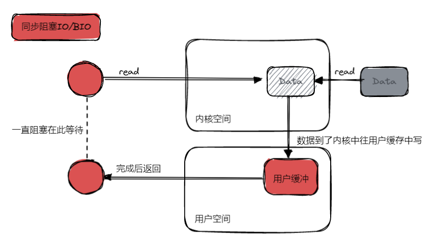
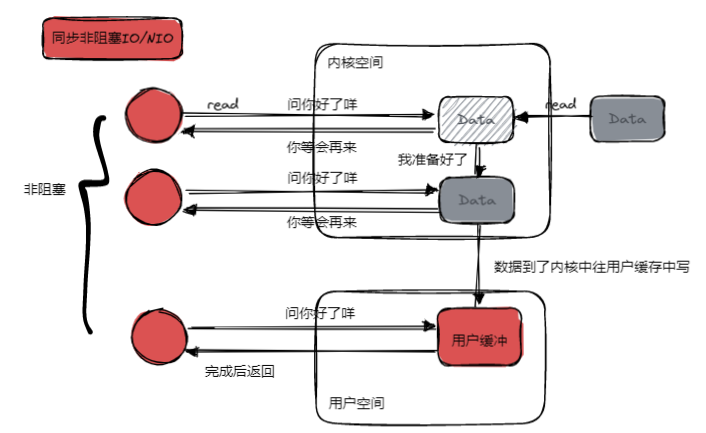
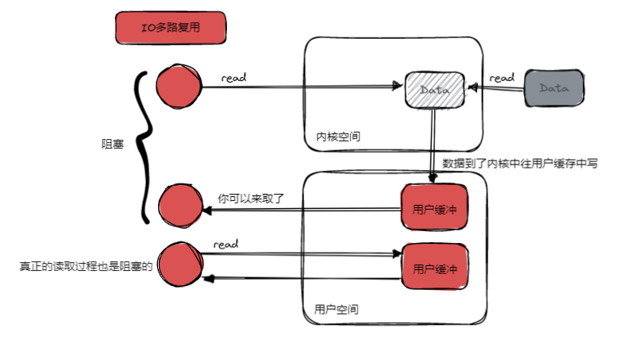
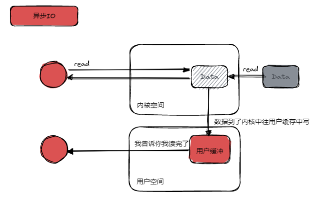

# 详解Netty

还是按习惯的套路，深入学习一个东西之前，先看它是怎么用的。

## Netty服务端
```java
public class NettyServer {
 
    public static void main(String[] args) throws Exception {
 
        // 创建两个线程组bossGroup和workerGroup
        EventLoopGroup bossGroup = new NioEventLoopGroup(1);
        EventLoopGroup workerGroup = new NioEventLoopGroup();
        try {
            // 用于引导启动的ServerBootstrap
            ServerBootstrap bootstrap = new ServerBootstrap();
            // 配置启动用的参数
            bootstrap.group(bossGroup, workerGroup) // 设置两个线程组
                    .channel(NioServerSocketChannel.class) // 使用非阻塞的Channel
                    // 初始化服务器连接队列大小，服务端处理客户端连接请求是顺序处理的,所以同一时间只能处理一个客户端连接。
                    // 多个客户端同时来的时候,服务端将不能处理的客户端连接请求放在队列中等待处理
                    .option(ChannelOption.SO_BACKLOG, 1024)
                    .childHandler(new ChannelInitializer<SocketChannel>() {// 创建通道初始化对象，设置初始化参数
                        @Override
                        protected void initChannel(SocketChannel channel) throws Exception {
                            // 设置自定义好的处理器
                            channel.pipeline().addLast(new NettyServerHandler());
                        }
                    });
            ChannelFuture future = bootstrap.bind(9000).sync();
            //给future注册监听器，监听我们关心的事件
            /*future.addListener(new ChannelFutureListener() {
                @Override
                public void operationComplete(ChannelFuture future) throws Exception {
                    if (future.isSuccess()) {
                        System.out.println("监听端口9000成功");
                    } else {
                        System.out.println("监听端口9000失败");
                    }
                }
            });*/
            // 对通道关闭进行监听，closeFuture是异步操作，监听通道关闭
            // 通过sync方法同步等待通道关闭处理完毕，这里会阻塞等待通道关闭完成
            future.channel().closeFuture().sync();
        } finally {
            // 资源释放
            bossGroup.shutdownGracefully();
            workerGroup.shutdownGracefully();
        }
    }
}
 
 
/**
 * 自定义Handler需要继承netty规定好的某个HandlerAdapter(规范)
 */
public class NettyServerHandler extends ChannelInboundHandlerAdapter {
 
    /**
     * 读取客户端发送的数据
     *
     * @param ctx 上下文对象, 含有通道channel，管道pipeline
     * @param msg 就是客户端发送的数据
     * @throws Exception
     */
    @Override
    public void channelRead(ChannelHandlerContext ctx, Object msg) throws Exception {
    }
 
    /**
     * 数据读取完毕处理方法
     *
     * @param ctx
     * @throws Exception
     */
    @Override
    public void channelReadComplete(ChannelHandlerContext ctx) throws Exception {
    }
 
    /**
     * 处理异常, 一般是需要关闭通道
     *
     * @param ctx
     * @param cause
     * @throws Exception
     */
    @Override
    public void exceptionCaught(ChannelHandlerContext ctx, Throwable cause) throws Exception {
        ctx.close();
    }
}
```

## Netty是怎么工作的
当我们知道怎么使用的时候，这时候需要深入了解一下它是怎么工作的。那么之后再使用的话就不会畏手畏脚，感觉自己像是在背书。

### 从操作系统内核开始
最开始的IO理解是从磁盘中像计算机中传输数据，慢慢的有了网络IO。
而如今在缓冲区盛行的时代，缓冲区和内存、硬件中的交换都不乏IO。
那么我们可以将一个用户想要获取数据的IO过程抽象成如下步骤：
1. 从数据源读取数据到内核空间中
2. 用户空间从内核空间调取数据

### 各种IO类型

#### BIO


#### NIO


#### IO多路复用


#### AIO


### Java中的IO
Java中最早采用的是BIO，也叫作同步阻塞IO。JVM1.4之后引进了新版本Java New IO类库，变成了NIO，但是这个NIO并不是我们常规意义下的非阻塞IO，它用IO多路复用来形容比较贴切。
与此同时BIO也被称之为OIO（OLD IO）。与这些同步的IO不同的还有另一种IO叫异步IO。

### NIO
那我们Java，Netty如今选用的NIO，它的核心就在于selector，选择器，与非阻塞IO不同的是，有选择器的介入后，一个线程就可以对接多条IO通道，当有一方数据准备好时便获取。具体方式不再是
同步非阻塞IO一样的一直轮询自己是否可以进行IO。

### Java NIO的三大利器
Java NIO与之前的OIO最大的不同也是来自于下面这三者
#### Channel
Java OIO的读写是基于流或者字节的，就区分为writebuffer和readbuffer，那channel就相当于两者的结合体，既可以写出也可以读进。
#### Selector
Selector是实现IO多路复用的核心，它是IO事件的查询器，通过Selector，我们能知道当前哪个注入到Selector当中的IO已经准备就绪，那就对这个IO进行读写。
它的好处就是，我们不用像BIO一样，如果有多个IO就要用多个线程去监控，这种方式可以让一个线程就可以负责到所有注册到Selector当中的IO。从而减小了系统开销。
#### Buffer
Buffer也是一门利器，从channel中读数据是读进buffer，要写出也是从buffer中写入channel。有buffer的存在，我们就不用一个个的按字节或者流去读取，而是想读哪读哪，想写哪里写哪里，哪里不会点哪里。

## 总结
好了，现在介绍到了IO以及Java中的IO，后续我们就要基于这些去继续将Netty分解出来。