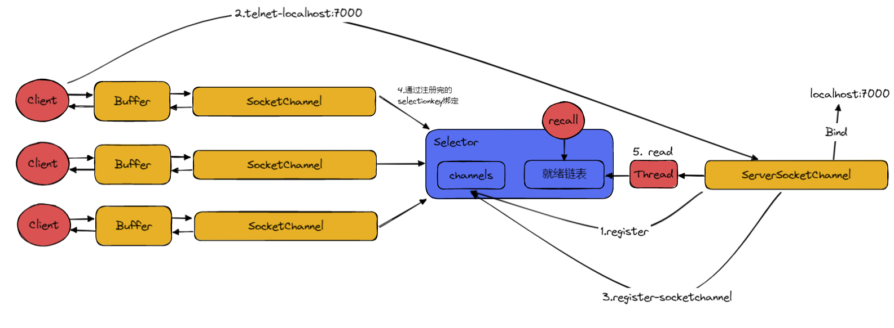

# NIO的底层实现

这节我们从多路复用聊起，详解Java中的NIO模型。

## Java NIO的三大利器
Java NIO与之前的OIO最大的不同也是来自于下面这三者
### Channel
Java OIO的读写是基于流或者字节的，就区分为writebuffer和readbuffer，那channel就相当于两者的结合体，既可以写出也可以读进。
### Selector
Selector是实现IO多路复用的核心，它是IO事件的查询器，通过Selector，我们能知道当前哪个注入到Selector当中的IO已经准备就绪，那就对这个IO进行读写。
它的好处就是，我们不用像BIO一样，如果有多个IO就要用多个线程去监控，这种方式可以让一个线程就可以负责到所有注册到Selector当中的IO。从而减小了系统开销。

#### Selector的三大方法

1. open()：Linux下是epoll实现，会返回一个Selector对象
2. register(): 将file description fd(在这里的表现形式就是socketChannel)加入到epoll内部的集合中
3. select(): 数据已经读取到了用户空间的缓冲区，可以进行读取了。具体来说就是调用epoll_ctl，监听socketChannel是不是完成了读写事件；再调用epoll_wait方法，监听IO完成的实践列表，如果没有实际完成的事件，那么它会被阻塞。

### Buffer
Buffer也是一门利器，从channel中读数据是读进buffer，要写出也是从buffer中写入channel。有buffer的存在，我们就不用一个个的按字节或者流去读取，而是想读哪读哪，想写哪里写哪里，哪里不会点哪里。

## Selector的原理

Selector在Linux内核在的原理就是epoll，那么我们稍微来对比一下。select，poll，epoll，他们都是IO多路复用的实现，所以他们都能实现一个线程监听多个IO，那么三种常见的方法有什么不同！

其实具体区别就是如何将已经准备好数据的socketChannel放到一个就绪的集合里面。

### select
select使用的是遍历所有socketChannel的方式，把已经准备好了的放进就绪链表，集合是有长度限制的。
### poll
形式与select一致，但是具体的集合采用了链表，那么它是没有长度限制的。
### epoll
采用的是观察者模式，事件驱动，并不会主动的去遍历，而是当数据准备完成以后，用发布事件再感知，将这些放入到准备就绪的事件集合。
### 优劣势
一般来说epoll是有较大优势的，毕竟遍历的方式是O(n)的时间复杂度，每一次都要这样遍历的消耗是很大的，除非说你的channel很少，这样遍历的消耗小于事件的维护，这样才会说select/poll更优。再者socket和poll这种方式是要维护一个数据结构的，如果一直累计，这样占用的空间也是很苦恼。

## Java中NIO的结构

我们拆解一下具体情况
1. 我们的ServerSocketChannel去监听着一个端口，并且我们把ServerSocketChannel注册到了Selector中。
2. 之后有客户端连接这个端口，Selector感知到了这个注册事件，将新来的SocketChannel注册到Selector当中，并用selectionkey绑定。
3. 当客户端向服务器发送消息的时候，Selector又进行感知，把这个事件放到就绪事件链表中。
4. 那么ServerSocketChannel那边的线程就可以去读取数据了。

