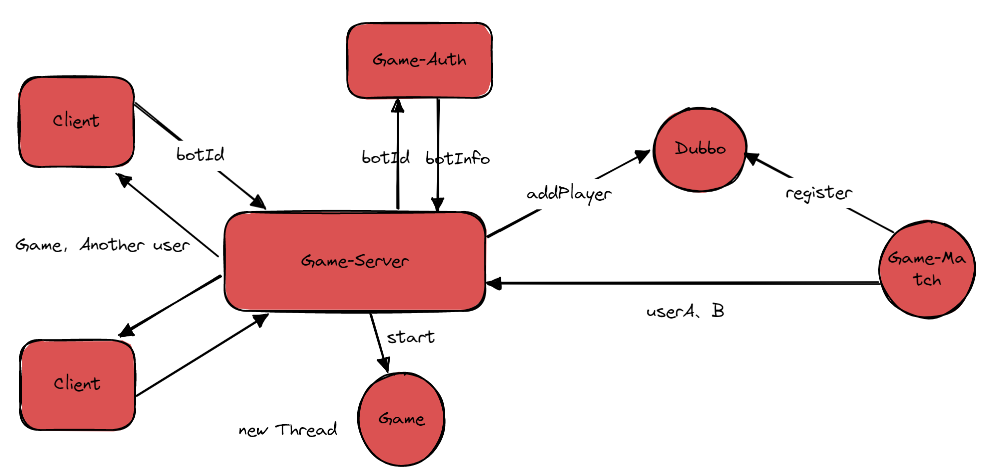

# 开启游戏
这节我们主要来梳理一下开启游戏的思路，具体实现在下一节展开
此时，我们已经可以把要匹配的用户放入匹配池中，等待匹配池发送匹配成功的用户过来，然后我们就可以将匹配成功的用户开启一个新的游戏。

## 如何开启一个游戏

1. 我们需要构建一个棋盘
2. 我们需要知道对阵双方的信息，客户端肯定已知自己的信息，所以要传过去对方的信息
3. 我们需要知道bot的具体内容，知道它的运行逻辑，所以要去game-auth中去获取bot的信息。
4. 将这个游戏的棋盘信息绑定在此时用户对应的socketHanlder当中，方便后续获取
5. 把棋盘信息和对阵信息发送给用户

## 看看整个系统的逻辑走向

项目写到这时候，需要梳理一下数据逻辑是怎么走的。我们画一张图来看看吧


### 如何构建一个棋盘
一个棋盘是由障碍物和用户的蛇身组成的，如果碰到了障碍物算输，如果碰到了蛇身也算输，所以要把这样的一个n * m的网格建立好。

### 如何知道对阵双方的信息
此时我们的game-server已经收到了来自game-match的信息，那么就可以封装好对阵双方的信息给客户端，通过我们提前保存的一个（用户id，SocketHandler）的一个map。

### 如何知道bot的具体内容
因为这时候我们获取到的是是对阵双方的botId，并不知道bot的具体信息，所以我们还得去在game-auth中提供接口，我们通过restTemplate远程调用这个接口进行访问。

### 在game-server中编排过程
此时我们已经接受到了sendResult的结果，知道了两个用户的id和botId，那么我们就要想想怎么发送给前端。
如果是使用-1，就是亲自出马的时候，这时候就应该判断是不是botId是-1，否则我们要去game-auth去查询这个bot的具体信息。
```java
    /**
     * 接受到匹配服务器的信息后，再此开始对局
     * @param aId
     * @param aBotId
     * @param bId
     * @param bBotId
     */
    public static void startGame(Integer aId, Integer aBotId, Integer bId, Integer bBotId) {
        // 开启对局
        logger.info("start!, {}, {}", aId, bId);
        User a = ChannelHandler.userSockets.get(aId).user;
        User b = ChannelHandler.userSockets.get(bId).user;
        Bot botA = null;
        if (aBotId.equals(-1)) {
            botA = new Bot();
            botA.setId(-1);
        } else {
            botA = postIdForBot(aBotId);
        }
        Bot botB = null;
        if (bBotId.equals(-1)) {
            botB = new Bot();
            botB.setId(-1);
        } else {
            botB = postIdForBot(bBotId);
        }
        Map<Integer, SocketHandler> users = ChannelHandler.userSockets;
        Game game = new Game(13, 14, 20, a.getId(), b.getId(), botA, botB);
        users.get(a.getId()).game = game;
        users.get(b.getId()).game = game;
        game.start();

        JSONObject respGame = buildGameResponse(game);
        JSONObject respA = buildGameResponseDetail(respGame, b);

        if (users.get(a.getId()) != null) {
            users.get(a.getId()).ctx.channel().writeAndFlush(new TextWebSocketFrame(respA.toJSONString()));
        }

        JSONObject respB = buildGameResponseDetail(respGame, a);
        if (users.get(b.getId()) != null) {
            users.get(b.getId()).ctx.channel().writeAndFlush(new TextWebSocketFrame(respB.toJSONString()));
        }
    }

    private static JSONObject buildGameResponse(Game game) {
        JSONObject respGame = new JSONObject();
        respGame.put("a_id", game.getPlayerA().getId());
        respGame.put("b_id", game.getPlayerB().getId());
        respGame.put("a_sx", game.getPlayerA().getSx());
        respGame.put("a_sy", game.getPlayerA().getSy());
        respGame.put("b_sx", game.getPlayerB().getSx());
        respGame.put("b_sy", game.getPlayerB().getSy());
        respGame.put("map", game.getG());
        return respGame;
    }

    private static JSONObject buildGameResponseDetail(JSONObject respGame, User another) {
        JSONObject respA = new JSONObject();
        respA.put("event", "start-matching");
        respA.put("opponent_username", another.getUsername());
        respA.put("opponent_photo", another.getPhoto());
        respA.put("game", respGame);
        return respA;
    }

    private static Bot postIdForBot(Integer botId) {
        String queryBotUrl = "http://game-auth/user/bot/queryBot";
        MultiValueMap<String, Integer> data = new LinkedMultiValueMap<>();
        data.add("botId", botId);
        HashMap<String, String> resultMap = restTemplate.postForObject(queryBotUrl, data, HashMap.class);
        return new Bot(Integer.valueOf(resultMap.get("botId")), Integer.valueOf(resultMap.get("userId")), resultMap.get("content"), resultMap.get("description"), resultMap.get("title"));
    }
```

基本上也就这么一些问题，我们下一节进行游戏棋盘的具体的实现。